# C基础与杂项知识点
## Linux命令
### 打开终端的方式
- 直接点击终端图标打开 这种方式同时只能开一个终端（打开的是家目录）
- alt+crtl+t 打开家目录的新终端
- ctrl + shift+n 打开当前目录的新终端
- ctrl + shift+t 在当前终端内新建终端 打开的是当前目录
### 关闭终端
- 点击叉号直接关闭
- ctrl +d关闭当前活动终端
- 在终端输入exit也可以关闭终端
### 改变终端大小
- 放大终端 ctrl shift +
- 缩小终端 ctrl -
### 终端开头信息的含义(了解)
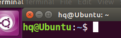
*参数含义*
- hq 这个表示 当前用户名
- @表示一个分隔符，分割作用
- Ubuntu 表示 **主机名**
- 这个波浪线~表示当前路径
- 这个美元$表示 命令提示符（告诉用户后面可以输入命令）
### 路径问题
路径分为两类
- 绝对路径 从根目录开始算
- 相对路径 从当前位置开始算
*查阅绝对路径，输入pwd命令即可*
### 查看用户名
输入下面指令即可查询
```sh
whoami
```
### 查看主机名
输入下面命令即可
```sh
hostname
```
### 查看文件
查看当前路径下的所有文件
```sh
ls
```
加入-l参数（或者直接输入ll）
*表示查看当前路径下的所有信息*
```sh
ls -l
```
*文件详细信息的参数含义*

- 开头的d表示 文件类型
- rwx那一堆表示文件权限 : 文件所有者（Owner）、用户组（Group）、其它用户（Other Users）
- 14表示链接数
- 第一个hq表示用户名
- 第二个hq表示组名
- 4096 表示文件大小
- 这个时间表示最后一次修改的时间
- 最后面这个表示文件名
*文件权限中的横杠表示这个选项不可以，比如在r的位置放一个横杠表示不可读*

**该命令显示的文件大小的默认单位是字节，可以添加其他参数来显示单位，例如添加参数h来显示大小，会使用G M等来显示大文件**
```sh
ls -alh
```
前面是.开头的表示这个文件为隐藏文件
### 复制
```sh
cp 文件名 目标路径
```
复制目录文件
```sh
cp -r 目录文件名 目标路径
```
*复制的另一个功能是另存为*
```sh
cp 文件名 路径/新名字
```
### 移动
```sh
mv 普通文件/文件夹 目标路径
```
*给文件重命名*
```sh
mv 原文件名 新文件名
```
### Linux中的7类文件类型
*块设备文件*
用b表示，可以在根目录下查找具体是/dev
*字符设备文件*
c表示，在/dev/input/mouse查找
*目录文件*
用d表示， 表示目录文件，也就是文件夹
*普通文件*
用一根横杠表示。.c .h .txt之类的都属于
*软链接*
用l表示，相当于我们的快捷方式，在C高级中回接触到
*套接字文件*
用s表示 在网络编程中会用到
*管道文件*
会在io进程中学到

### 修改文件权限
修改权限 chmode 权限值 文件名
### cd切换路径
. 表示当前路径，但是可以忽略
cd .. 表示返回上一级
cd - 表示返回上次所在的路径
只输入cd表示返回家目录，也就是返回/home/用户名
### 新建文件方法
touch 文件名.后缀
touch 同名文件 会更新时间戳(不会覆盖文件)
### 新建文件夹方法
mkdir 文件夹名字
**递归创建文件夹**
mkdir -p /1/2/3
mkdir若创建同名文件夹会直接报错
### 删除文件夹
*删除普通文件*
rm 普通文件名
*删除文件夹*
rm -r 文件夹名字
## vi/vim编辑器
分为三个模式
- 命令行模式
- 插入模式
- 低行模式
**整理代码格式 gg=G**
## 编程语法发展历史
机器语言->汇编语言->高级语言
## gcc的编译流程
*第一步 预处理*
这一步负责展开头文件 删除注释 替换宏定义
```sh
gcc -E test.c -o test.i
```
*第二步 编译*
这一步会检查语法错误，没有语法问题的话，会转换为汇编语言生成汇编文件
```sh
gcc -S test.i -o test.s
```
*第三步 汇编*
这一步将汇编文件转换为二进制文件
```sh
gcc -c test.s -o test.o
```
*第四步 链接*
链接程序所用的库文件，最终生成机器能够识别的可执行文件
```sh
gcc test.o -o test
```
# 计算机数据表示形式
就是进制转换
数据大致分为两类
- 数值型数据 能进行算术运算并且能得到运算的顺序的数据
- 非数值型数据 就是指ASCII码

二进制(bin) 逢二进一
八进制(oct) 逢八进一
十进制(dec) 逢10进一
十六进制(hex) 用A表示10，F表示15

反斜杠0的ASCII值为0 一般作为字符串结束的标志
反斜杠n的ASCII为10，一般表示换行
空格的ASCII值为32 
字符0 的ASCII值为48
字符9 的ASCII值为57
**如果想把字符数字转换为真正的数字，只需要用字符数字的ASCII减去48就行**
大写字母+32=小写字母
小写字母-32=大写字母 
# 词法符号
*概念*：词法符号就是你在程序设置的时候在里面规定的一些有几个字符组成的一些简单的有意义的最小的语法单位。
## 关键字
*概念*：由系统预定义的具有特殊功能的词法符号。
## 存储类型：
- auto 自动
- static 静态
- extern 外部引用
- register 
数据类型：（在此不赘述）注意有符号和无符号是用来修饰的
## 构造类型：
- struct 结构体
- union 共用体
- enum 枚举
## 选择结构
if else switch case defaultS
循环结构
for while goto do break continue
其他功能
- void 空类型
- typedef 重定义
- const 常量化（表示只读）
- volatile 防止编译器优化
- return 函数返回值
- sizeof 计算数据所占空间大小
## 运算符
算数运算符
逻辑运算符
位运算符
位运算符的位指的是二进制里的每一位，指的是 0 和 1，没有真假，因为它不是一个逻辑上的判断真假，而是让你去计算  0 和 1 通过位运算符算出来的结果到底是什么样的，按位进行操作。分为下面几个大类。**位运算符都是针对补码进行操作**
- & (位与) 
- | (位或)		
- ^(异或)		
- ~(取反)		
- <<(左移)	
- (>>)右移	
- (>>> 无符号右移)**注意：没有无符号左移**
关系运算符
赋值运算符
三目运算符
*此处特别注意这个相除/*
**整数相除，向下取整，当你的除号两边都是整数的时候，得到的会是一个整数**
```c
int a=5/2;//a=2

float a=5/2;//a=2.000000

float a=5.0/2;//a=2.500000
```
*除法运算不止能用于整数运算，还可以用于别的计算，，但是取余计算只能用于整数计算*
练习：将1234的每个数位分别输出到终端上
千位：1234/1000
百位：1234/100%10
十位：1234/10%10
各位：1234%10
### 运算符优先级
单算移关与，异或逻条赋，从右向左单条赋。
单目运算符 	!  	~ 	 	++ 		 --
算术运算符 	*	 /	 %		 +	 -
移位运算符	 <<	 	>>
关系运算符 	<	 <= 		>	 >= 		==		 !=
位与运算符 	&
异/或运算符 	^ 	|
逻辑运算符	&& 		||
条件运算符 	?	:
赋值运算符 	=	+=	*=	/=	%=	...
## 原码补码（重点）
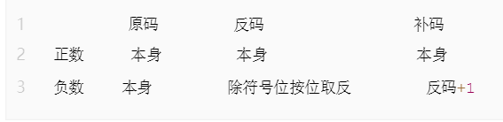
### 快速计算补码转换
**一般的计算方法**
```c
1、正数的原码 = 正数的反码 = 正数的补码
2、负数的原码 = 对应正数的原码 + 2的数据位数量次方，最高位作为符号位
3、负数的反码 = 负数的原码的符号位不变，其他数据取反
4、负数的补码 = 负数的反码+1
```
对原码从右往左数，知道遇到第一个数字1，1及1右边的数不变，1左边的数字按位求反。
**这个方法也能用来做补码到原码的转换**
负数的补码=（负数+2的数据数量次方）再对这个取二进制
把有符号位的负数，当作无符号数来表示，就可以知道，对于取反操作来说，负数的原码取反 = 2的数据位数量次方 - 负数原码 - 1
## 左移右移和取反的计算(重点)
### 右移
右移几位，左边补几个符号位(0-1)
```c
// 是正数就补0，是负数就补1
// 前提条件还是补码

8 >> 2 = 2(公式： 8/2^2 = 8/4 = 2)
0000 0010
-48 >> 4 = -3 (公式：-48/2^4 = -48/16 = -3)
// 正数都是向下取整
// 负数的话根据编辑器不一样，会产生的不一样的结果
```
### 左移
左移几位，右边补几个0
```c
8 << 2 = 32 (公式：8 * 2^2 = 8*4 = 32)
100000
-6 << 3 = -24 (公式：-6 * 2^3 = -6 * 8 = -48)
```
### 取反
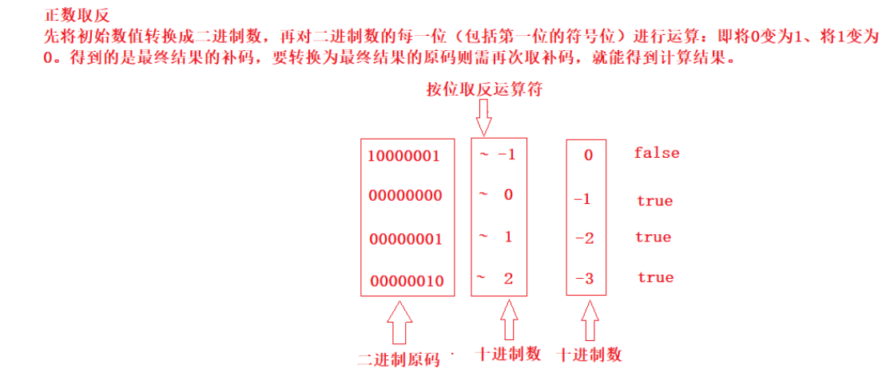
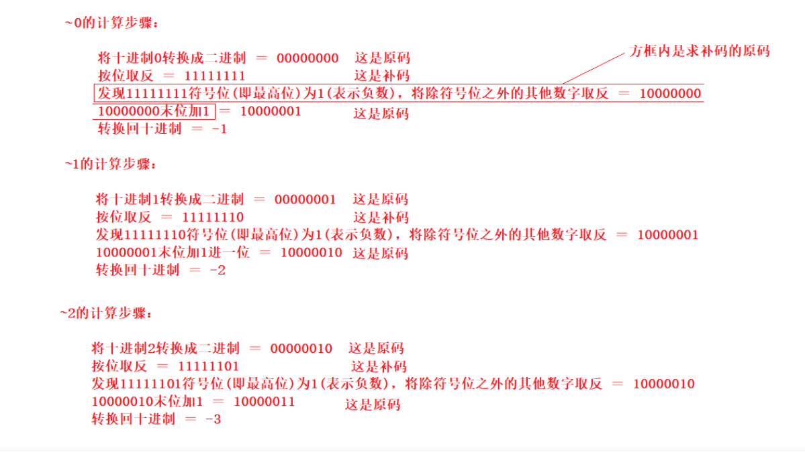
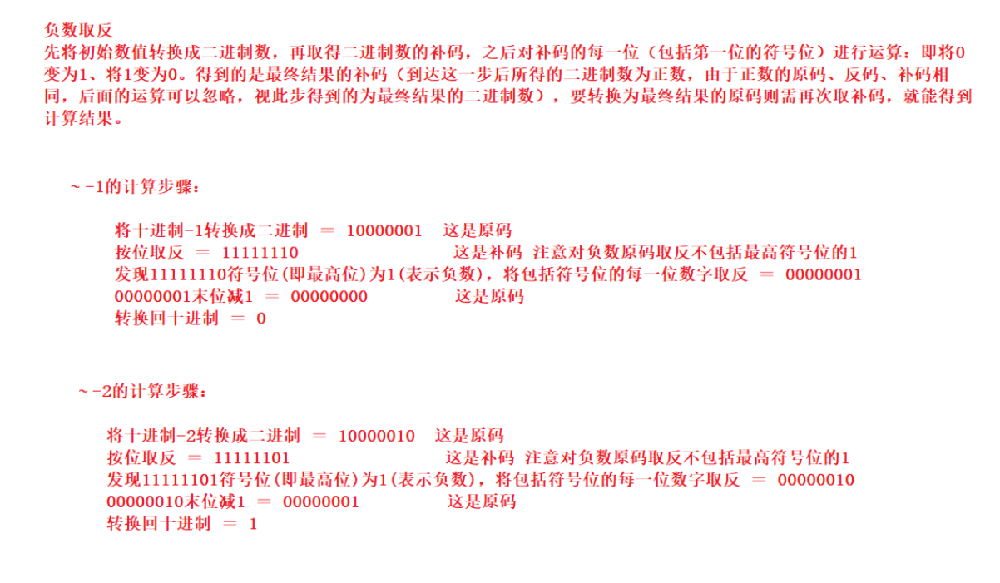
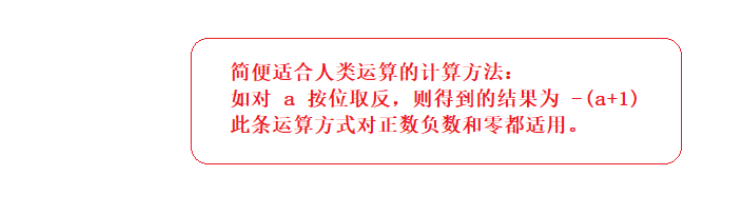
## 位运算的技巧
**我们的程序设计应该尽量贴合芯片硬件的特点**比如芯片进行位运算的效率是远高于
其他运算的，所以位运算的技巧能大大提高软件执行的效率。
###  位操作交换两个数
```c
//普通操作
void swap(int &a, int &b) {
  a = a + b;
  b = a - b;
  a = a - b;
}

//位与操作
void swap(int &a, int &b) {
  a ^= b;
  b ^= a;
  a ^= b;
}
```
*介绍*：
位与操作解释：第一步：a ^= b ---> a = (a^b);

第二步：b ^= a ---> b = b^(a^b) ---> b = (b^b)^a = a

第三步：a ^= b ---> a = (a^b)^a = (a^a)^b = b
### 位操作判断奇偶数
只要根据数的最后一位是 0 还是 1 来决定即可，为 0 就是偶数，为 1 就是奇数。
```c
if(0 == (a & 1)) {
 //偶数
}
```
###  位操作交换符号
交换符号将正数变成负数，负数变成正数
```c
int reversal(int a) {
  return ~a + 1;
}
```
整数取反加1，正好变成其对应的负数(补码表示)；负数取反加一，则变为其原码，即正数
### 位操作求绝对值
整数的绝对值是其本身，负数的绝对值正好可以对其进行取反加一求得，即我们首先判断其符号位（整数右移 31 位得到 0，负数右移 31 位得到 -1,即 0xffffffff），然后根据符号进行相应的操作
```c
int abs(int a) {
  int i = a >> 31;
  return i == 0 ? a : (~a + 1);
}
```
上面的操作可以进行优化，可以将 i == 0 的条件判断语句去掉。我们都知道符号位 i 只有两种情况，即 i = 0 为正，i = -1 为负。对于任何数与 0 异或都会保持不变，与 -1 即 0xffffffff 进行异或就相当于对此数进行取反,因此可以将上面三目元算符转换为((a^i)-i)，即整数时 a 与 0 异或得到本身，再减去 0，负数时与 0xffffffff 异或将 a 进行取反，然后在加上 1，即减去 i(i =-1)
```c
int abs2(int a) {
  int i = a >> 31;
  return ((a^i) - i);
}
```

### 位操作进行高低位交换
给定一个 16 位的无符号整数，将其高 8 位与低 8 位进行交换，求出交换后的值，如：
```c
34520的二进制表示：
10000110 11011000

将其高8位与低8位进行交换，得到一个新的二进制数：
11011000 10000110
其十进制为55430
```
从上面移位操作我们可以知道，只要将无符号数 a>>8 即可得到其高 8 位移到低 8 位，高位补 0；将 a<<8 即可将 低 8 位移到高 8 位，低 8 位补 0，然后将 a>>8 和 a<<8 进行或操作既可求得交换后的结果。
```c
unsigned short a = 34520;
a = (a >> 8) | (a << 8);
```
## 截断法则
- 逻辑或运算中：如果前面的表达式为真，则后面的 表达式不执行
- 逻辑与运算中：如果前面的表达式为假，则后面的表达式不执行
```c
#include <stdio.h>
int main()
{
    int a = 5, b = 6, c = 7, d = 8, m = 2, n = 2;
    (m = a > b) && (n = c < d);
    printf("%d %d", m, n); // 0    2
};
//上述代码会输出0 2
```
## 置一/置零公式
此处主要是左移右移来完成。多用于底层寄存器的操作。
- 置一公式：a | (1 << n)
- 置零公式：a & (~(1 << n))
## 标识符
有四个命名规则
- 由数字（单独一个数字不行） 字母 下划线(单个下划线做变量名也可以)组成
- 变量名的开头不能是数字
- 不能和关键字重名
- 命名规范，力求见名知意
## 分隔符
- 换行
- 空格 
- tab
## 标点符号
, ; {} [] ()
# 变量
概念：在程序运行中发生变化的量
*定义格式*：存储类型        数据类型           变量
- 存储类型控制变量存储的位置
- 数据类型就是变量所占字节的个数
数据类型的分类和取值范围如下图所示
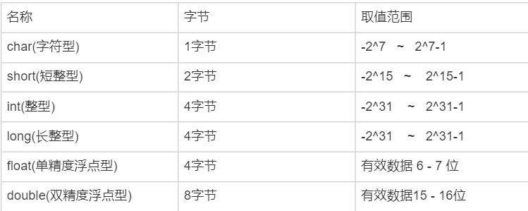
**注意上图中的浮点数和双精度浮点数，是存在有效位数的，超过这个位数会造成精度损失问题**
```c
#include<stdio.h>
#include<stdlib.h>
#include<string.h>

int main(int argc, char* argv[])
{
	float b=3.33333333;
	double c=123456789123456.3;
  float d=1.3456789;
	printf("%f\n",b);
	printf("%f\n",c);
 	printf("%f\n",d);

	return 0;
}//上述代码是为了验证二者的精度损失问题，可能在第六位或者第七位发生精度损失
//这个不一定
```
*现象*
```c
3.333333
123456789123456.296875
1.345679
```
*变量分类*
- 局部变量
- 全局变量
二者的比较如下图

指数表示的e后面不能跟括号，只能是常量或者常量表达式
且e只能表示10的多少次方，不是10的不能用，得用pow
# 常量
概念：程序运行过程中不会发生变化的量
## 字符型常量
```c
用 ' ' 括起来
'a'  -> 字符 a

a   ->    变量

'\0'   // 字符串结束的标志
'\n'   
' ' // 空格也可以是字符
'+'    '-'
'\x41'   ->   'A' //16进制转义
'\101'   ->   'A' //8进制转义
65       ->    'A' //10进制转义
```
## 字符串常量
```c
表示字符串：用 "" 括起来

"hello"  // 字符串里面最后总会有一个  \0 只是你看不到，它是默认存在的
```
## 整型常量

## 浮点型常量
## 指数常量
```c
1*10^6      写为    1e6
3*10^-10    写为    3e-10
// 不是 10 的几次方就不能用 e 了，要用 pow 函数
```
## 标识常量
```c
宏定义：起标识作用
遵循标识符的命名规则
一般会用大写表示
格式：#define 宏名 常量或表达式
    #define NUM 3
特点：只能单纯替换，不要进行手动运算(原样替换，替换完在计算)
#define MAX(m,n) m>n?m:n
```
# 输入输出
## 按字符输入
```c
int getchar(void);
功能：从终端输入一个字符
参数：无
返回值：输入字符的ASCII值

int ch = getchar();

getchar()
```
## 按字符输出
```c
int putchar(int c);

功能：向终端输出一个字符
参数：c：要输出字符的ASCII值
返回值：要输出字符的ASCII值

putchar(10); // putchar('\n'); // 这两种方式都是可以的
putchar('a'); // putchar(97); // 一般是不会这么写的
// 注意：他只能输出一个字符
```
## 按格式输出
```c
// man 3 printf
int printf(const char *format, ...);
功能：按照指定格式向终端输出
参数：format：字符串    "hello nihao"
格式：
    "%d"    int
    "%f"    float
    "%lf"    double
    "%c"    char
    "%s"    字符串
    "%p"    地址
    "%e"    指数
    "%#x"    十六进制
    "%#o"    八进制
    "%-m.n"    含义：
        .n：打印小数点后几位
        m：位宽
        -左对齐，默认是右对齐
返回值：输出字符的个数(不常用)

int d = 1;
int ret = printf("%d\n", d);
printf("%d\n", ret); // 2    
```
## 按格式输入
```c
int scanf(const char *format, ...);
```
功能：按格式从终端输入
参数：同 printf // 你用来输入的时候后面放的是变量的地址
返回值：正确输入数据的个数
当第一个数输入的格式不正确时，会直接返回 0
**一定要按照双引号内规定的格式进行输入，否则无法正常进行变量赋值，就比如下面这样**
```c
int main()
{
    float a,b;
    scanf("x=%f,y=%f",&a,&b);//必须按照格式输入
    printf("x=%f,y=%f\n",a,b);
}
```

**注意看执行的效果，不同的输入方式，结果不同**
## 垃圾字符回收(重点)
**1. 通过空格回收，这种用的也多**
```c
scanf("%c %c", &a, &ch);
```
可以回收一个或多个的空格、回车、tab
2. %*c
只能回收任意一个字符
```c
char a;
char ch;
scanf("%c%*c%c", &a, &ch);
printf("a=%c ch=%c\n", a, ch);
```
**3. getchar()这种用的多**
只能回收任意一个字符，一般用于循环里面
```c
while (1)
{
    char a;
    scanf("%c", &a);
    printf("%c/n", a);
    while (getchar() != '\n');
 
}
```
```c
#include <stdio.h>
#include <stdlib.h>
int main(void)
{
    int a, c;
    char b;
    printf("input a: ");
    scanf("%d", &a); //将前一个scanf输入的缓冲区通过循环全部清空
    while (getchar() != '\n')//表示只要字符不是回车就继续吃缓冲区字符
    {
        ;//空语句
    }
    printf("\ninput b,c\n");
    scanf("%c,%d", &b, &c);
    printf("a = %d, b = %c, c = %d\n", a, b, c);  system("pause");
}
```
# 强制转换
存在的问题，能将低类型的强转为高类型的
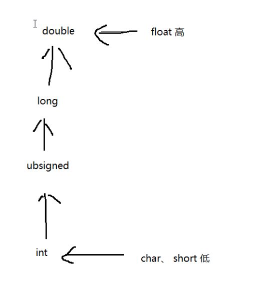
横向的表示必须转换（有些是系统自动转换），纵向的表示从低到高的转换。
在强制转换的时候可能会造成数据丢失和精度损失
```c
// int a = 5;
// float b = a/2;
// float c = (float)a/2;
// printf("%f%f\n",b,c);
int a = 1.0f;
printf("%d\n", a); // 1
printf("%d\n", 1.0); // 0
printf("%d\n", sizeof(1.0));  // 8 在系统中会默认认为1.0是double
printf("%d\n", (int)1.0);  // 1
printf("%f\n", 1); // 1.000000
printf("%d\n", (int)(1.0 + 'A')); // 66
float fl = 1.12;
printf("%d %f\n", (int)fl, fl); // 1 1.120000
```
# 分支语句
## if else
```c
// 基本结构
if(表达式)
{
    语句块一;
} 
else 
{
    语句块二;
}

    int a;
    scanf("%d", &a);
    if(a>3 && a<5)
    {
        printf("%d\n", a);
    }
    else 
    {
        printf("nonono\n");
    }

// 分层结构
if(表达式一)
{
    语句块一;
} 
else if(表达式二)
{
    语句块二
}
else 
{
    // 都不符合条件
    语句块三;
}

// 嵌套结构
if(表达式一)
{
    // 语句块一
    if(表达式二)
    {
        语句块二;
    }
    else 
    {
        语句块三;
    }
}
else 
{
    语句块;
}
1）if后面可以没有 else，但是 else前面必须有if
2）if 和 else 后面的 {} 可以省略，但是只能匹配之后的一条语句
```
## switch case
```c
switch(变量或表达式)
{
    case 常量一: 
        语句块一; 
    break;
     case 常量二: 
        语句块二; 
    break;
     case 常量三: 
        语句块三; 
    break;
    ....
     case 常量n: 
        语句块n; 
    break;
    default: 语句块 n+1
}

执行顺序：
判断 switch 后面的表达式的结果，和 case 后的常量相匹配，
如果匹配成功，就执行相对应的语句块，
如果没有匹配成功就执行 default 后面语句块，遇到 break 结束
```
# 循环
**在进行死循环的时候for(;;)的优化比while(1)好，所以尽量用for(;;)完成**
## for循环
```c
for(表达式1; 表达式2; 表达式3)
{
    语句块;  // 4
}
表达式1：赋初值
表达式2：循环终止条件
表达式3：增值或减值

int i;
    for (i = 0; i < 3; i++)
    {
        printf("%d\n", i);
    }
    printf("\n");

执行顺序：
首先执行表达式1进行赋值，然后判断表达式2是否成立，
如果成立就进入循环、执行语句块，再执行表达式3进行增值或减值
然后继续判断表达式2是否成立，直到表达式2不成立，退出循环
// 124 324 324 ... 直到 2 不成立
```
*嵌套结构*
```c
for(表达式1; 表达式2; 表达式3)
{
    for(表达式4; 表达式5; 表达式6)
    {
        语句块;  // 7
    }
}
// 外部的循环执行一次，内部循环执行一遍
```
### for循环的三种变形结构
**变形1**
```c
int i = 0;
for(; 表达式2; 表达式3)
{
    语句块;
}
```
**变形2**
```c
int i = 0;
for(; 表达式2;)
{
    语句块;
    表达式3;
}
```
**变形3**
```c
int i = 0;
for( ; ;) // 死循环
{
    if(表达式2)
    {
        语句块;
        表达式3;
    }
    else
    {
        break;
    }
}
```
## while循环
```c
格式：
定义循环变量并赋值;
while(判断条件) // 表达式
{
    语句块;
    增值或减值语句;
}

int i = 0,sum = 0;
    while (i < 10)
    {
        sum += i;
        i++;
    }
    printf("%d\n", sum);
    
执行顺序：
首先定义循环变量并赋值，然后判断是否符合循环条件，如果符合就执行语句块以及增值减值语句，然后继续判断，直到不符合循环条件，就会退出循环.
```
## do while循环
```c
定义循环变量并赋值
do
{
    语句块;
    增值减值语句;
}while(判断条件); // 循环终止条件
先执行后判断
最起码会先执行一次

//死循环
for(;;){}
while(1){}

while(1);
```
## 循环控制语句
```c
break;    continue;

break：直接结束循环
continue：结束本次循环，继续下一次循环

使用场景：
    使用在循环语句，结束循环
    使用时需要判断条件
```
# 数组
概念：具有一定顺寻的若干变量的集合
定义格式：存储类型  数据类型  数组名[元素个数]
访问元素：数组名[下标]，*下标从0开始*
访问第一个元素：a[0]
访问第n个元素：a[n-1]
**数组名**：代表数组首地址，数组名是**地址常量，不能为左值，不能被赋值**
## 注意数组越界问题
一个有数组有n个元素，则a[n-1]是能访问的最后一个元素，超过规定大小越界访问会发生段错误。
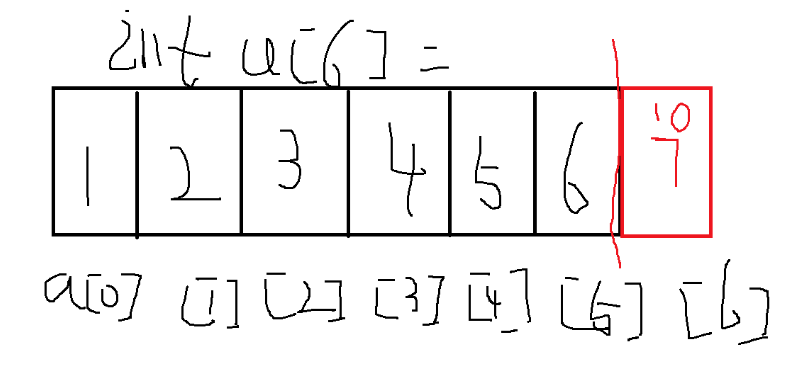
如图所示，定义一个int a[6]的数组，黑色标号的位置是可以正常访问的位置，红色位置我们是不能进行访问的，否则会造成数组越界的问题。
## 数组的特点
- 数据类型是相同的
- 内存是连续的
## 定义数组时需注意的问题
- 数组的数据类型和数组原色的数据类型一样
- 数组名要符合标识符命名规则
- 在*同一个函数*中，数组名不要与变量名相同
- 下标从0开始，到n-1结束
### 关于定义数组的一些探讨
*高版本gcc已经支持int a[];这种形式来定义变长数组，低版本gcc也可以通过int a[0];这种形式来完成变长数组使用*，**但是切记定义数组还是不能在方框里面填写变量。**
```c
#include <stdio.h>
#include <strings.h>
#include <stdlib.h>
int main()
{
    int num=5;
    int a[num]={0};
    for (size_t i = 0; i < num; i++)
    {
        printf("%d\n",a[i]);
    }
}
```
报错信息如下
```sh
test.c: In function ‘main’:
test.c:7:5: error: variable-sized object may not be initialized
     int a[num]={0};
     ^
test.c:7:17: warning: excess elements in array initializer
     int a[num]={0};
                 ^
test.c:7:17: note: (near initialization for ‘a’)
```
**但是如果你换一种写法，你就可以骗过编译器**
```c
#include <stdio.h>
#include <strings.h>
#include <stdlib.h>
int main()
{
    int num=5;
    int a[num];
    for (size_t i = 0; i < num; i++)
    {
        printf("%d\n",a[i]);
    }
}
```
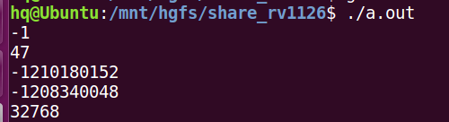
此时不会报错不会警告，由于没有初始化，所以输出的是脏数据。下一步做出大胆假设此时已经可以正常访问，但是初始化数组的方式得换一种思路
```c
#include <stdio.h>
#include <strings.h>
#include <stdlib.h>
int main()
{
    int num=5;
    int a[num];
    memset(a,0,num*sizeof(int));
    for (size_t i = 0; i < num; i++)
    {
        printf("%d\n",a[i]);
    }
}
```
**成功运行，效果如下**
```sh
hq@Ubuntu:/mnt/hgfs/share_rv1126$ gcc test.c 
test.c: In function ‘main’:
test.c:8:5: warning: implicit declaration of function ‘memset’ [-Wimplicit-function-declaration]
     memset(a,0,num*sizeof(int));
     ^
test.c:8:5: warning: incompatible implicit declaration of built-in function ‘memset’
test.c:8:5: note: include ‘<string.h>’ or provide a declaration of ‘memset’
hq@Ubuntu:/mnt/hgfs/share_rv1126$ ./a.out 
0
0
0
0
0
```
*用循环单独赋值也是可以通过*
```c
#include <stdio.h>
#include <strings.h>
#include <stdlib.h>
int main()
{
    int num=5;
    int a[num];
    for (size_t i = 0; i < num; i++)
    {
        printf("请输入数字\n");
        scanf("%d",&a[i]);
    }
    for (size_t i = 0; i < num; i++)
    {
        printf("%d\n",a[i]);
    }
}
```
*成功运行，效果如下*
```sh
hq@Ubuntu:/mnt/hgfs/share_rv1126$ gcc test.c 
hq@Ubuntu:/mnt/hgfs/share_rv1126$ ./a.out 
请输入数字
1
请输入数字
2
请输入数字
3
请输入数字
4
请输入数字
5
1
2
3
4
5
```
**尝试利用const**
```c
#include <stdio.h>
#include <strings.h>
#include <stdlib.h>
int main()
{
    const int num=5;
    int a[num]={0};
    for (size_t i = 0; i < num; i++)
    {
        printf("%d\n",a[i]);
    }
}
```
不行，直接报错，log显示gcc不认为num是个常量
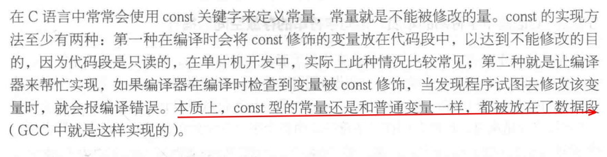
*但是在定义数组的同时不进行初始化就不会报错*
```c
#include <stdio.h>
#include <strings.h>
#include <stdlib.h>
int main()
{
    const int num=5;
    int a[num];
    for (size_t i = 0; i < num; i++)
    {
        scanf("%d",&a[i]);
    }
    for (size_t i = 0; i < num; i++)
    {
        printf("%d\n",a[i]);
    }
}
```
**利用宏定义也可以代替数组元素个数**
```c
#include <stdio.h>
#include <strings.h>
#include <stdlib.h>
#define num 5
int main()
{
    int a[num]={};
    for (size_t i = 0; i < num; i++)
    {
        printf("%d\n",a[i]);
    }
}
```
效果如下
```sh
hq@Ubuntu:/mnt/hgfs/share_rv1126$ gcc test.c 
hq@Ubuntu:/mnt/hgfs/share_rv1126$ ./a.out 
0
0
0
0
0
```
## 数组的分类
### 一维数组
概念：只有一个下标的数组
- 1.格式：存储类型		数据类型		数组名[元素个数]
- 2.访问元素：数组名[下标]，下标从 0 开始
- 3.数组名：数组首地址
- 4.初始化：可以在定义的同时进行赋值
#### 初始化的三种方式
**1. 全部初始化**
```c
    // 分别放上第一个元素到最后一个元素全部的数值
    int arr[5] = {1,2,3,4,5};
```
**2. 部分初始化,未初始化部分元素值为 0**
```c
    int arr[5] = {1,2};
```
**3. 未初始化： 每个元素都是随机值**
```c
    int arr[5];
    arr[0] = 1;  // 其他位置的值依然是随机值,

```
#### 定义空数组
**1 全部初始化**
```c
int arr[5] = {0,0,0,0,0};
```
**2 部分初始化**
```c
int arr[5] = {0};
```
**3 只写括号**
```c
int arr[5] = {};
```
这三种方式都可以定义一个空数组

**疑问：数组大小为什么不考虑内存对齐呢？**
### 二维数组
格式 
存储类型   数据类型    数组名[行数][列数]
#### 二维数组的数组名
```c
int arr[2][3];
```
**arr：第一行的首地址，arr+1：第二行的首地址**
#### 二维数组初始化
```c
1)全部初始化：
    // 顺序赋值
    int a[2][3] = {1,2,3,4,5,6}; 
    printf("%d %d %d", a[0][0], a[0][1], a[0][2]);
    printf("%d %d %d", a[1][0], a[1][1], a[1][2]);
    //按行赋值
    int a[2][3] = {{1,2,3}, {4,5,6}};

2)部分初始化：未赋值的元素值为0
    // 顺序赋值
    int a[2][3]={1,2,3};
    // 按行赋值
    int a[2][3] = {{1,2}, {4,5}};
    
3. 未初始化：随机值，需要在后续代码中单独赋值（重点注意）
    int a[2][3];
```
#### 二维数组大小
两种计算方式：
- 二维数组大小 = 数据类型大小 * 行数*列数
- sizeof(数组名)
#### 二维数组的内存空间分布
**本质上来说，二维数组和一维数组一样都是在内存空间中连续分布，二维数组的访问和定义方式也没有比一维数组高，用二维数组仅仅是便于组织数据**
下图是示意图
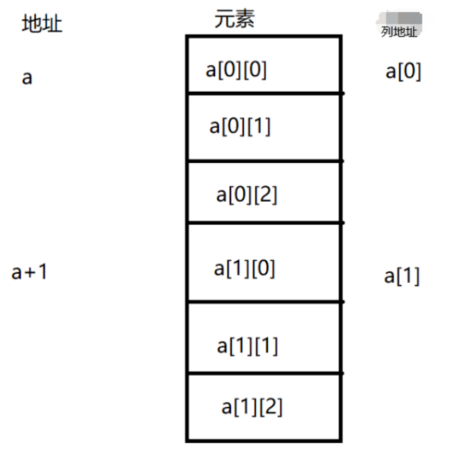
- a表示 第一行的地址
- a+1 表示 第二行的地址
- a[0] 表示第一行第一列的地址
- a[1] 表示第二行第一列的地址
*老实说我觉得这张图并不能清晰反映出二维数组的特点，这是老师画的版本做一个备份*

#### 访问二维数组(重点)
数组名[行下标][列下标]，下标从0开始，注意这两个下标都不能越界
**定义的时候行数可以省略，列数不能省略（访问的时候这条原则不适用）**
**暂时测试出8种方法，指针的各类变体能写出更多的方法**
```c
#include <stdio.h>
#include <strings.h>
#include <stdlib.h>
int main()
{
    int a[2][3]={1,2,3,4,5,6};
/////////////////////////////////////////////////////////////////
    for (size_t i = 0; i < 2; i++)
    {
        for (size_t j = 0; j < 3; j++)
        {
            printf("%d\t",a[i][j]);
        }
        printf("\n");
    }
///////////////////////////////////////////////////////////////////
    int (*p)[3]=&a[0]; //首先这是个指针，其次它指向数组
    for (size_t i = 0; i < 6; i++)
    {
       printf("%d\n",*((*p)+i)); 
    }
////////////////////////////////////////////////////////////////////
    for (size_t i = 0; i < 6; i++)
    {
       printf("%d\n",*(a[0]+i)); 
    }
////////////////////////////////////////////////////////////////////  
    for (size_t i = 0; i < 6; i++)
    {
       printf("%d\n",*(*(a+0)+i)); 
    }
////////////////////////////////////////////////////////////////////
    int (*p)[3]=a; //首先这是个指针，其次它指向数组
    for (size_t i = 0; i < 6; i++)
    {
       printf("%d\n",*((*p)+i)); 
    }
////////////////////////////////////////////////////////////////////
    int (*p)[3]=&(a[0][0]); //首先这是个指针，其次它指向数组
    for (size_t i = 0; i < 6; i++)
    {
       printf("%d\n",*((*p)+i)); 
    }
//////////////////////////////////////////////////////////////////
    int *x=&(a[0][0]);
    int (*p)[3]=&(*x); //首先这是个指针，其次它指向数组
    for (size_t i = 0; i < 6; i++)
    {
       printf("%d\n",*((*p)+i)); 
    }
/////////////////////////////////////////////////////////////////
    int *p[2]={&a[0],&a[1]};
    for (size_t i = 0; i < 3; i++)
    {
       printf("%d\n",*(p[0]+i)); 
    }
///////////////////////////////////////////////////////////////
}
```
```c
#include <stdio.h>
#include <string.h>
#include <stdlib.h>
int main()
{
    int a[2][3]={{1,2,3},{7,8,9}};
    int *p;
    printf("第一个元素是%d\n",a[0][0]);
    printf("第二行第一个元素是%d\n",*(*(a+1)));
    printf("第二行第一个元素是%d\n",*(&a[0][0]+3));
    printf("第二行第一个元素是%d\n",*(a[0]+3));
    printf("第二行第一个元素是%d\n",*((a[0]+3)));
    printf("第二行第一个元素是%d\n",*(*(&a[0]+1))+0);

    printf("第二行第二个元素是%d\n",*(*(&a[0]+1))+1);
}
```

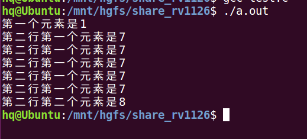
```c
int main()
{
    int a[2][3] = {1,22,33,44,55,66};
    int *p=NULL;//a=&a[0]=&&a[0][0]
    printf("a is        %p\n",a);
    printf("a[0] is     %p\n",a[0]);
    printf("&a[0] is    %p\n",&a[0]);
    printf("&a[0][0] is %p\n",&a[0][0]);
    printf(" *(a+0) is  %p\n",*(a+0));
}
```
```c
int main()
{
    int a[2][3]={11,22,33,44,55,66};
    int *p_normal=a;//编译器此处检查严格，尽管a=&a[0],&a[0]+1会偏移一行，但是你定义为普通指针，编译器就会按照步长为一个元素来处理，不会移动一行
    printf("用普通指针访问%d\n",*(p_normal+5));
    printf("普通指针移动的步长为一个元素,而不是移动一行%d\n",*((p_normal+1)+2));//此时只会输出44
    //不通过指针， a=&a[0],&a[0]+1会偏移一行 编译器会这么处理，这就是为什么sizeof(a)等于数组的大小
    printf("用数组名直接操作地址%d\n",*(*(a+1)+2));

    int (*p)[3]=&a[0];//这种写法，编译器才会认为指针指向的是一个一维数组，此时的步长是一维数组的长度
    printf("用数组指针访问%d\n",*(*(p+1)+2));
    //通过指针是间接访问，编译器内部也会进行类型检查来设置步长等，
    //综上所述 指针哪怕指向数组，此时数组名和指针也不能混为一谈
}
```
**下面是个人的理解（老师说这么理解可以）**

    个人理解：二维数组的数组名a表示首元素的地址，a等同于&a[0]
    a[0]是表示第一行，同时也是一个数组名，表示第一行的地址也表示第一行第一个元素
    的地址，a[0]=&a[0][0],综上所述a等同于&&a[0][0]

    目的：利用a[0]偏移一行数据元素的长度来访问第二行的数据，
    &a[0]相当于指向第一行的指针，然后加1，相当于指向第二行的指针，然后
    对这个指向第二行的地址取*，此时用户指向的不是整个第二行数组，而是指向第二行
    的第一个元素，此时再偏移，再进行*就和一维数组一样了

    根据《C和指针》中的理论，当a前面有&操作符时，
    编译器将会把a对应符号表中的地址看作指向数组的指针，
    此时sizeof（a）返回整个数组的长度

    a+1:数组元素的移动：首地址 + 一个数组元素的大小 
    &a+1: 其实加的整个数组大小：首地址 + 数组长度*数组元素大小 
## 清零函数
这类函数可以批量操作数组元素
### bzero
```c
#include <strings.h>
void bzero(void *s, size_t n);
```
功能：将内存空间设置为0
参数：s:要清空的空间的地址
    n: 字节大小
返回值：无
```c
//示例
#include <stdio.h>
#include <strings.h>
#include <stdlib.h>
int a[5] = {1,2,3,4,5};

int main(void)
{
    bzero(a,sizeof(a));
    for (size_t i = 0; i < 5; i++)
    {
        printf("%d\n",a[i]);
    }
    
}
```
运行现象
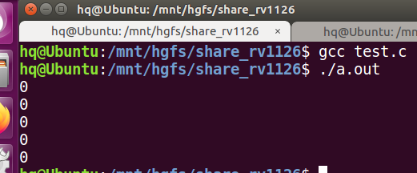
### memset
```c
#include <string.h>
    void *memset(void *s, int c, size_t n);
```
功能：将内存空间设置为0
参数：s：要清空的空间的地址
    c：要设置的值，设置为 0  -1;
    n：字节大小
```c
//示例
#include <stdio.h>
#include <strings.h>
#include <stdlib.h>
int a[5] = {1,2,3,4,5};
int main(void)
{
    memset(a, 0, sizeof(a));
    printf("这是 memset\n");
    for (size_t i = 0; i < 5; i++)
    {
        printf("%d\n", a[i]);
    }

}
```
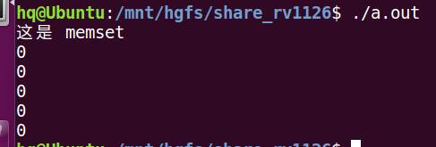
**注意：尽管该函数可以批量复制别的值，但是该函数最稳妥的用法是给字符数组赋值'\0',给int数组赋值0，因为这个函数的底层工作机制不一样**
下图是glibc的函数讲解
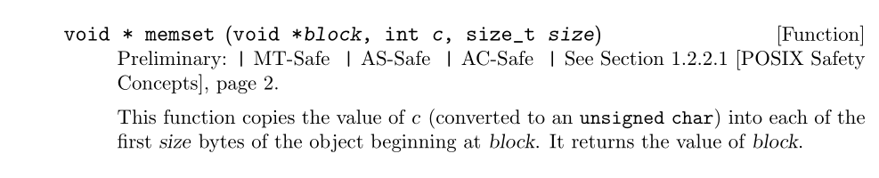
**一个整型数组的每个元素在32位系统中所占空间为4个字节，该函数进行赋值的时候会把数据元素的从右到左的字节，按位操作，例如下面的示例**
```c
#include <stdio.h>
#include <strings.h>
#include <stdlib.h>
int a[5] = {1,2,3,4,5};
int main(void)
{
    memset(a,7, sizeof(a));
    printf("这是 memset\n");
    for (size_t i = 0; i < 5; i++)
    {
        printf("%d\n", a[i]);
    }

}
```
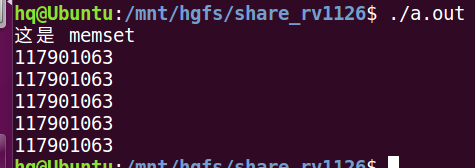
我们预想的效果是每一个数据元素都被赋值为7，但是实际上每个数据元素的数都很大，
**注意这个很大的数不是随机数，而是函数正确操作的结果**
```c
#include <stdio.h>
#include <strings.h>
#include <stdlib.h>
int a[5] = {1,2,3,4,5};
int main(void)
{
    memset(a,7, sizeof(a));
    printf("这是 memset\n");
    for (size_t i = 0; i < 5; i++)
    {
        printf("%x\n", a[i]);
    }
}
```
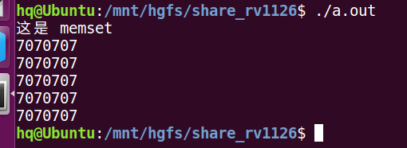
这是以十六进制输出的现象,最高位把0省略了，其实现在每个元素都是
0x07070707一共4个字节，07就代表8位一个字节，这个函数执行之后，会把每个字节从最低位开始以二进制的形式修改为你输入的值。
**验证一下这个推测**
```c
#include <stdio.h>
#include <strings.h>
#include <stdlib.h>
int a[5] = {1,2,3,4,5};
int main(void)
{
    memset(a,17, sizeof(a));
    printf("这是 memset\n");
    for (size_t i = 0; i < 5; i++)
    {
        printf("%x\n", a[i]);
    }
}
```
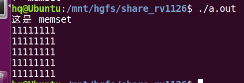
*分析*：11就是8位代表一个字节，转换为2进制就是00010001，也就是17，符合推测
## 字符数组
字符数组存放字符串

1. 概念：元素的数据类型为字符型的数组
2. 形式：
```c
    char a[] = {'h', 'e', 'l', 'l', 'o'};
    
    char b[] = {"world"}; // 字符串结尾默认有一个 \0 也算字符
    sizeof(b) // 6
    
    char c[] = "hello";
    
    char c[32] = "hello";
    sizeof(c) // 32
```
注意：字符串赋值常常会省略数组的长度，需要注意数组越界问题
### 字符数组的输入
```c
char str[32] = {};
1. scanf("%s", str);
char str[32] = {};
    scanf("%s", str);
    printf("%s\n", str);
    
输入的字符串不能还有空格，因为 scanf 输入字符串遇到空格或者 \n 都会认为字符串输入结束，空格后面的内容就不能在存放在数组里面

如果需要输入空格按以下格式输入：
scanf("%[^\n]", str); // 直到遇到 \n 才结束

2. for(i = 0; i<32; i++)
{
    scanf("%c", &a[i]);
}

3. gets
char *gets(char *s);

功能：从终端获取字符串
参数：s：目标字符串的首地址
返回值：目标字符数组的首地址

char str[32] = {};
    gets(str);    printf("%s\n", str);
    return 0;
```

### C语言定义字符串的其他形式
有时候这种定义字符串的形式上不灵活，由于数组本质上就是利用指针开辟的内存空间，所以还有一些变体来完成。
**1 直接利用指针**
```c
#include <stdio.h>
#include <strings.h>
#include <stdlib.h>
char *p="hello world";
int main(void)
{
        printf("%s\n", p);
}
```
*现象*
```sh
hello world
```
**但是这种写法也是有弊端的，你初始化之后是不能再对它进行修改的（进行修改直接段错误），因为编译器会把“hello world”这个字符串分配在代码段，也就是说这个是常量字符串，不是变量字符串**
_注意下面这种情况_
尽管不能对这个字符串修改，但是可以再定义一个指针（**名字可以一样**）
```c
#include <stdio.h>
#include <strings.h>
#include <stdlib.h>
char *p="hello world";
int main(void)
{
    printf("%s\n", p);
    char *p="竟然真的能用";
    printf("%s\n", p);
}
```
现象如下图所示
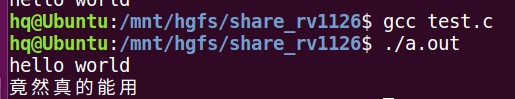
**2 利用数组指针**
```c
#include <stdio.h>
#include <strings.h>
#include <stdlib.h>
int main()
{
    char *test[]={"hello","world"};
    //为了方便理解可以写为下面这样，效果一样
    //char *(test[])={"test","one"};
    printf("%s\n",test[1]);

}//上述代码执行之后会输出world字符串
```
也能类似二维数组的形式进行访问单个字符
```c
#include <stdio.h>
#include <strings.h>
#include <stdlib.h>
int main()
{
    char *test[]={"hello","world"};
    printf("%c\n",*(test[0]+1));

}//上述代码执行后输出e这一个字符
```
**分析**：test[]是一个指针数组，里面有两个元素，每个元素都指向一个字符串常量，和之前说的一样，此处初始化之后也是不能修改字符串内容
#### 字符串和字符串数组的区别
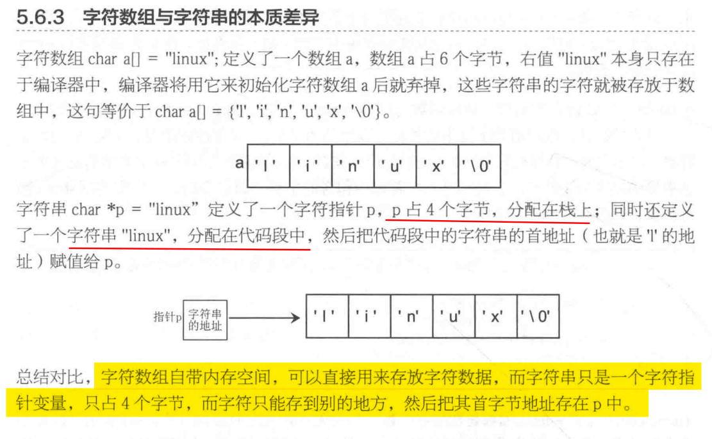
### 字符数组的输出
```c
1. prinf("%s\n", str);

2. for(int i = 0; i < 32; i++)
    printf("%c", s[i]);
    
3. puts
int puts(const char *s);
功能：向终端输出字符串
参数：s：要输出字符数组的首地址
返回值：输出字符的个数

char str[10] = "hello";
    int ch = puts(str);
    printf("%d\n", ch);
```
### 字符数组小练习
判断下面初始化字符数组的语句对错
```c
char s[10] = {};

s[10] = "hello"; // 错 S[10]是一个具体元素，直接赋值字符串造成越界，
s = "hello"; // 错 S是数组名代表地址常量
strlen(s);  // 对
```
### 计算字符串的实际长度
```c
1. for 循环遍历数组，直到 \0 为止
for (i = 0; str[i] != '\0'; i++)

2. strlen
#include <string.h>
       size_t strlen(const char *s);
功能：计算字符串的实际长度(不包括 \0)
参数：s：要计算的字符串的首地址
返回值：字符串的长度

char str[] = "hello";
    int num = strlen(str); // 5
    int sum = sizeof(str); // 6
    int a = printf("%s\n", str); // 6
    printf("%d %d %d\n", num, sum, a);
```
### sizeof和strlen的区别
```c
// 从本质上看
1. sizeof 是关键字，strlen是函数
// 从功能
2. sizeof是计算数据所占空间的大小，strlen计算字符串的实际长度
3. sizeof 计算包含 \0，strlen计算不包含 \0 
    sizeof计算的前提是 元素个数省略的情况下，sizeof比strlen大1
```
*sizeof当你数组省略元素个数的时候，sizeof会多算一个反斜杠0使长度加1，当元素个数不省略的时候，和strlen一样不会多算长度*（**此处有些不严谨需要在测试一下**）
### 判断字符数组长度问题
尽管可以借助strlen函数来计算有效字符串的长度，但是由于C语言的转义字符机制，导致
经常混淆错误。
```c
int main()
{
    char str[]=" ";//输入一个空格
    printf("长度是%d\n",strlen(str));
    printf("所占空间大小是%d\n",sizeof(str));
}
```
上述代码的执行结果
```sh
长度是1
所占空间大小是2
```
因为这种初始化方式是编译器会认为你把一个字符串塞进数组里，数组末尾会插入反斜杠0
计算空间会计入这个字符，计算长度不会计算这个字符。
**下面这种情况需要注意**
```c
int main()
{
    char str[]="\ \\";//输入一个反斜杠空格
    printf("长度是%d\n",strlen(str));
    printf("所占空间大小是%d\n",sizeof(str));
}
```
上述代码的执行结果
```sh
长度是2
所占空间大小是3
```
**分析**:C语言内部识别转义字符就是靠这个反斜杠标志，遇到反斜杠会把反斜杠和它后面的那个字符，看作一个整体的转义字符，并把它认为的这个转义字符分配一个字符的内存空间，就是算作一个字符。反斜杠空格当作一个字符，两个反斜杠也会认为一个转义字符，所以长度是2，空间是3
# 冒泡排序
两两比较，第i个和第i+1个比较,下一次轮比上一次少一次
```c
#include <stdio.h>
#include <strings.h>
#include <stdlib.h>
int main()
{
    int a[5]={};
    for (size_t i = 0; i < 5; i++)
    {
        printf("请输入数\n");
        scanf("%d",&a[i]);
    }
     printf("开始排序\n");
    for (size_t i = 0; i < 5-1; i++)
    {
        for (size_t j = 0; j <4-i; j++)
        {
            if (a[j]>a[j+1])
            {
                a[j]^=a[j+1];
                a[j+1]^=a[j];
                a[j]^=a[j+1];
            }
        }
        
    }
    for (size_t i = 0; i < 5; i++)
    {
        printf("%d\n",a[i]);
    }
}
```
**如果有n个数进行比较，则需要比较n-1轮 ，每轮交换的次数从n-1开始依次递减**
# 选择排序
n个数，先找到最小值的下标暂存选择出最小的值与第一个值交换
```c
#include <stdio.h>
#include <strings.h>
#include <stdlib.h>
void swap(int *a,int *b) //交換兩個變數
{
    int temp = *a;
    *a = *b;
    *b = temp;
}
void selection_sort(int arr[], int len)
{
    int i,j;

        for (i = 0 ; i < len - 1 ; i++)
    {
                int min = i;
                for (j = i + 1; j < len; j++)     //走訪未排序的元素
                        if (arr[j] < arr[min])    //找到目前最小值
                                min = j;    //紀錄最小值
                swap(&arr[min], &arr[i]);    //做交換
        }
}
int main()
{
    int len=5;
    int a[5]={1,233,7,666,0};
    selection_sort(a,5);
    for (size_t i = 0; i < len; i++)
    {
        printf("%d\n",a[i]);
    }
}
```
# 指针
**相关概念：**
地址：内存中每个字节单位都有一个编号
指针：指针就是地址
指针变量：用于存放地址的变量就叫做指针变量
## 指针的优点
- 1.使程序更简洁、紧凑、高效
- 2.有效的表达更复杂的数据结构
- 3.动态分配内存
- 4.得到多于一个数的函数返回值
## 指针操作符
&: 取地址符，取变量的地址
*：取内容，取地址里面的内容
## 如何定义一个普通指针
```c
存储类型        数据类型    *指针变量名
                int *p
int a = 5;
    int *p = &a;
    char b = 'v';
    char *q = &b;
    printf("%p\n", p);
    printf("%p\n", q);
```
## 给普通指针初始化
指针变量在使用时不仅要定义，最好也初始化
**未初始化的指针变量不能随便使用，会产生野指针**
```c
1. 将普通变量的地址赋值给指针变量
    int a = 10;
    1）int *p = &a; // 定义的同时赋值
    
    2) int *p = NULL;
        p = &a; // 先定义后赋值
        
        int a = 10;
        int *p = NULL;
        p = &a;
        printf("%d %d\n", a, *p); // 10 10
        printf("%p %p\n", &a, p); // 打印的都是变量a地址
        *p = 3;
        printf("%d %d\n", a, *p); // 3 3
        printf("%p %p\n", &a, p); // 打印的地址没有发生改变
    
    2. 将数组的首地址赋值给指针变量
        char s[10] = "hello";
        char *p = s; //指针指向数组的首地址，即指向字符 'h'
        
    3. 将指针变量里面保存的地址赋值给另一个指针变量
        float a = 1.3;
        float *p = &a;
        float *q = p;
```
## 指针的运算
### 算数运算
**指向不同类型的数组指针间的算数运算没有意义，指向不同区域的指针算数运算也没有意义，所以一般用在同一个数组间的运算**
```c
char s[32] = "hello";
    char *p = s;
    p++; // 它现在指向了 e 
```

p++; // 指针向高地址方向移动一个数据单位，指针指向发生变化
p--; // 指针向低地址方向移动一个数据单位，指针指向发生变化
*因为加加减减运算符最后会进行赋值运算，等价于p++=>p=p+1*
**特别注意如果不要对数组名进行加加减减运算**
```c
int main()
{
    int a[10]={};
    for (size_t i = 0; i < 10;i++)
    {
        printf("%d",a++);
    }
}//上述代码会直接报错
//因为数组名是个地址常量，是不能对他进行修改的
```
*可以通过下面这种方式来用*
```c
int main()
{
    int a[10]={};
    for (size_t i = 0; i < 10;i++)
    {
        printf("%d",*(a+i));
    } 
}
```

```c
int *p; p++; // 移动 4 字节
double *p; p++ // 移动 8 字节
//每加1就是移动一个数据元素大小的长度
```
p+n：访问高地址方向第 n 个数据的地址，指针指向不发生变化
p-n：访问低地址方向第 n 个数据的地址，指针指向不发生变化

// p 到 p+5 之间相隔了多少个地址
sizeof(数据类型) * n = 偏移了多少字节(地址)
```c
int arr[32] = {1,2,3,4};
    int *p = arr;
    int num;
    p = p+3;
    int *q = arr;
    printf("%d\n", p-q);
```

两个地址之间的差 = 两个地址之间相差元素的个数
p-q = 之间相差元素的个数
```c
    int m = 100;
    double n = 200;
    int *p1 = NULL, *p2 = NULL;
    double *p1 = NULL, *p2 = NULL;

    p1 = &n;
    p2 = p1 + 2;
    printf("p1=%p p2=%p\n", p1, p2);
    printf("p2-p1=%d\n", p2-p1); // 2
```
### 关系运算
指针之间关系运算比较的是它指向地址的高低
__指向高地址的指针大于指向低地址的指针__
```c
int main()
{
    char s[10] = "hello";
    char *p1 = &s[1];
    char *p2 = &s[3];
    if(p1 < p2)
    {
        printf("p2大\n");
    }
    else
    {
        printf("p1大\n");
    }
}
```
**指向不同类型的数组指针间的关系运算没有意义，指向不同区域的指针关系运算也没有意义，所以一般用在同一个数组间比较**
## 指针的大小
**操作系统为32位，这个32位是什么含义？**
    表示单次运算可以处理最大数据的位数
**总结**：在32位操作系统中，无论是什么类型的指针，哪怕这个指针是指向NULL。他的大小也是**4字节**，可以由8位（4*8=32）16进制数表示。
在64位操作系统中，指针大小为**8字节**，可以有16位（4*16=64）16进制数表示。
**重要知识点**
- 32位操作系统，指针大小为4字节，64位操作系统，指针大小为8字节
- 内存地址是固定的，但是变量的地址不固定（栈区变量随机分配）
- 指针类型是根据指针指向空间内的数据类型来确定的
## 变量在内存中如何分配（重要）

## 段错误
报错信息如下所示就是指发生段错误
```sh
Segmentation fault (core dumped)
```
*产生段错误之后可以利用生成的core dumped(核心转储文件)来进行问题复现和调试*
### 导致段错误的原因
- 野指针导致访问非法地址
- 直接访问非法地址(详情见下面的示例)
- 内存泄漏：对非法空间进行赋值
- 数组越界
- 按字符串类型输出时没有传入地址(详情见下面的示例)

**直接访问非法地址**
下面只是举个例子，有机会查查那些内存地址已经默认是非法地址了
```c
int main()
{
    int *p=NULL;
    printf("%d\n",*p);
}//上述代码可以通过编译，但是执行后直接显示段错误
//NULL空指针所指向的内存0地址，不是能随便访问的，对普通的应用程序来说
//内存0地址就是一个非法地址
```
**按字符串类型输出时没有传入地址**
```c
int main()
{
    char a[10]="fuck test";
    printf("%s\n",a[5]);//此处没有传入地址 
    //直接报错 段错误
}
```
*但是这样写，传入地址就正常了*
```c
int main()
{
    char a[10]="fuck test";
    printf("%s\n",&a[5]);
//上述代码执行后输出test
}
```
## 指针修饰
### const常量化
```c
1. const 常量化
    1）修饰普通变量
        const int a = 10;
        // const int a = 10;
        int const a = 10;
        // a=30; // 错
        // a++;
        int *p = &a; // 这样可以，因为 const 没有修饰 *p，修饰的是 a
        *p = 20;
        // float b = (float)a;
        printf("%d\n", a);
        // printf("%f\n", b);
    2）修饰指针指向的内容
    也就是修饰 *p，此时指针指向的内容不能改变，但是指向可以改变
    const int *p;
    int const *p;

    int a = 10;
    int b = 30;
    int const *p = &a;
    const int *q = &b;
    printf("%d %d\n", a, b);
    // *p = 1; // *p 只读不可以被更改
    // *q = 3; // *q 只读不可以被更改
    p = q;
    printf("%d %d\n", *p, *q);

    3）修饰指针指向
        int *const p;
        此时 const 修饰 p，指针指向不能被改变，但是指向的内容可以被更改
        
        int a = 10;
        int b = 20;
        int *const p = &a;
        int *const q = &b;
        printf("%d\n", *p);
        *p = 20;
        printf("%d\n", *p);
        p = q;
2. void(这部分讲解我觉得没啥用)
    void a; // 不允许修饰变量
    int a = 100;
    void *p = &a;  // p 是一个任意类型的指针
    int *q = (int *)p;
    printf("%d %d\n", *(int *)p, *q);
    
    使用场景：函数参数或返回值
    注意通过 void 类型指针进行取内容时，需要对地址进行强转
    
    void *p = NULL;
    int a = 10;
    (int *)p =
         &a; // 错误 (int *)p 为右值  
    printf("%d\n", *(int *)p);
    
    现用现转，或者转换之后赋值给另外一个变量然后应用另外一个变量
```
*重点记忆*
- int const *p p所指向的空间是常量，里面的内容不能被修改
- int * const p p变量本身不能被修改（p初始化完成后不能被指向别的变量），p所指向的空间内容可以被修改
- int const *const p; 都不能被修改
## 指针和数组
直接访问：按变量的地址存取变量的值(通过数组名访问)
间接访问：通过存放变量地址的变量去访问变量(通过指针访问)
### 指针和一维数组
```c
nt a[5] = {1,2,3,4,5};
    int *p = a;
    printf("%p %p %p\n", a, a+1, a+2);
    printf("%p %p %p\n", p, p+1, p+2);
    printf("%d %d\n", a[1], *(a+1));
```
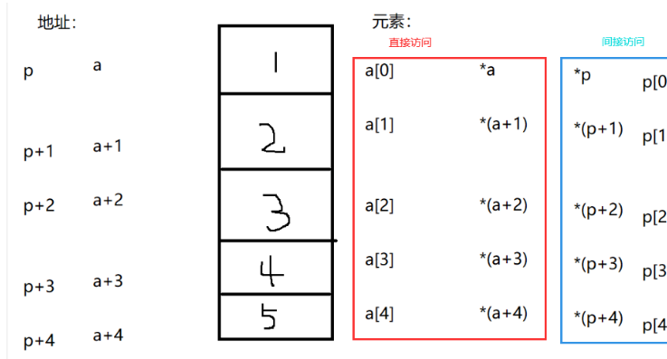
```c
a和p本质上不同，a是地址常量，p是变量，a不能执行 ++ 操作，但是 p 可以

访问数组元素 a[i] 的值；
直接访问：a[i]  *(a+i)
间接访问：p[i]  *(p+1)

访问数组元素 a[i] 的地址；
直接访问：&a[i]    a+i
间接访问：&p[i]    p+i
```
**重要知识点**
```c
int a[3] = {1,2,3};
int *p = a;
printf("%d\n", *p++); // 1
printf("%d\n", *p++); // 2
printf("%d\n", *a++); // 报错

运算方法：
    1）++ 和 * 都是单目运算符，优先级相同
    2）单目运算符从右向左运算
    
    *(p++) // 1    先取值，再移动
    (*p)++ // 同上    但是第一个实际上变成了2

    ++*p // 打印出来 2， 1自加完之后的值
    ++(*p) // 同上

    *++p // 先移动再取值，2
    *(++p) // 同上
```
### 指针和二维数组(重要)
```c
int a[2][3] = {1,2,3,4,5,6}; // a：第一行首地址，a+1：第二行的首地址

在 a 前面加 *，表示将行地址降级成为列地址

*a：第一行第一列的地址
*a+1：第一行第二列的地址
*(a+1)：第二行第一列的地址
*(a+1)+1：第二行第二列的地址

访问数组元素地址(a[i][j]的地址)
printf("%p\n",&a[i][j]);
printf("%p\n",*(a+i)+j);
printf("%p\n",a[i]+j);

访问数组元素值：
printf("%d\n", a[i][j]);
printf("%d\n", *(*(a+i)+j));
printf("%d\n", *(a[i]+j));
```
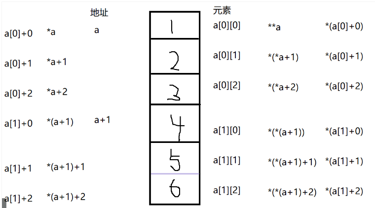
## 数组指针
*定义*：本质上是指针，指向的是数组(又称为行指针)
```c
定义格式：存储类型    数据类型   (* 指针变量名)[列数] 
int a[2][3] = {1,2,3,4,5,6};
    int (*p)[3] = a;
    for (size_t i = 0; i < 2; i++)
    {
        for (size_t j = 0; j < 3; j++)
        {
            printf("%p\n", *(p+i)+j);
            printf("%p\n", *(a+i)+j);
        }
        
    }
```
p可以代替a进行元素访问，但是本质不同
**p是一个指针变量，而a代表一个地址常量**

```c
访问数组元素地址（a[i][i]的地址）
*(p+i)+j)
p[i]+j
访问数组元素值：
*(*(p+i)+j)
*(p[i]+j)

大小
sizeof(p) // 4
因为本质上还是指针，所以大小都是4字节
```
## 指针数组
定义：所谓指针数组是指若干个具有相同存储类型和数据类型的指针变量构成的集合。
其本质是数组，里面存放的是指针
```c
定义格式：存储类型    数据类型    *数组名[元素个数]
                      int        *arr[2]
                      
应用示例：
    1) 用于存放普通变量的地址
    int a = 10,b = 20, c = 30;
    int *p[3] = {&a, &b, &c};
    
    访问b的值：
    *p[1]    *(*(p+1))    **(p+1)  
    
    访问b的地址
    printf("%p\n", p[1]);
    printf("%p\n", *(p+1));
    printf("%p\n", *p+1);

     2）用于存放二维数组的每行第一个元素的地址(列地址)
    int a[2][3] = {1,2,3,4,5,6};
    int *p[2] = {a[0], a[1]};
    
    访问a[1][2]的地址：
    printf("%p\n", p[1]+2);
    printf("%p\n", *(p+1)+2);
    
    访问a[1][2]的值：
    printf("%d\n", *(p[1]+2));
    printf("%d\n", *(*(p+1)+2));
    
    
    大小：
    printf("%d\n", sizeof(p)); // 8
    因为 p 中包含了两个指针
    
    
    3）用于存放字符串
    char *p[3] = {"hello", "world", "ikun"};
    
    打印 "world" 字符串
    printf("%s\n", p[1]);
    printf("%s\n", *(p+1));
    
    打印 "world" 中 "d" 这个字符
    printf("%c\n", *(p[1]+4)); // d
    printf("%c\n", *(*(p+1)+4)); // d
    
    4）命令行参数
    int main(int argc, char const *argv[])0
    
    argc：表示 argv 指针数组里面存储数据的个数，即命令行传递字符串的个数
    argv：就是一个指针数组，里面存放的是命令行传递的字符串
    
    int main(int argc, char const *argv[])
{
    printf("%s\n", argv[0]); // ./a.out
    // printf("%s\n", argv[1]); // 123456
    printf("%d\n", argc);  // 2
    return 0;
}
// gcc argv.c
// 我们说的命令行，就是 gcc 后即将要输入的内容
// ./a.out 123456 执行
//此时命令行参数有2个一个是./a.out 
//一个是 123456
//如果只输入一个命令行参数，但是在程序中访问了argv[1],或者超过
//一个元素，此时数组越界，造成段错误
```
# 大小端问题
*大小端也被称作字节序，面试得时候别人问得知道*
**这是个非常重要的问题，例如给单片机的一组寄存器赋值，如果大小端和你设想的不一样，就会造成不该赋值的寄存器位被赋值**
在计算机进行超过1字节数据进行存储的时候，会出现存储数据顺序不同的情况即大小端存储
## 大小端定义
- 小端：数据的低位存储在低地址，数据的高位存储在高地址，小端字序称为 LSB
- 大端：数据的低位存储在高地址，数据的高位存储在低地址，大端字序称为 MSB
## 大小端示例
```c
例：存储数据 0x12345678, 起始地址 0x4000

    0x4000    0x4001    0x4002    0x4003
小端：0x78       0x56    0x34        0x12
大端：0x12         34      56          78

小端：在低地址存放低字节数据，高地址存放高字节数据
大端：在低地址存放高字节数据，高地址存放低字节数据
```
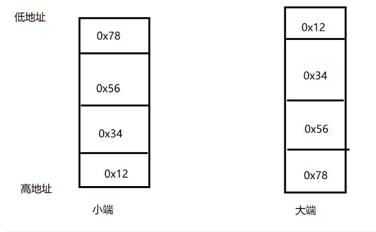
## 如何判断开发环境的大小端
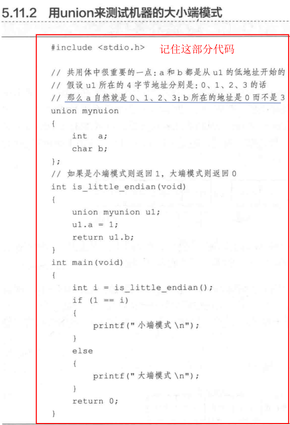
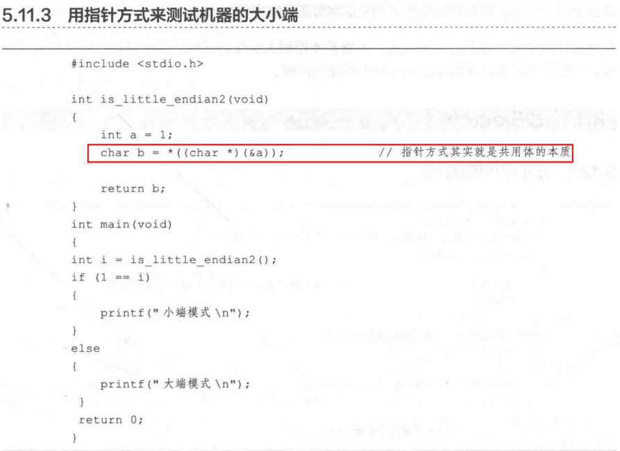
# 函数
定义：一个完成特定功能得代码模块
**函数的三要素：** 功能 参数 返回值
*格式：*
存储类型      数据类型      函数名(参数列表)
{
    函数体
}
- 没有参数：参数列表可以省略，也可以用 void
- 没有返回值：数据类型为 void，函数内部没有 return 语句
- 有返回值：要根据返回值的数据类型定义函数的数据类型
- 定义子函数时可以直接定义在主函数的上面，如果定义在主函数下面需要提前声明函数
**函数声明**
数据类型     函数名(参数列表)
**函数调用**
- 没有返回值：直接调用：函数名(填入实参)
- 有返回值：如果需要接受返回值，就要定义一个与返回值类型相同的变量接收
				如果不需要接收返回值，就直接调用函数
```c
void fun()
{
    printf("hello\n");
}

void num(int a, int b)
{
    printf("num=%d\n", a+b);
}

int num2(int a, int b)
{
    return a+b;
}

// 这样就声明了，就没有警告了
int sub(int a, int b);

int main(int argc, char const *argv[])
{
    fun();
    num(1, 2);
    int a = num2(3,4);
    printf("%d\n", a);
    int b = sub(5,6);
    printf("%d\n", b);
    return 0;
}

// 函数如果放在主函数的上面，那么这个函数还能调用
// 函数如果放在主函数的下面，会报一个警告，告诉你这个函数没有声明
// 需要再 mian 函数上边，给它声明一下
int sub(int a, int b)
{
    return a+b;
}
```
## 函数小练习
练习1：编写一个函数，函数有两个参数，第一个是一个字符，第二个是一个 char *，返回字符串中该字符的个数。
int fun(char ch, char *s)
```c
int fun(char c,char *p)
{

    //返回字符串中该字符的个数
    char temp[128]={0};
    strcpy(temp,p);
    int times=0;
    for(int i=0;i<=strlen(temp);i++)
    {
        if (temp[i]==c)
        {
            times++;
        }
        
    }
    return times;
}
int main()
{
    char test[]="sss2";
    printf("%d\n",fun('s',test));
}
```
练习2：编程实现 strlen 函数的功能，strlen 计算字符串实际长度，不包括 '\0'
```c
int my_strlen(const char *p)
{
    int len=0;
    while (*p!='\0')
    {
        len++;
        p++;
    }
    
    return len;
}
int main()
{
    char test[]="sss2";
    printf("%d\n",my_strlen(test));
}
```
## 函数传参（重点）
### 值传递
**单项传递，将实参传递给形参使用，改变形参实参不会受影响**
```c
int num2(int a, int b)
{
    ++a;
    ++b;
    return a+b;
}

int main(int argc, char const *argv[])
{    
    int a = 3, b=4;
    int c = num2(a,b);
    printf("%d %d %d\n",a, b, c);    
    return 0;
}
//执行之后，a b的值不会被真正改变
```
### 地址传递
**双向传递，在函数中改变修改形参，实参会随之变化**
```c
int sum(int *a, int *b)
{
    *a = *a + *b;
    *b = *b + 2;
    return *a+*b;
}
int main(int argc, char const *argv[])
{
    int a = 3, b=4;
    // 因为你是拿到了那块的空间，是对空间赋值，并不是拿到值
    int ret = sum(&a, &b);
    printf("%d %d %d\n",a, b, ret);
    return 0;
}
```
### 数组传递
*个人觉得这种方式没有什么实际使用价值*

__向函数中传入数组，编译器会自动让数组退化为指针__,在函数的参数列表中写为char *a[32]这么写仅仅是提醒用户这里需要输入一个数组的首地址，而不是其他普通字符或字符串的指针.
传入普通数组时，没有什么值得注意的地方，**重点关注传入常量字符串的不同情况**
**第一种情况**
```c
char *str(char a[32])
{
    a = "hello";
    printf("%s\n", a);
    return a;
}
int main(int argc, char const *argv[])
{
    char *ch = str("abc");
    printf("%s\n", ch);
    return 0;
}
```
//上述代码执行后输出
```sh
hello
hello
```
**前提知识**：在C语言中定义一个常量字符串，编译器会把它分成两部分，一部分是在栈区（如果是局部变量的话）的一个字符型指针，这个指针的大小有操作系统的位数决定。
**这个指针所指向的内存空间是存储在常量区的字符串本身。在常量区的数据是不能被修改的**
**分析**：尽管abc这个字符串是个存储在常量区，但是向函数传入数组的时候，会自动退化为指针。尽管在常量区的数据不能修改，但是指针的指向是可以修改的（*类似const修饰指针*）
```c
a="hello"
```
该语句其实就是让a这个指针由原来指向常量区abc变为指向hello，所以最终程序会输出hello而不是abc
**但是要注意常量区的数据是绝对不能被修改的**
```c
char *str(char a[32])
{
    *a = "hello";
    printf("%s\n", a);
    return a;
}
int main(int argc, char const *argv[])
{
    char *ch = str("abc");
    printf("%s\n", ch);
    return 0;
}//上述代码强行对常量区的内容进行修改
//导致段错误
```
**此外还需要注意如下所示传入指针误操作造成野指针的问题**
```c
char *str(char a[32])
{
    char *p=a;
    printf("%c\n", &p+1);
    return a;
}
int main(int argc, char const *argv[])
{
    char *ch = str("abc");
    printf("%s\n", ch);
    return 0;
}//上述代码强行对常量区的内容进行修改
//导致段错误
```
```c
char *str(char a[32])
{
    // *a = 's';
    // char *p=a+1;
    printf("%c\n", *(a+1));
    printf("%p\n", (a+1));
    printf("%p\n", a);
    return a;
}
int main(int argc, char const *argv[])
{
    char *ch = str("abc");
    printf("%s\n", ch);
    return 0;
}
```
### 字符数组和字符串的区别
```c
char *p = "hello";
char buf[32] = "hello";
```
p是一个指针，这个指针指向的是在常量区的一块空间，空间内部存储hello，
但是p本身并不是存储在常量区的。
buf[32]是一个数组，这个数组不是开辟在常量区的，内容是可以随便修改的。

## 函数和栈区
栈用来存储函数内部 (包含main()函数) 的变量，它是一个 FILO（First in Last Out），先进后出的结构。当一个函数运行结束后，这个函数所有在栈中的变量都会被删除，并且它们的所占的空间将会被释放。不需要手动的申请和释放
# 开辟堆区空间

## 栈区和堆区的区别
栈区：是由系统自动申请和释放，不需要我们手动申请
堆区：需要我们随时申请，由我们自己去释放的，随用随取，用完释放
## 如何开辟堆区空间
```c
// 开辟
#include <stdlib.h>
       void *malloc(size_t size);
       
功能：在堆区开辟空间
参数：size：开辟空间的大小(单位字节)返回值：
    成功：返回开辟空间的首地址
    失败：NULL;
    
#include <stdlib.h>
       void free(void *ptr);

功能：释放堆区空间
参数：ptr：堆区空间首地址
返回值：无

int *p = (int *)malloc(sizeof(int)*100);
    if(p == NULL)
    {
        printf("lost\n");
    }
    else
    {
        printf("success\n");
    }
    free(p);
    p = NULL;
    printf("%p\n",p);
    
注意：
1. 手动开辟堆区空间，要注意内存泄漏
    当指针指向开辟堆区空间后，又对指针重新赋值，则没有指针指向开辟的堆区空间，就会造成内存泄漏
2. 使用完堆区空间后及时释放空间
```
**内存泄漏示例**
```c
// 如下代码输出结果
void fun(char *p)
{
    p = (char *)malloc(32);
    strcpy(p, "hello");
}
int main()
{
    char *m = NULL;
    fun(m);
    printf("%s\n", m);
}
原因：函数执行完堆空间会被销毁，不会被保留函数内部开辟堆空间的地址，并不会保留 m 的指向，此时 m 指向空
```
**有两种方式可以避免这个问题**
```c
1. 通过返回值
char *fun() // p = NULL
{
    char *p = (char *)malloc(32);
    strcpy(p, "hello");
    strcpy(p, "hello");
    return p;
}
int main()
{
    char *m = fun();
    printf("%s\n", m);
    fun(m);
    free(m);
    m = NULL;
    return 0;
}
2. 通过传参
void fun(char **p)
{
    *p = (char *)malloc(32);
    strcpy(*p, "hello");
}

int main(int argc, char const *argv[])
{
    char *m = NULL;
    fun(&m);
    printf("%s\n", m);
    free(m);
    m = NULL;
    return 0;
}
```
# string函数族
```c
1. strcpy
#include <string.h>
       char *strcpy(char *dest, const char *src);
功能：实现字符串的复制，包括 \0
参数：char *dest：目标字符串的首地址
    const char *src：源字符串首地址
返回值：目标字符串首地址

char s[32] = "hello";
    char str[32] = "world";
    strcpy(s, str);
    printf("%s\n", s);
    // printf("%s\n", str);
    for (size_t i = 0; i < 6; i++)
    {
        复制包括 \0
        printf("%d\n", s[i]);
    }
    printf("\n");
    
char *strncpy(char *dest, const char *src, size_t n)
功能：实现字符串复制
参数：char *dest：目标字符串的首地址
    const char *src：源字符串首地址
    size_t n：字符的个数
返回值：目标字符串的首地址
char s[32] = "hello";
char str[32] = "world";
strncpy(s, str, 3);
printf("%s\n", s);

2. strlen
#include <string.h>
       size_t strlen(const char *s);
功能：计算字符串实际长度
参数：s：字符串的首地址
返回值：实际长度

3. strcat
#include <string.h>
       char *strcat(char *dest, const char *src);
功能：用于字符串拼接
参数：char *dest：目标字符串的首地址
    const char *src：源字符串首地址
返回值：目标字符串的首地址

char s[32] = "hello";
    char str[32] = "world";
    strcat(s, str);
    printf("%s\n", s);
    printf("%s\n", str);
    return 0;

char *strncat(char *dest, const char *src, size_t n);
拼接 str 的前n个 字符

4. strcmp
#include <string.h>
       int strcmp(const char *s1, const char *s2);
功能：用于字符串比较
参数：s1 s2 用于比较字符串
返回值：从字符串首个字符开始比较字符ASCII的大小，如果相等继续向后判断
    1    s1 > s2
    0    s1 == s2
    -1   s1 < s2
    
    char s[32] = "hello";
    char str[32] = "world";
    char data[] = "ikun";
    char *ss = "kunkun";
    int ret = strcmp(s, str);
    printf("%d\n", ret);

int strncmp(const char *s1, const char *s2, size_t n);
比较两个字符串前n个字符的大小
```
# 递归函数
1. 定义：自己调用自己
2. 执行过程分为两个阶段
- 1）递推阶段：从原问题，按递推公式从未知到已知，最终达到递归终止条件
- 2）回归阶段：按递归的终止条件求出结果，逆向逐步带入递归公式，回到原问题求解
*示例代码*
```c
int fun(int n)
{
    if(n == 1)
        printf("你好");
    return n*fun(n-1);
}

int main(int argc, char const *argv[])
{
    printf("%d\n", fun(5)); //输出120
    return 0;
}
```
# 结构体（重点）
1. 定义：用户自定义的数据类型，在结构体中可以包含若干不同数据类型的成员变量(也可以相同),使这些数据组合起来反应某一个信息。
2. 格式：
struct 结构体名
{
    数据类型    成员变量1;
    数据类型    成员变量2;
    数据类型    成员变量3;
    ....
}
*定义结构体示例*
```c
struct dog
{
    char name[32];
    int age;
    char eat;
}
```
## 如何定义结构体变量
1）概念：通过结构体数据类型定义的变量
2）格式    struct     结构体名    变量名
### 先定义结构体，在定义结构体变量
```c
   struct 结构体名
   {
       成员变量;
   };
   struct 结构体名 变量名;
   
   #include<stdio.h>
   struct student
   {
       int id;
       int age;
       float score;
   } stu1; // 这个是全局的

   int main(int argc, char const *argv[])
   {
       struct student stu;
       return 0;
   }  
```
### 定义结构体的同时，定义结构体变量
```c
  struct 结构体名
  {
      成员变量;
  }变量名;
  
  #include<stdio.h>
  struct student
  {
      int id;
      int age;
      float score;
  } stu1; // 这个是全局的
```
### 缺省结构体名定义结构体变量
这种用的比较少，毕竟不方便后续使用
```c
  struct
  {
      成员变量;
  }变量名;
```
## 如何给结构体赋值

### 定义变量时直接用大括号赋值
```c
    struct student
    {
        int id;
        int age;
        float score;
        char name[32];
    };
    struct student stu = {1,21,60,"jinqi"};
```
### 定义变量时未初始化，然后对变量单独赋值
```c
    struct student
    {
        int id;
        int age;
        float score;
        char name[32];
    };
    struct student stu;
    stu.id = 2;
    stu.age = 18;
    stu.score = 80;
    stu.name = "zhangsan";
```
### 点等法赋值
```c
    struct student
    {
        int id;
        int age;
        float score;
        char name[32];
    };
    struct student stu = {
        .id = 3,
        .score = 70;
        .age = 20;
        .name = "lisi";
    };
```
## 访问结构体
通过 .访问：结构体变量名.成员变量名
scanf("%d %d %f %s", &stu1.id, &stu1.age, &stu1.score, stu1.name);
printf("%d %d %.1f %s\n", stu1.id, stu1.age, stu1.score, stu1.name);
## 结构体重定义
### 定义结构体的同时重定义
```c
    typedef struct student
    {
        int id;
        int age;
        float score;
    }STU;
    struct student stu;   ===  STU stu;
```
### 先定义结构体，然后重定义
```c
     struct student
    {
        int id;
        int age;
        float score;
    };
    typedef struct student STU;
    STU stu;
```
例：
```c
    struct student
    {
        int id;
        int age;
        float score;
    };
    typedef struct student STU;

    int main(int argc, char const *argv[])
    {
        STU stu = {1, 20, 60.5};
        printf("%d %d %.1f\n", stu.id, stu.age, stu.score);
        return 0;
    }
``` 
# 共用体union
共用体有时候也叫联合体，用法类似结构体，区别在于结构体所占内存的大小等于所有成员所占内存的总和，而共用体使用了内存覆盖技术，同一时刻只能保存一个成员的值，如果对成员赋新值，就**会把原来成员的值覆盖掉**
也就是说共用体成员共用一块内存区域，每次赋值只保留一个成员的值。

## 定义格式
union 共用体名
{
	成员列表；
}；
**定义共用体union变量**
```c
#include <stdio.h>
union val {
    int a;
    int b;
    char ch;
};
int main(int argc, char const *argv[])
{
    union val v;
    v.a = 10;
    printf("%d %d %d\n", v.a,v.b, v.ch);  //10 10 10
    v.ch = 66;
    printf("%d %d %d\n", v.a,v.b, v.ch);  //66 66 66
    return 0;
}
```
得出共用体变量公用一块空间

## 特性
- 共用体成员共用一块空间
- 赋值顺序以最后一次赋值为准
- 共用体的大小为成员种类型最大的数据大小
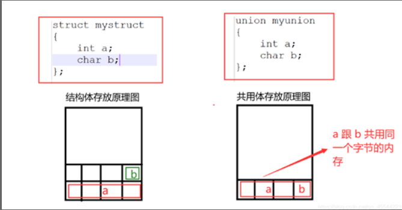
# 枚举
## 定义格式
```c
enum 枚举名
{
	value1,
	value2,
	value3,
	等等
};
```
未赋初值时，第一个常数默认为0，然后后面的常数值是依次加一。 可以给每个元素都赋值，如果有元素没有被赋值默认为上一个元素的值加一。
**示例**
```c
#include <stdio.h>
enum week
{
    MON=1,
    THES,
    WED
};

int main(int argc, char const *argv[])
{
    printf("MON=%d\n",MON);
    printf("THES=%d\n",THES);
    printf("WED=%d\n",WED);
    return 0;
}
```
# 结构体数组
概念：本质上是数组，结构体类型相同的变量组成的数组
## 如何定义
### 定义结构体同时定义结构体数组
```c
struct student
{
    int id;
    int age;
    float score;
}stu[5];
```
### 先定义结构体，然后定义结构体数组
```c
struct student
{
    int id;
    int age;
    float score;
};
struct student stu[5];
```
## 如何初始化
### 定义结构体同时赋值
```c
struct student
{
    int id;
    int age;
    float score;
}stu[5] = {
    {1, 20, 56},
    {2, 21, 56},
    {3, 19, 56},
    {4, 17, 56},
    {5, 30, 56}
};
```
### 点等法
```c
{
    int id;
    int age;
    float score;
}stu[3] = {
    [0] = {
        .id = 1,
        .age = 20;
        .score = 66;
    },
    [1] = {
        .id = 2,
        .age = 22;
        .score = 66;
    },
    [2] = {
        .id = 2,
        .age = 23;
        .score = 66;
    }
}
```
### 先定义结构体数组，在对数组中的每一个元素分别赋值
```c
struct student
{
    int id;
    int age;
    float score;
}stu[5];
stu[0].id = 1;
stu[0].age = 20;
stu[0].score = 99;
```
## 求解结构体数组大小
- 结构体类型大小 * 元素个数
- sizeof(结构体数组名)
## 结构体数组输入输出
**利用for循环**
```c
struct student
{
    int id;
    int age;
    float score;
}stu[5];

int main(int argc, char const *argv[])
{
    int i,j;
    for ( i = 0; i < 5; i++)
    {
        scanf("%d %d %f", &stu[i].id,&stu[i].age,&stu[i].score);
    }
    for ( j = 0; j < 5; j++)
    {
        printf("%d %d %.2f\n", stu[j].id,stu[j].age,stu[j].score);
    }
    
    return 0;
}
```
# 结构体指针
1.概念：指向结构体变量的指针
2.定义格式：
	struct 	结构体名	*结构体指针名
**注意下面这个示例，不匹配也不行**
```c
struct student
{
    int id;
    int age;
    float score;
} stu1, stu2;

struct work
{
    int id;
    int age;
    float score;
} w1;


int main(int argc, char const *argv[])
{
    struct student *p = &stu1;
    struct student *p1 = &w1; // 错误，结构体类型不同
    
    return 0;
}
```
## 利用结构体指针给成员变量赋值
__格式：指针变量名 -> 成员变量名 或者( *指针变量名).成员变量名__
```c
struct student *sp = &s1;
    // sp -> id = 123;
    // strcpy(sp -> name, "zhangsan");
    (*sp).id = 123;
    strcpy((*sp).name, "zhangsan");
    printf("%d %s\n", sp -> id, sp -> name);
    printf("%d %s\n", s1.id, s1.name);
    printf("%d %s\n", (*sp).id, (*sp).name);
    
注：结构体指针的大小：4字节，因为本质还是指针。

总结：
1. 不能把结构体类型变量作为整体引用，只能对结构体类型变量中的各个成员变量分别引用
2. 如果成员变量本身属于另一种结构体类型，用若干个成员运算符一级级找到最低级的成员变量

例：
struct work
{
    int ip;
};
struct student
{
    int id;
    int age;
    struct work w1;
}stu1;
stu1.w1.ip = 2;

3. 可以把成员变量当成普通变量运算
4. 在数组中，成员之间是不能彼此赋值，结构体变量可以相互赋值
```
## 计算结构体大小（重要）
C语言结构体对齐步骤:
- 结构体各成员对齐.
- 结构体总体对齐
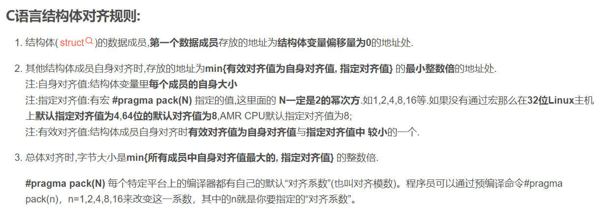
```c
struct student
{
    char b;
    short c;
    int a;
}; // 8

struct student
{
    char b;
    short c;
    double a;
}; // 12
struct student
{
    char a;
    int b;
    char c;
    double d;
}; // 20
struct student
{
    char n;
    short a;
    char c;
}; // 6 注意看这个例子
```
# 数据类型总结
## 基本数据类型
基本数据类型**最主要的特点是其值不可以再分解为其它类型**。也就是说，基本数据类型是自我说明的。如char, short, int, long, float, double, signed, unsigned。
## 构造数据类型
构造数据类型是根据已定义的一个或多个数据类型用构造的方法来定义的。也就是说，一个构造类型的值可以分解成若干个“成员”或“元素”。每个“成员”都是一个基本数据类型或又是一个构造类型。如struct结构体、union联合体、enum枚举和数组
## 指针类型
指针是一种特殊的数据类型。其值用来表示某个变量在内存中的地址。虽然指针变量的取值类似于整型量，但这是两个类型完全不同的量，因此不能混为一谈，定义时要用星号*。
## 空类型
空类型void用来定义任意类型的指针和无返回值的函数。
# 存储类型
## auto
修饰变量，一般省略时会认为是auto类型。
auto 数据类型 变量名/指针/数组
(auto) int a;
放在栈区。
## static
可以修饰变量和函数
### 修饰变量时
1.变量的存放位置全局区（静态区）
如果变量有初值，存放在.data区，如果没有初值存放在.bss区域。
2.生命周期为整个程序
3.限制作用域：
修饰局部变量，作用域和普通局部变量没有区别还是函数体内部，但是生命周期为整个程序。
修饰全局变量，作用域被限制在本文件中使用。
4.值初始化一次，初始赋值为0。
```c
#include <stdio.h>
void fun()
{
    static int a;
    int b = 0;
    printf("in fun:%d %d\n", a, b);
    a++;
    b++;
    printf("in fun:%d %d\n", a, b);
}

int main(int argc, char const *argv[])
{
    fun();
    fun();
    fun();
    return 0;
}
```
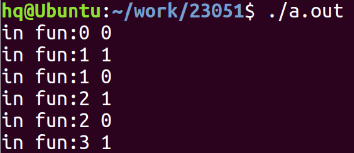
### 修饰函数
static修饰函数，限制在本文件中使用。
## extern
外部引用：通过extern可以引用其他文件的全局变量或者函数
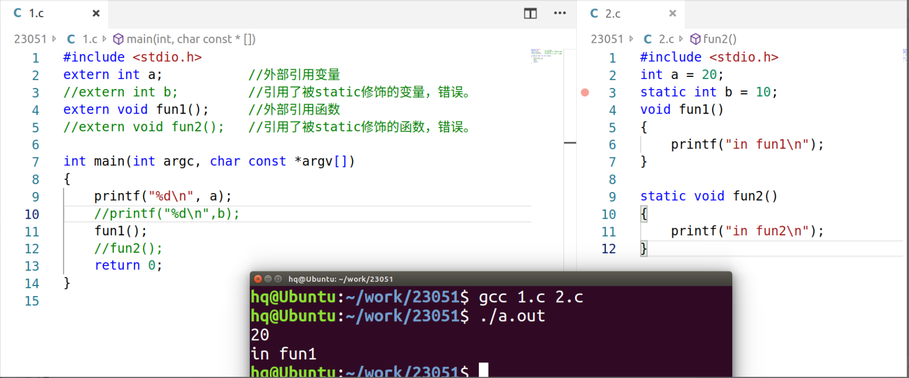
**注意：编译时要同时编译外部引用的文件**
## register
寄存器类型，顾名思义就是把修饰的变量放到寄存器中，目的是提高运行效率。数量是有限的如果寄存器类型满了就不再申请了。
**某些常用的变量可以定义为这个类型**
# 头文件""和<>的区别
- <>: 去系统目录下查找头文件
- “” : 先从当前目录下查找，如果没有再去系统目录下查找头文件。

# gcc编译工具
## 1.预处理
处理以#开头的内容，展开头文件，替换宏定义，删除注释，但是不会进行语法检查。
```c
gcc -E xx.c -o xx.i
```
## 2.编译
进行语法词法检查，将.i文件转化成.s汇编文件
```c
gcc -S xx.i -o xx.s
```
## 3.汇编
将汇编文件转换成二进制文件（此时该文件不可执行）
```c
gcc -c xx.s -o xx.o
```
## 4.链接
链接库文件，将不可执行的二进制文件转换成可执行的二进制文件。
```c
gcc xx.o -o xx
```
## 补充知识
gcc xx.c 默认生成a.out
gcc xx.c -o xx生成一个新名字的可执行文件
写makefile时一般这样写：
gcc -c xx.c -o xx.o
gcc xx.o -o xx
# gdb调试工具
gcc -g xx.c 生成./a.out
**这样才能生成调试信息**
gdb a.out
              r：  运行代码
		l:   查看文件
		b 行号或者函数名：添加断点
		info b：查看断点情况
		d num（断点编号）：删除断点
		p 变量名：查看变量的值
		s/n:   单步运行，s会进入子函数顺序执行；单步跳过，n不会进入子函数
		help：帮助
		q：    退出

步骤：代码写好后，先通过gcc -g进行编译代码，没有错误后，可以通过gdb  a.out进行调试，输入l查看文件内容，通过b设置断点，输入r进行运行，n或s进行单步调试，q退出
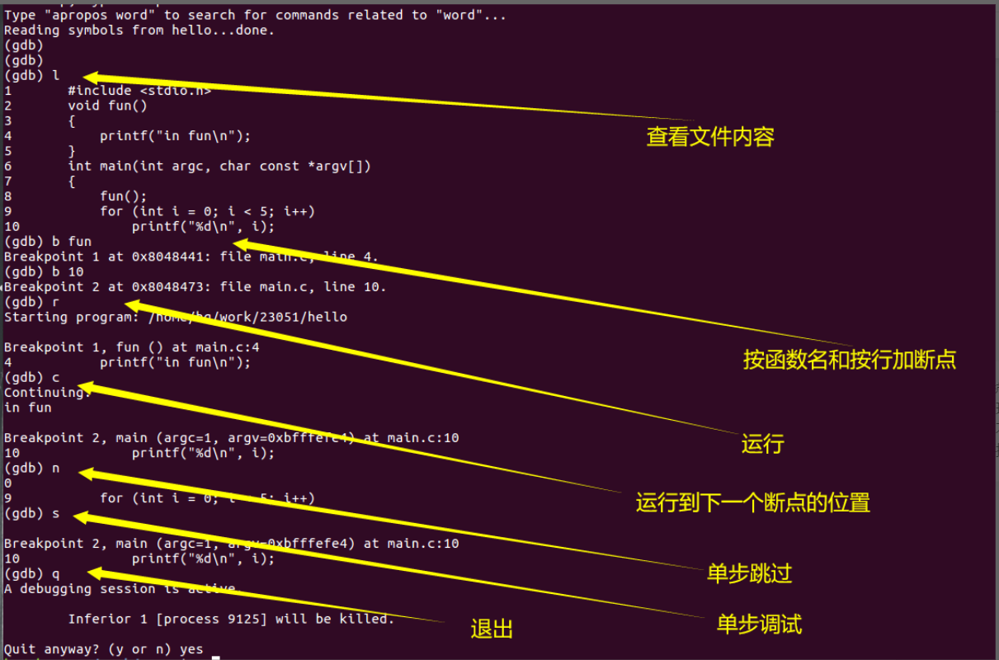
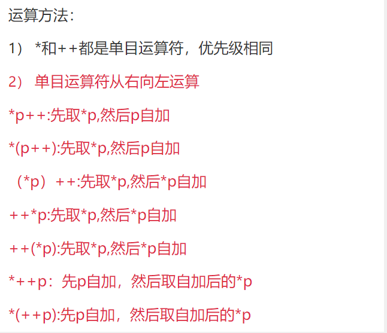