# C高级知识
*看山是山，看水是水->看山不是山，看水不是水->看是还是山，看水还是水*
## 数据类型的本质含义
数据类型的本质就是决定变量的内存占用数，和内存的解析方法
**C语言中变量必须有确定的数据类型**。如果一个变量没有确定的类型（或者说无类型），这会导致编译器无法给这个变量分配内存，因为编译器不清楚到底应该给这个变量分配多少内存才对。
**但是C语言中存在没有类型的内存**，在内存还没有和具体的变量绑定之前，内存可以没有类型，换句话说，内存空间本来就是没有类型的，只不过是认为和变量绑定之后才有限制。这就好比一个空房子，你可以进去居住，也可以当仓库，也可以当厕所，本身空房子是没有类型限制的。但是如果空房子门上挂着男厕所的牌子（内存和具体变量绑定），此时这个房子只能用来上厕所不能居住了。**也就是说实际上纯粹的内存就是没有类型的**。
内存本身并不知道自己是什么类型，而编译器知道，我们程序在使用这个内存时知道类型所以会按照类型的含义取进行内存的读写。这就好比一栋房子，房子本身不知道自己的用途，只有小区物业知道你这房子具体的用途，比如具体是仓库，那么审查的时候会按照仓库的标准来。
## 强类型语言与弱类型语言
C语言是典型的强类型语言，每个变量都必须有确定的数据类型。很多脚本语言（*例如Makefile*）是弱类型语言，所有变量都是一种类型（**一般是字符串**）程序在用的时候再根据需要来处理变量。
**void空类型也是有类型的，void的本质请看下面**
## void类型的本质
平时我们经常说void是个空类型，严格来说这么看不对，毕竟C语言是门强类型语言，要求每个变量都有类型.
**void类型的正确含义：不知道类型，不确定类型。**
假如定义一个void类型的变量a,含义是指a是一个变量，而且a肯定有确定的类型，只是我们现在不确定a的类型，所以标记为void.后续会确定a到底是什么类型。
## 为什么需要void
为什么要使用void或者说什么时候使用void类型?
**答：在描述一段还没有具体使用的内存时（此时该内存空间没有和具体的变量绑定）需要使用void类型**
## void的正确应用
void的一个典型应用案例就是**malloc**。malloc向系统堆管理器申请一段内存给当前程序使用，malloc申请成功之后会返回一个void型指针，来指向那段申请的内存。（此时这片内存空间还没有和具体的变量绑定，不确定是什么类型，所以是返回一个void型指针）。正因如此，我们在使用malloc之后可以给这段申请的内存空间读写任意类型的数据。（这是**void类型的最终归宿，被强制转换为一个具体类型**，这也是为什么每次用malloc开辟空间都有个强制类型转换）
```c
int *p=(int *)malloc(4);//malloc的具体细节可以参考man手册
```
```sh
man 3 malloc
```
__void类型使用一般都是指针形式(void *), 单独使用void不配合指针使用，这种形式没有任何意义__
*错误示例*
```c
void a=5;//直接报错，因为编译器不知道给a分配多大的内存空间
```
```c
void a;
int b=(int)a;
b=23;
return 0;
//这样写也是直接报错，这种用法没有任何意义，纯属脱裤子放屁
```
## main的正确写法
```c
int main(void)
int main(int argc,char **argv)
int main(int argc,char *argv[])
//这三种写法都是正确
```
**注意：下面这种写法，严格来说是不对的，单片机编程可以这么写，有些编译器支持这么写，有些不支持**
```c
void main(void)
{
    int a=0,b=3,c=0;
    a=b+c;
    printf("a=%d\n",a);
}
//这样写尽管能输出正确结果，但是这种写法是不对的
```
## main函数可以被谁调用
main函数是特殊的，首先这个名字是特殊的，**因为C语言规定了main函数是整个程序的入口。** 其他函数只有直接或间接被main所调用才能被执行，如果没有被mian直接或者间接调用，那么这个函数在整个程序中无用。
- 在命令行中./xxx可以运行一个程序
- 可以通过shell脚本调用一个程序
- 可以在别的程序中调用其他程序通过fork exec
**总结：有很多方法都可以执行一个程序，但是本质上是相同的，linux中一个新程序的执行本质上是一个进程的创建 加载 运行 消亡**
## main函数返回给谁
*结论：main函数返回给调用这个函数的父进程，子进程执行完之后通过main函数的返回值返回给父进程一个答复，这个答复一般是表示子进程的任务执行结果完成了还是错误了。（0表示成功，负数表示失败，不同的错误码对应不同的错误）*

*分析*：例如命令行本身就是一个进程，在命令行中./xx执行一个程序，其实这个新程序是作为命令行进程的一个子进程去执行的。

-------人是人他妈生的，妖是妖他妈生的，任何程序不会无缘无故出现或消亡------
## 获取程序的返回值
完成这个功能需要配合shell脚本完成
```sh
#！/bin/sh
./a.out
echo $? #$表示程序的返回值
```
**提示：shell命令中用 $?这个符号来存储和表示上一个程序执行结果**
```c
int main()
{
    return 123;
}
```
运行脚本之后，可以看到终端上输出了123这个特殊的返回值
**可以根据这个用法，来写一个Shell脚本来完成一些自动化工作**
*注意下面这种情况，你没看见不代表没有发生错误*
```c
float main()
{
    return 123;
}//上述代码能编译通过
```
**main函数的返回值必须是int**,配合脚本可以发现返回值从123变成0了，已经发生返回值的类型不匹配问题了。
## C语言中的NULL
*切记NULL并不是C语言中的一个关键字,本质上是一个宏定义*
### NULL在C/C++中的标准定义
```c++
#ifdef _cplusplus
#define NULL 0
#else 
#define NULL (void *)0
#endif
```
**解释**：C++的编译环境中，编译器预先定义了一个宏_cplusplus,程序中可以用条件编译来判断当前的编译环境是C++还是C的，
如果是C++那么NULL就是0，__如果是C语言，那么就是(void *)0__
**NULL的本质是0，但不是当作一个数字解析，而是作为一个内存地址0x00000000，代表内存的0地址**
### 从指针角度理解NULL的本质
(void *)0这个表达式整体表示一个指针，这个指针变量本身占4个字节，这个地址在哪里取决于指针变量本身，但是这个指针变量的值为0.也就是说它指向0地址（实际是0地址开始的一段内存,这个指针大小在32位操作系统中还是**4字节**）
### 为什么需要NULL
```c
int *p;//如果没有NULL，p是局部变量还是野指针会指向未知地址
```
如果有NULL 
```c
int *p=NULL;
//p是局部变量，分配在栈上的地址是由编译器决定的，我们不必关心
//但是p此时是指向内存的0地址，他就不是野指针了
```
### 为什么指针初始化要指向内存0地址
因为在大部分的CPU中，内存的0地址都不是可以随意访问的，一般都是操作系统严密管控的区域，所有应用程序不能随便访问，所以指向此处是个非常安全的位置。如果程序意外解引用指向0地址处的野指针则会触发段错误，这种报错机制便于用户排查错误。
### NULL为什么要是void型的指针
因为你不知道用户的指针是什么类型的，可能是int，也可能是char，而**void型直接转换为其他类型的指针，所以void指针也被称为万能指针，但是其他类型的指针是不不能转换为void型指针**
### 注意不要混用NULL与'\0'

## 加加减减运算符细节
```c
int main()
{
    int x=1,y=1,z=1;
    printf("%d",x+++y+++z++)
}//上述代码在gcc环境下会输出3
//我用7版本的clangd试了一下也是3
```
**分析**：x+++y+++z++相当于(x++)+(y++)+(z++)，
x++是先算表达式的值在做++运算的
所以x+++y+++z++ = 1+1+1 = 3
**推测此处与运算符和左值运算的顺序有关，之前看过一个说法（出处记不清了，抽空问问老师）**
就是说尽管是从右往左进行运算，但是进行运算的时候会把左边的看作一个整体分析
[x+++y++]+（z++） 编译器先算小括号里面的，识别到Z左边第一个加号，它会认为
这个加号左边，也就是中括号里的内容看作一个整体进行运算。在对中括号的内容进行运算的时候，也是遵循这个规则，先识别到y++,同时识别到y左边第一个加号，此时又把x++看作一个整体，*按照这个规则下来，并不会发生歧义，应该和编译器无关*


# Linux命令部分
## Linux大致发展（了解）
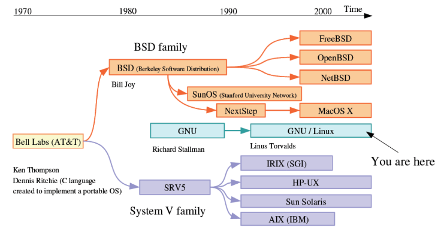
ubuntu 每半年会更新一次，4月和10月份，23.04
## 查看乌班图和内核版本
__查看乌班图版本__
```sh
sudo lsb_release -a
cat /etc/issue
```
__查看内核版本__
```sh
uname -r
cat /proc/version
```
*uname也支持很多其他功能，可以uname --help查看详细功能*
```sh
uname -a 查看操作系统的发行版号和操作系统版本
uname -v 可以查看版本号
```
## Linux系统分层结构
*大致分为5层*
- 应用层 负责用户的程序和命令
- 内核层：主要是系统内核的功能
    - 进程管理
    - 设备管理
    - 内存管理
    - 网络管理
    - 文件系统管理
- 驱动层
    - 字符设备驱动
    - 块设备驱动
    - 网络设备驱动
- 硬件：鼠标 键盘（字符设备驱动） 硬盘 U盘（块设备驱动）等
## 系统关机重启命令
```sh
sudo shutdown -h now: 立即关机
sudo shutdown -r now: 立即重启
sudo reboot now: 立即重启
sudo shutdown -h 时间 “提示语句”： 定义关机
sudo shutdown -r 时间 “提示语句”：定义重启
shutdown -c: 可以取消定时操作
```
## 查看历史记录
**借助这个命令可以查看自己曾经输入过的命令**
历史记录命令默认存储1000条命令
history历史记录命令存储2000条历史记录
可以在/home/用户名/.bashrc 的HISTFILESIZE修改）
历史命令的默认存储位置是/home/用户名/.bash_history 
ctrl+r 关键字可以搜索之前的命令
## date命令
- date:显示当前日期和时间
- sudo date -s y/m/d 修改年月日
- sudo date -s h(英文冒号)m(英文冒号)s 修改时分秒
## echo命令（经常用）
功能：向终端输出指定内容
- echo str1多个空格str2 ：输出的信息保留一个空格 str1空格str2
- echo -n str1 :不换行输出
- echo 单独一个echo只有换行作用
- echo "str1" 原样输出
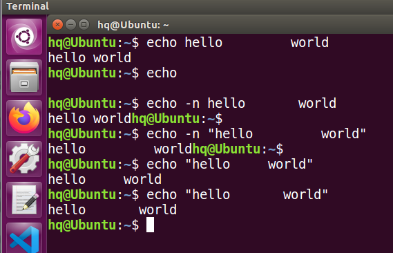

注意，默认情况下，不需要使用引号将要显示的文本字符串划定出来。但有时在字符串中出现引号的话就比较麻烦了。

```
$ echo Let's see if this'll work
Lets see if thisll work
```

echo 命令可用单引号或双引号来划定文本字符串。如果在字符串中用到了它们，你需要在文本中使用其中一种引号，而用另外一种来将字符串划定起来。

```
$ echo "This is a test to see if you're paying attention"
This is a test to see if you're paying attention
$ echo 'Rich says "scripting is easy".'
Rich says "scripting is easy".
```
所有的引号都可以正常输出了。
### 环境变量

你已经看到过 Linux 的一种变量在实际中的应用。前面介绍了 Linux 系统的环境变量。也可以在脚本中访问这些值。shell 维护着一组环境变量，用来记录特定的系统信息。比如系统的名称、登录到系统上的用户名、用户的系统 ID（也称为 UID）、用户的默认主目录以及 shell 查找程序的搜索路径。可以用 set 命令来显示一份完整的当前环境变量列表。

```bash
$ set
BASH=/bin/bash
[...]
HOME=/home/Samantha
HOSTNAME=localhost.localdomain
HOSTTYPE=i386
IFS=$' \t\n'
LANG=en_US.utf8
LESSOPEN='|/usr/bin/lesspipe.sh %s'
LINES=24
LOGNAME=Samantha
[...]
```

在脚本中，你可以在环境变量名称之前加上美元符（$）来使用这些环境变量。下面的脚本演示了这种用法。

```bash
$ cat test2
#!/bin/bash
# display user information from the system.
echo "User info for userid: $USER" #若为单引号包裹则不会变更$USER的值
echo UID: $UID
echo HOME: $HOME
$
```

> 你可能还见过通过${variable}形式引用的变量。变量名两侧额外的花括号通常用来帮助识别美元符后的变量名。

注意，echo 命令中的环境变量会在脚本运行时替换成当前值。另外，在第一个字符串中可以将$USER 系统变量放置到双引号中，而 shell 依然能够知道我们的意图。但采用这种方法也有一个问题。看看下面这个例子会怎么样。

```bash
$ echo "The cost of the item is $15"
The cost of the item is 5
```

显然这不是我们想要的。只要脚本在引号中出现美元符，它就会以为你在引用一个变量。在这个例子中，脚本会尝试显示变量$1（但并未定义），再显示数字 5。要显示美元符，你必须在它前面放置一个反斜线。

```bash
$ echo "The cost of the item is \$15"
The cost of the item is $15

```> 你可能还见过通过${variable}形式引用的变量。变量名两侧额外的花括号通常用来帮助识别美元符后的变量名。

注意，echo 命令中的环境变量会在脚本运行时替换成当前值。另外，在第一个字符串中可以将$USER 系统变量放置到双引号中，而 shell 依然能够知道我们的意图。但采用这种方法也有一个问题。看看下面这个例子会怎么样。

```bash
$ echo "The cost of the item is $15"
The cost of the item is 5
```

显然这不是我们想要的。只要脚本在引号中出现美元符，它就会以为你在引用一个变量。在这个例子中，脚本会尝试显示变量$1（但并未定义），再显示数字 5。要显示美元符，你必须在它前面放置一个反斜线。

```bash
$ echo "The cost of the item is \$15"
The cost of the item is $15

```

### 用户变量

除了环境变量，shell 脚本还允许在脚本中定义和使用自己的变量。定义变量允许临时存储数据并在整个脚本中使用，从而使 shell 脚本看起来更像一个真正的计算机程序。用户变量可以是任何由字母、数字或下划线组成的文本字符串，长度不超过 20 个。用户变量区分大小写，所以变量 Var1 和变量 var1 是不同的。这个小规矩经常让脚本编程初学者感到头疼。
使用等号将值赋给用户变量。在变量、等号和值之间不能出现空格（另一个困扰初学者的用法）。这里有一些给用户变量赋值的例子。

```bash
var1=10
var2=-57
var3=testing
var4="still more testing"
```

shell 脚本会自动决定变量值的数据类型。在脚本的整个生命周期里，shell 脚本中定义的变量会一直保持着它们的值，但在 shell 脚本结束时会被删除掉。

与系统变量类似，用户变量可通过美元符引用。变量每次被引用时，都会输出当前赋给它的值。重要的是要记住，引用一个变量值时需要使用美元符，而引用变量来对其进行赋值时则不要使用美元符。通过一个例子你就能明白我的意思。

```bash
$ cat test4
#!/bin/bash
# assigning a variable value to another variable
value1=10
value2=$value1
echo The resulting value is $value2
```

在赋值语句中使用 value1 变量的值时，仍然必须用美元符。这段代码产生如下输出。

```bash
$ chmod u+x test4
$ ./test4
The resulting value is 10

```

要是忘了用美元符，使得 value2 的赋值行变成了这样：

```bash
value2=value1
```

那你会得到如下输出：

```bash
$ ./test4
The resulting value is value1
```

没有美元符，shell 会将变量名解释成普通的文本字符串，通常这并不是你想要的结果。


## Linux系统维护命令
### man
著名的man手册说的就是这个，可以用它来查询一些系统自带的函数 命令的用法和简介
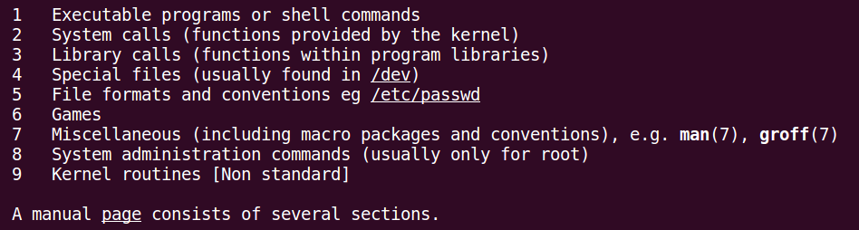
*你甚至可以输入下面的语句来查看man手册的简介*
```bash
man man 
```
### su
- sudo su root 切换到管理员模式或者只输入su
- sudo su 用户名 切换到其他普通用户
- exit 退出当前用户，或者直接按下ctrl+d
### sudo
获取**临时管理员**权限
### df
```bash
df -Th #查看磁盘使用情况
```
输出信息如下所示
```bash
Filesystem     Type              Size  Used Avail Use% Mounted on
udev           devtmpfs          2.0G     0  2.0G   0% /dev
tmpfs          tmpfs             398M  6.5M  392M   2% /run
/dev/sda1      ext4               19G  5.9G   12G  34% /
tmpfs          tmpfs             2.0G  112K  2.0G   1% /dev/shm
tmpfs          tmpfs             5.0M     0  5.0M   0% /run/lock
tmpfs          tmpfs             2.0G     0  2.0G   0% /sys/fs/cgroup
tmpfs          tmpfs             398M   60K  398M   1% /run/user/1000
vmhgfs-fuse    fuse.vmhgfs-fuse  477G  165G  312G  35% /mnt/hgfs
```
**各个参数的含义**
```bash
文件系统	   文件类型  大小  已使用 可用  使用比例  挂载点
Filesystem          Type      Size  Used   Avail    Use%    Mounted on
```
### mount(重要)
作用：文件系统的挂载
*挂载设备的方法*
```bash
sudo mount -t 设备类型 设备名称 挂载点
```
*卸载设备的方法*
```bash
sudo unmount 挂载点
```
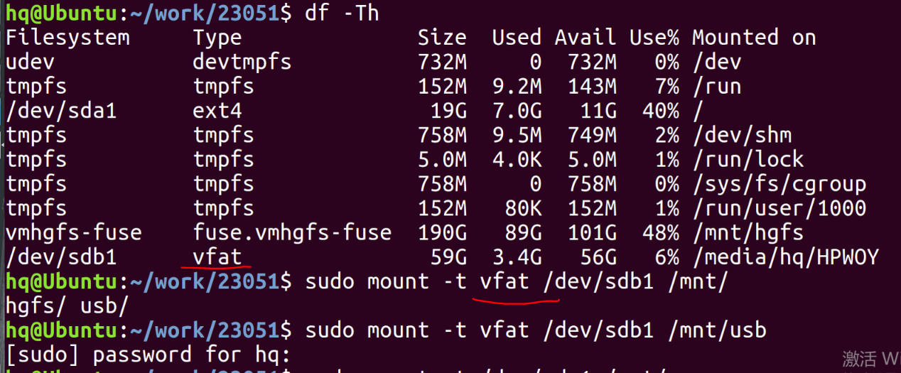
**注意：卸载时不要在挂载点卸载**
*补充知识*
- 挂载优盘时，出现u盘识别不出的现象，解决办法：
    - 1）虚拟机->设置->usb控制器->兼容usb3.0
    - 2）虚拟机->可移动设备->找到自己的u盘->连接
- 如果出现u盘类型不匹配的问题
    - sudo apt-get install exfat-fuse exfat-utils
## 用户管理命令
### 添加用户
```bash
sudo adduser 用户名：添加用户
```
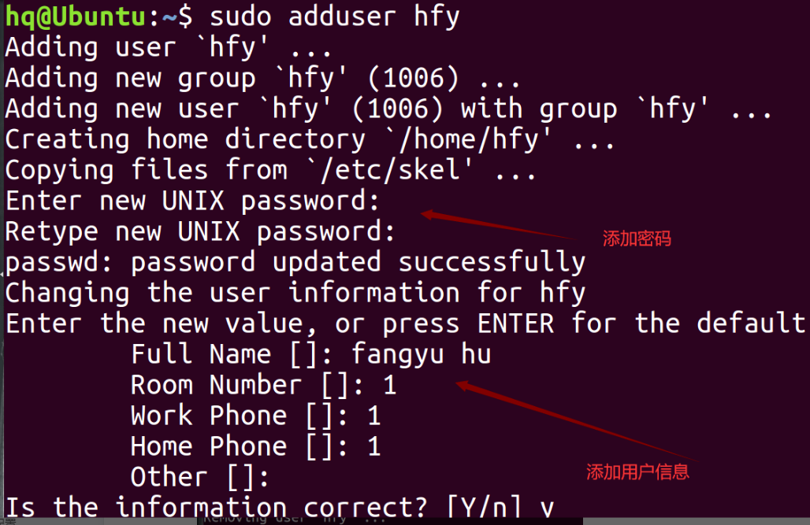
### 删除用户
```bash
sudo deluser --remove-home 用户名：删除用户的同时删除工作目录
```
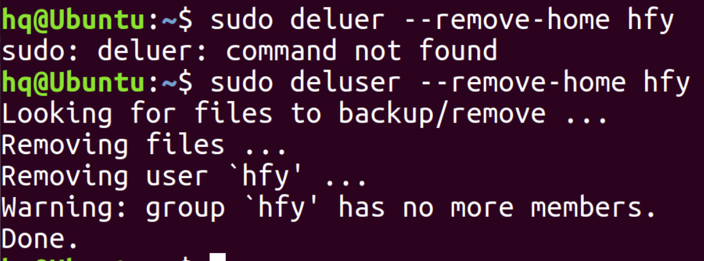
## 进程管理命令
### ps
- ps -aux : 显示当前系统中运行的进程
- ps -ef : 显示当前系统中运行的进程，包含PPID(父进程号)
**进程状态的缩写**
```bash
    1.D    uninterruptible sleep (usually IO)  不可中断的睡眠态
    2.R    running or runnable (on run queue)  运行态
    3.S    interruptible sleep (waiting for an event to complete)  可中断的睡眠态
    4.T    stopped by job control signal  暂停态
    5.t    stopped by debugger during the tracing 因为调试而暂停
    6.X    dead (should never be seen)  死亡态
    7.Z    defunct ("zombie") process, terminated but not reaped by its parent 僵尸态
    8.<    high-priority (not nice to other users) 高优先级
    9.N    low-priority (nice to other users) 低优先级
    10.L has pages locked into memory (for real-time and custom IO) 锁在内存中
    11.s    is a session leader 会话组组长
    12.l    is multi-threaded (using CLONE_THREAD, like NPTL pthreads do)多线程
    13.+    is in the foreground process group 前台进程
    14.没有+时，默认是后台进程
    15.I 空闲状态进程
```
### top
**动态查看系统中的运行的进程**
- shift 加 > :向下翻页
- shift 加 < :向上翻页
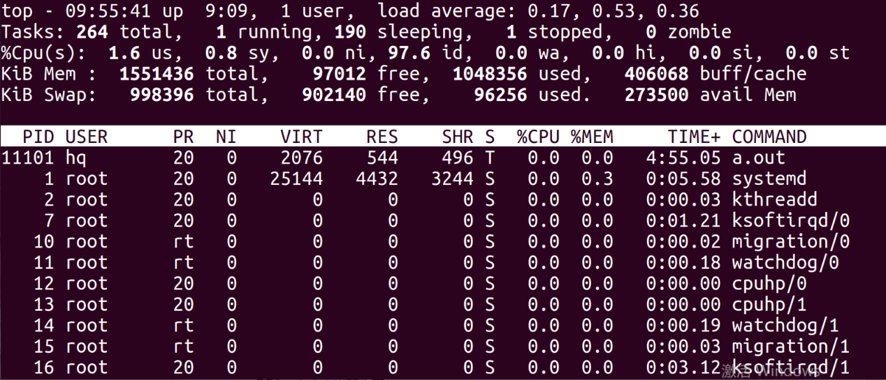
**参数含义**
```bash
PR： 优先级
VIRT：占用虚拟内存
RES：真正占用的内存
SHR: 共享内存
q ：退出
```
### 修改优先级命令
__PR=NI+20__
__NI值的范围：-20 ~ 19，NI值越小优先级越高。__
```bash
sudo renice [NI] PID #改变正在运行的进程的优先级
```
如：sudo renice 5 11101
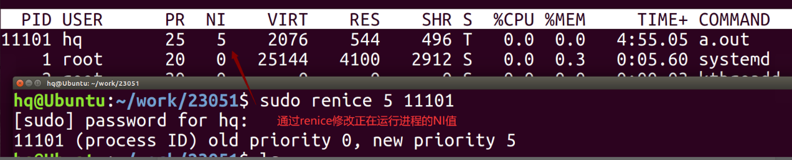
```bash
sudo nice -n [NI值] 进程: 以指定优先级运行进程
```
如：sudo nice -n -5 ./a.out
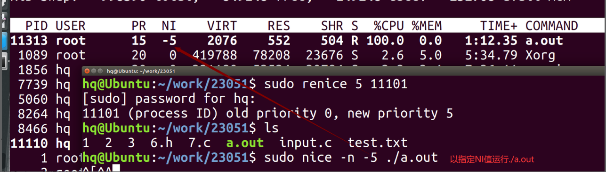
### grep(重要)
```bash
grep:从文件中查找字符串
grep "查找的字符串" 文件名
grep "\<要查找的字符串\>" 文件名：精确查找
```
**一般该命令都是与其他命令结合使用**
结合ps以及管道：
```bash
ps -aux | grep "a.out" #从当前运行进程中查看a.out
```
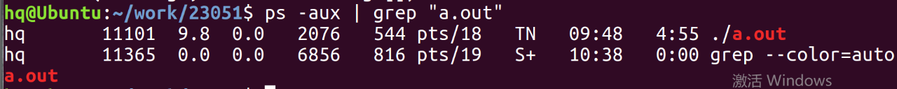
```bash
grep -r "查找的字符串" 路径/目录
```
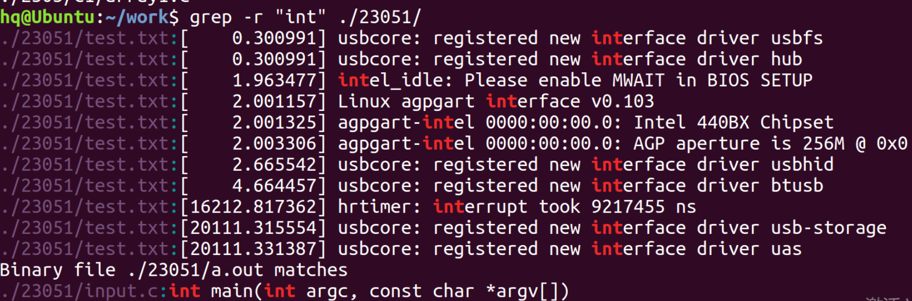
### find
```bash
find 路径 -name 文件名： 查找路径下的文件
```
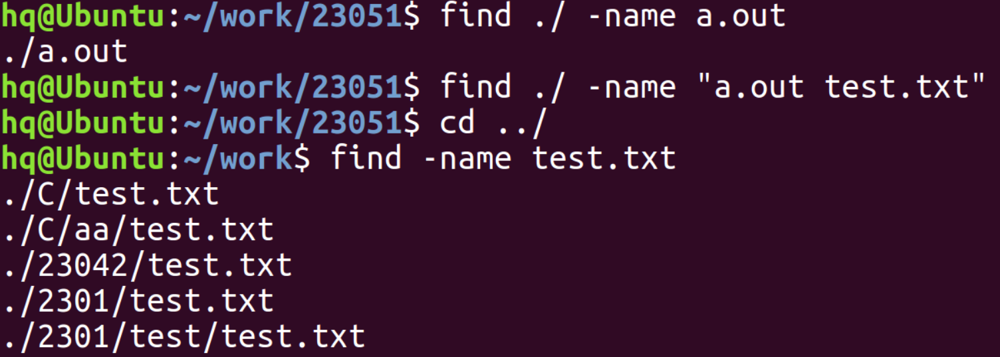
### kill发送信号（重要）
kill用来向进程发送一个信号，信号是什么需要用户指定。
**查看所有信号类型**
```bash
kill -l #查看系统中定义的信号
```
**常用的是下面这些**
```bash
2：SIGINT  快捷方式：ctrl+c 结束进程
3：SIGQUIT 快捷方式：ctrl+\ 结束进程
9：SIGKILL 杀死进程
15：SIGTERM 结束进程 kill发信号时不加编号，默认信号为15号
18：SIGCONT 让暂停进程继续
20：SIGTSTP 暂停信号 快捷方式：ctrl+z 暂停信号
```
**向指定进程发送信号**
```bash
kill  -num  PID #PID是进程号 num是信号类型的编号
```
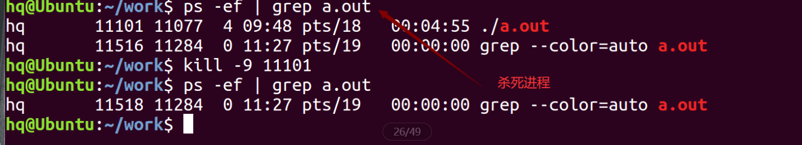
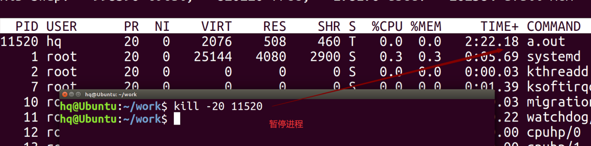
### 前后台进程切换
步骤：先运行进程
ctrl z : 将进程暂停
bg 编号: 切换到后台
jobs: 查看在当前终端后台执行的进程
fg 编号: 将后台进程切换到前台
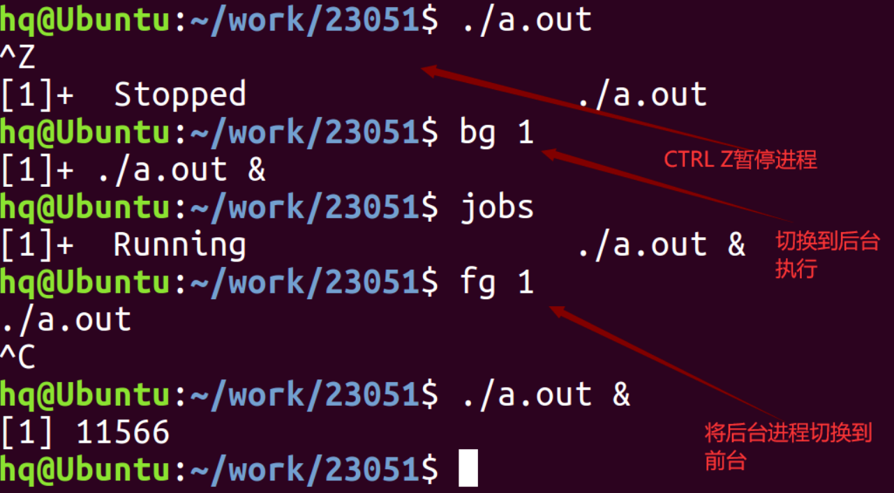
### 网络管理命令
*此处老师讲解不多*
ifconfig: 查看linux的ip地址
ipconfig: 查看windows的ip地址
win+r打开运行窗口，输入cmd打开命令窗口，输出ipconfig
ping 域名/ip地址： 检查网络连通性（是否能通信）
windos ping虚拟机默认是发个包，如果想发更多包可以-n加包数
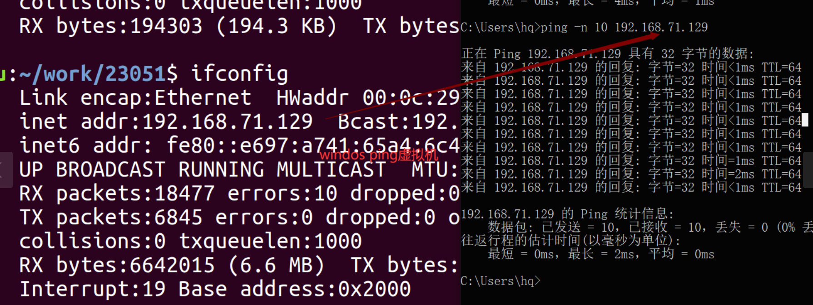
**常见问题**：
```bash
1.如果虚拟机无法ping通windows，再试一下windows ping 虚拟机
如果能ping通，说明是防火墙的问题，将防火墙关闭即可。
2.虚拟机配置网络找不到主机适配器的解决方法：
首先将虚拟机卸载，安装ccleaner软件，清理注册表；
把防火墙关闭、杀毒软件退出，右击以管理员身份运行虚拟机exe进行安装vmware
```
## 关于文件系统的命令
### 文件系统分类
**1磁盘文件系统：**
指本地主机中实际可以访问到的文件系统，包括硬盘、CD-ROM、DVD、USB存储器、磁盘阵列等。常见文件系统格式有：Ext2、Ext3、Ext4、VFAT等
**2网络文件系统：**
是可以远程访问的文件系统，这种文件系统在服务器端仍是本地的磁盘文件系统，客户机通过网络远程访问数据。常见文件系统格式有：NFS（Network File System，网络文件系统）、Samba（SMB/CIFS）等
__3专有/虚拟文件系统__
不驻留在磁盘上的文件系统。常见格式有：TMPFS（临时文件系统）、PROCFS（Process File System，进程文件系统）和LOOPBACKFS（Loopback File System，回送文件系统）
### 根文件系统结构(重要)
需要了解常见的目录含义：
```bash
/bin：存放系统中最常用的可执行文件（二进制）
/sbin : 存放更多的可执行文件（二进制），包括系统管理、目录查询等关键命令文件
/boot：存放Linux内核和系统启动文件，包括Grub、lilo启动器程序
/opt: 与系统无关的安装程序
/etc: 放的一些配置文件
/dev : 存放所有设备文件，包括硬盘、分区、键盘、鼠标、USB、tty等
/lib : 存放共享的库文件，包含许多被/bin和/sbin中程序使用的库文件
/mnt : 该目录通常用于作为被挂载的文件系统的挂载点
/proc : 存放所有标志为文件的进程，
        它们是通过进程号或其他的系统动态信息进行标识，
        例如cpuinfo文件存放CPU当前工作状态的数据
/usr : 用于存放与系统用户直接有关的文件和目录，
        例如应用程序及支持它们的库文件。以下罗列了/usr中部分重要的目录。
/usr/lib: 库文件，系统默认搜索的库路径
/usr/include: 头文件，系统默认搜索的头文件路径
```
### 显示文件内容的命令
### cat
输出文件内容到终端上
### head
```bash
head -n 文件名 #显示前n行
```
```bash
head  文件名 #默认显示前10行
```
### tail
```bash
tail -n 文件名： 显示后n行
tail后不加数组默认显示后10行
```
## 链接文件
**(1)文件类型：7种，b c d - l s p**
**硬链接：**
利用linux种为每个文件分配的物理编号inode建立的链接。因此，硬链接不能跨越文件系统。
**软连接（符号链接）：**
是利用文件的路径建立的链接，通常用绝对路径而不是相对路径。
### 建立链接的命令
```bash
硬链接：ln 源文件 链接文件名
软链接：ln -s 源文件 链接文件名
```
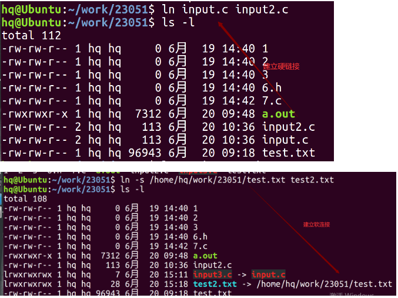
### 软硬链接的区别
硬链接：删除或者移动目标文件链接依然有效，只能操作普通文件。
软连接：删除或者移动目标文件链接失效，建立链接使用绝对路径名。
## 文件压缩解压
### 归档和压缩的区别
**归档**
也称为打包，指的是一个文件或目录的集合，而这个集合被存储在一个文件中。归档文件没有经过压缩，因此，它占用的空间是其中所有文件和目录的总和。通常，归档总是会和系统（数据）备份联系在一起，不过，有关数据备份的内容，留到后续章节讲，本章仅学习归档命令的基本使用。
**压缩**
是指利用算法将文件进行处理，已达到保留最大文件信息，而让文件体积变小的目的。其基本原理为，通过查找文件内的重复字节，建立一个相同字节的词典文件，并用一个代码表示。比如说，在压缩文件中，有不止一处出现了 "C语言中文网"，那么，在压缩文件时，这个词就会用一个代码表示并写入词典文件，这样就可以实现缩小文件体积的目的。 

### zip
**zip**用于将一个文件或者多个文件压缩为单一压缩文件
**unzip** 命令用于将zip压缩文件进行解压
-d 加路径可以解压缩到指定目录下
```bash
zip 压缩后文件名.zip 文件列表
# 例如：zip file.zip 1 2 3
```
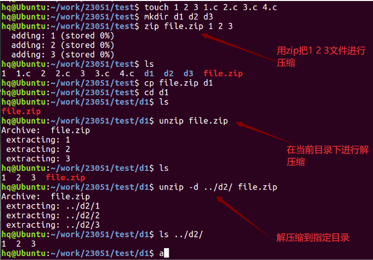
**注意事项**
- 具有归档功能，并进行压缩。
- 可以压缩文件夹，后缀为.zip
- 压缩或者解压后的源文件依然存在
### gzip与bzip2
gzip 命令用于将一个文件进行压缩
gunzip命令用于将gzip压缩文件进行解压缩
**注意事项**
- 只能对一个文件进行压缩，并且后缀自动为.gz
- 没有归档功能
- 压缩或解压后原文件不存在
*bzip2 命令功能与特点和gzip相同，只不过后缀为.bz2*

### tar
该命令是最广泛的归档（打包）命令
*支持的参数*
```bash
-x ： 释放归档文件，解压
-c ： 创建一个新的归档文件，压缩
-v ： 显示归档和释放的过程信息
-f ： 用户指定归档文件的文件名，否则使用默认名称
-j ： 由tar生成归档，然后由bzip2压缩  .tar.bz2
-z ： 由tar生成归档，然后由gzip压缩   .tar.gz
```
**注意：**
- 具有归档功能，通过选项进行压缩或解压缩。
- 压缩或解压后原文件依然存在
- 需要写全压缩或解压的文件名格式：

**组合用法：**
- -cjf 以bz2的格式压缩文件
- -czf 以gz的格式压缩文件
- -xvf 解压一个压缩包，解压后压缩包依然存在。

```bash
tar 选项 压缩(解压)文件名 要压缩的文件列表
```
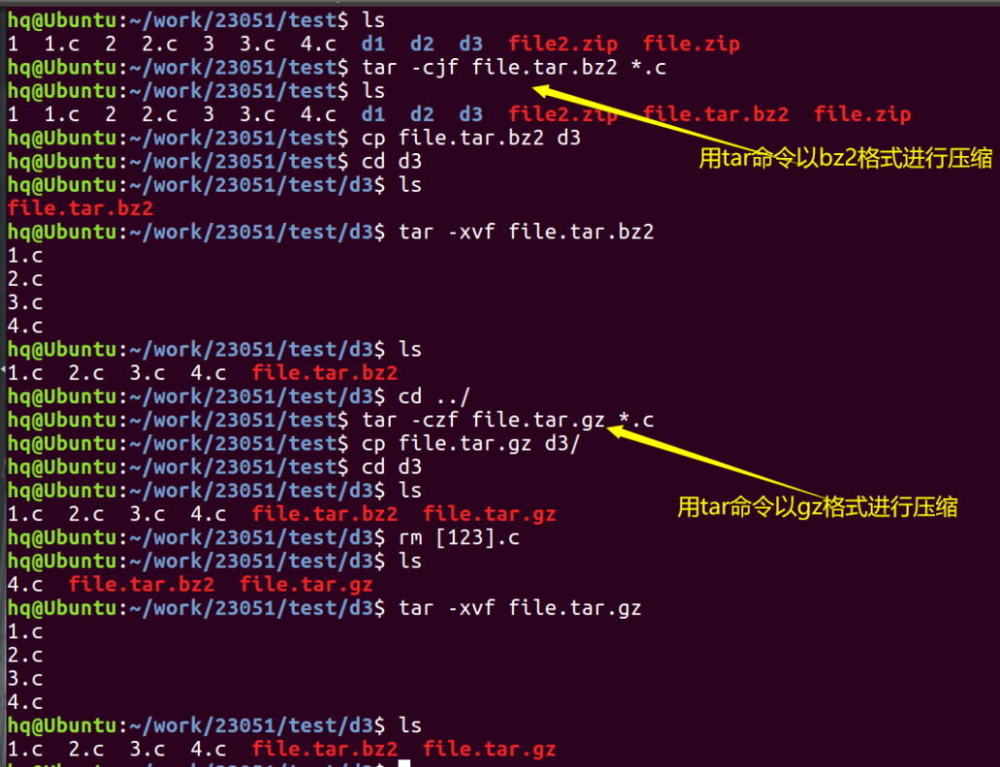


## Linux安装工具
### 软件包安装
#### 软件包的管理机制
- debian:deb软件包管理机制
- redhat:rpm软件包管理机制
#### 软件包分类
- 二进制软件包 xxx.deb
- 源码包 xx.dsc
*linux下所支持的软件包格式不止这些，甚至能用Sh后缀的shell脚本离线安装软件*
### 软件管理工具
在Debian的linux发行版下，采用dpkg和apt两种包管理工具。
- dpkg 离线安装，安装本地包，不能检查软件包的依赖关系，不关系仓库内的软件
- apt：在线安装，通过仓库获取软件包资源，解决依赖关系，不能安装本地包。
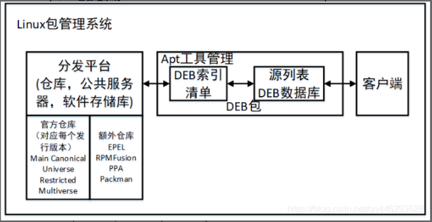
#### dpkg工具
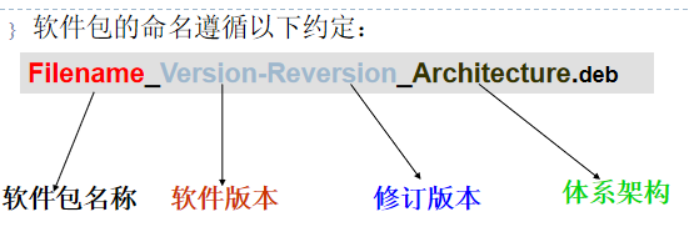
```sh
sudo dpkg -i 软件包全称
```
*一些常用的命令*
```sh
sudo dpkg  -i  软件包的全称：安装软件
sudo dpkg -s 软件包名：显示软件的安装状态  
sudo dpkg -L 软件包名：显示软件的安装路径
sudo  dpkg -r 软件包名：卸载软件
sudo dpkg -P 软件包名：完全卸载软件，重新下载不会保留上一次配置。
```
#### apt-get/apt-cache
```sh
sudo apt-get install 软件包名： 安装
```
**可以在 /etc/apt/sources.list这个路径下换源**
**默认下载包的存放路径：/var/cache/apt/archives/**
```sh
sudo apt-get install 软件包名：软件下载并安装
sudo apt-get remove 软件包名：卸载软件
sudo  apt-get  --purge  remove:完全卸载软件包
sudo apt-get  autoremove  软件包名：卸载软件
sudo apt-get update :下载更新软件包列表信息
sudo apt-get upgrade : 将系统中所有软件包升级到最新的版本
sudo apt-get upgrade  软件包名：将系统中指定的软件包升级到最新的版本
sudo  apt-get clean：清空安装包的存放路径
```
__apt-cache__
```sh
sudo apt-cache show 软件包名:获取二进制软件包的详细描述信息
sudo apt-cache policy 软件包名:获取软件包当前的安装状态
sudo apt-cache depends 软件包名:获取该软件包的依赖信息
sudo apt-cache rdepends 软件包名:获取所有依赖于该软件包的软件包
```
# shell
**shell这部分内容深入研究需要花费不少时间，比如结合正则表达式的应用，以及sed等高级用法，所以此处笔记我也只是记录了比较常见的一些知识点**
-------------------------------分割线----------------------------------
**仓库中的shell笔记的其他补充知识参考了Archlink的Wiki,正则表达式部分暂时没深入学习，正则表达式的资料可以参考下面这个链接，shell的深入知识请参考《Linux命令行与shell脚本编程大全》**
https://github.com/ziishaned/learn-regex/blob/master/translations/README-cn.md

## shell基础
shell是贝壳的意思，起到保护作用。那么Linux的shell可以保护内核。
shell: 命令行解释器
作用：负责把应用程序输入的信息解释给操作系统， 将操作系统执行后的结果解释给应用程序。

## shell分类（了解）
（1）Bourne Shell（简称sh）：Bourne Shell由AT&T贝尔实验室的S.R.Bourne开发，也因开发者的姓名而得名。它是Unix的第一个Shell程序，早已成为工业标准。目前几乎所有的Linux系统都支持它。不过Bourne Shell的作业控制功能薄弱，且不支持别名与历史记录等功能。目前大多操作系统是将其作为应急Shell使用。
（2）C Shell（简称csh）：C Shell由加利福尼亚大学伯克利分校开发。最初开发的目的是改进Bourne Shell的一些缺点，并使Shell脚本的编程风格类似于C语言，因而受到广大C程序员的拥护。不过C Shell的健壮性不如Bourne Shell。
（3）Korn Shell（简称ksh）：Korn Shell由David Korn开发，解决了Bourne Shell的用户交互问题，并克服了C Shell的脚本编程怪癖的缺点。Korn Shell的缺点是需要许可证，这导致它应用范围不如Bourne Shell广泛。
（4）Bourne Again Shell（简称bash）：Bourne Again Shell由AT&T贝尔实验室开发，是Bourne Shell的增强版。随着几年的不断完善，已经成为最流行的Shell。它包括了早期的Bourne Shell和Korn Shell的原始功能，以及某些C Shell脚本语言的特性。此外，它还具有以下特点：能够提供环境变量以配置用户Shell环境，支持历史记录，内置算术功能，支持通配符表达式，将常用命令内置简化。
## 命令的执行过程
用户在命令行下命令，开始与Shell进行交互。接着，Shell将用户的命令或按键转化成内核所能够理解的指令控制操作系统做出响应，直到控制相关硬件设备。然后，Shell将输出结果提交给用户。
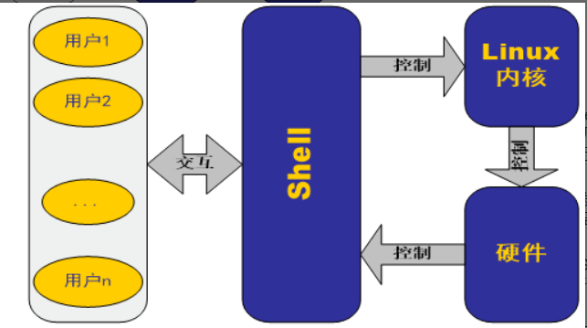
## shell命令格式
命令名称 选项 参数
命令名称： 必须得有
选项和参数：可有可无，选项前面要有-符号
## 变量
### 用户自定义变量
一般用大写
进行赋值时用=，左右两边不能有空格
引用变量前面加$
```bash
#!/bin/bash
VAR=10
echo $VAR
```
### 位置变量
```bash
$0或者${0}与输入的命令行一样，表示包含脚本名./xx.sh的参数
$1,$2,$3...表示命令行输入的剩下的参数
$# 表示包含命令行参数的个数（不包含脚本文件名这个参数）
$@ 包含命令行所有参数：“$1 $2 $3...”
$* 包含命令行所有参数：“$1 $2 $3...”
```
```bash
#!/bin/bash
VAR=10
echo $VAR

echo $0 $1 $2 $3
echo $#
echo $*
echo $@
```
### 预定义变量
```bash
$? 包含前一个命令的退出状态(0表示真 非0表示假)
$$ 包含正在执行进程的ID号
```
### 环境变量
环境变量一般是指在操作系统中用来指定操作系统运行环境的一些参数，如：临时文件夹位置和系统文件夹位置等。
	HOME： /etc/passwd文件中列出的用户主目录 
	PATH ：shell搜索路径，就是是一系列目录，当执行命令时，linux就在这些目录下查找。

## Linux特殊字符
### 通配符
*: 匹配所有字符
?: 匹配任意一个字符
[...]: 匹配[]中指定的一个字符
[-]: 匹配[]中指定范围的字符
[^]: 除了其中指定的一个字符均可匹配
### 管道（重点）
格式非常简单，但是用法非常灵活
```sh
命令1 | 命令2
```
**前一个命令的输出当作下一个命令的输入**
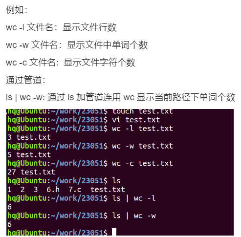
### 输入输出重定向(重点)
**输出重定向相关命令**
```sh
>file:输出重定向，新建模式
>>file: 输出重定向，追加模式
2> 或者 &> file: 将错误信息重定向到文件中
>file 2>&1: 将输出重定向到文件，然后将错误重定向到输出，所以错误也到了文件
```
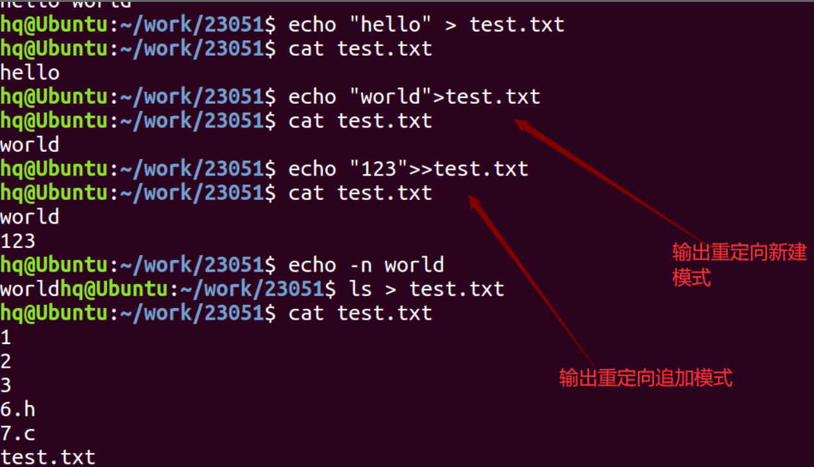
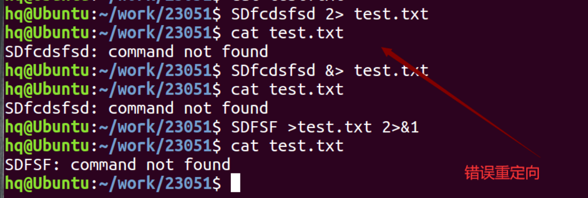
**输入重定向相关指令**
```c
< file: 输入重定向
```
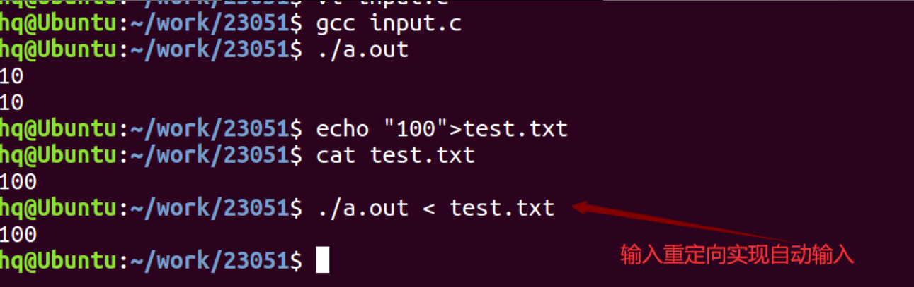
### 命令置换符
格式如下
```sh
命令1 `命令2`
```
将命令2的输出结果作为命令1的参数
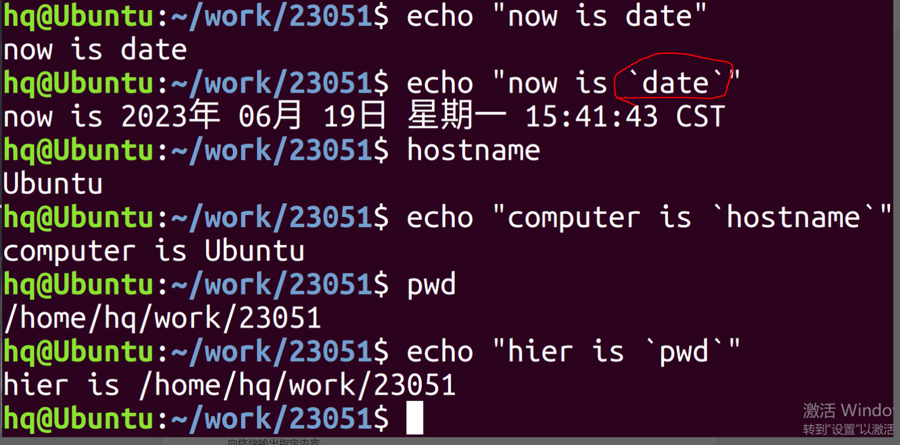
> 命令替换会创建一个子 shell 来运行对应的命令。子 shell（subshell）是由运行该脚本的 shell 所创建出来的一个独立的子 shell（child shell）。正因如此，由该子 shell 所执行命令是无法使用脚本中所创建的变量的。


## 执行数学运算

另一个对任何编程语言都很重要的特性是操作数字的能力。遗憾的是，对 shell 脚本来说，这个处理过程会比较麻烦。在 shell 脚本中有两种途径来进行数学运算。

### expr 命令

最开始，Bourne shell 提供了一个特别的命令用来处理数学表达式。expr 命令允许在命令行上处理数学表达式，但是特别笨拙。

```bash
$ expr 1 + 5
6
```

expr 命令能够识别少数的数学和字符串操作符。尽管标准操作符在 expr 命令中工作得很好，但在脚本或命令行上使用它们时仍有问题出现。许多 expr 命令操作符在 shell 中另有含义（比如星号）。当它们出现在在 expr 命令中时，会得到一些诡异的结果。

```bash
$ expr 5 * 2
expr: syntax error
```

要解决这个问题，对于那些容易被 shell 错误解释的字符，在它们传入 expr 命令之前，需要使用 shell 的转义字符（反斜线）将其标出来。

```bash
$ expr 5 \* 2
10
```

现在，麻烦才刚刚开始！在 shell 脚本中使用 expr 命令也同样复杂：

```bash
$ cat test6
#!/bin/bash
# An example of using the expr command
var1=10
var2=20
var3=$(expr $var2 / $var1) #命令替换的方式
echo The result is $var3
```

要将一个数学算式的结果赋给一个变量，需要使用命令替换来获取 expr 命令的输出：

```bash
$ chmod u+x test6
$ ./test6
The result is 2
```

幸好 bash shell 有一个针对处理数学运算符的改进，那就是方括号。

### 使用方括号

bash shell 为了保持跟 Bourne shell 的兼容而包含了 expr 命令，但它同样也提供了一种更简单的方法来执行数学表达式。在 bash 中，在将一个数学运算结果赋给某个变量时，可以用美元符和方括号（$[ operation ]）将数学表达式围起来。

```bash
$ var1=$[1 + 5]
$ echo $var1
6
$ var2=$[$var1 * 2]
$ echo $var2
12
$
```

用方括号执行 shell 数学运算比用 expr 命令方便很多。这种技术也适用于 shell 脚本。

```bash
$ cat test7
#!/bin/bash
var1=100
var2=50
var3=45
var4=$[$var1 * ($var2 - $var3)]
echo The final result is $var4  #The final result is 500
```

同样，注意在使用方括号来计算公式时，不用担心 shell 会误解乘号或其他符号。shell 知道它不是通配符，因为它在方括号内。

在 bash shell 脚本中进行算术运算会有一个主要的限制。请看下例：

```bash
$ cat test8
#!/bin/bash
var1=100
var2=45
var3=$[$var1 / $var2]
echo The final result is $var3 #The final result is 2
$
```

bash shell 数学运算符只支持整数运算。若要进行任何实际的数学计算，这是一个巨大的限制。

> z shell（zsh）提供了完整的浮点数算术操作。如果需要在 shell 脚本中进行浮点数运算，可以考虑看看 z shell。

### 浮点解决方案

有几种解决方案能够克服 bash 中数学运算的整数限制。最常见的方案是用内建的 bash 计算器，叫作 bc。

bash 计算器实际上是一种编程语言，它允许在命令行中输入浮点表达式，然后解释并计算该表达式，最后返回结果。bash 计算器能够识别：

- 数字（整数和浮点数）
- 变量（简单变量和数组）
- 注释（以#或 C 语言中的/\* \*/开始的行）
- 表达式
- 编程语句（例如 if-then 语句）
- 函数

可以在 shell 提示符下通过 bc 命令访问 bash 计算器：

```bash
$ bc
bc 1.07.1
Copyright 1991-1994, 1997, 1998, 2000, 2004, 2006, 2008, 2012-2017 Free Software Foundation, Inc.
This is free software with ABSOLUTELY NO WARRANTY.
For details type `warranty'.

12 * 5.4
64.8

3.156 * (3 + 5)
25.248
quit

$

```

浮点运算是由内建变量 scale 控制的。必须将这个值设置为你希望在计算结果中保留的小数位数，否则无法得到期望的结果。

```bash
$ bc -q
3.44 / 5
0
scale=4
3.44 / 5
.6880
quit
$

```

scale 变量的默认值是 0。在 scale 值被设置前，bash 计算器的计算结果不包含小数位。在将其值设置成 4 后，bash 计算器显示的结果包含四位小数。-q 命令行选项可以不显示 bash 计算器冗长的欢迎信息。

除了普通数字，bash 计算器还能支持变量。

```bash
$ bc -q
var1=10
var1 * 4
40
var2 = var1 / 5
print var2
2
quit
$
```

变量一旦被定义，你就可以在整个 bash 计算器会话中使用该变量了。print 语句允许你打印变量和数字。

---

现在你可能想问 bash 计算器是如何在 shell 脚本中帮助处理浮点运算的。还记得命令替换吗？是的，可以用命令替换运行 bc 命令，并将输出赋给一个变量。

```bash
$ cat test9
#!/bin/bash
var1=$(echo "scale=4; 3.44 / 5" | bc)
echo The answer is $var1  #The answer is .6880
```

也可以用 shell 脚本中定义好的变量进行运算：

```bash
$ cat test10
#!/bin/bash
var1=100
var2=45
var3=$(echo "scale=4; $var1 / $var2" | bc)
echo The answer for this is $var3 #The answer for this is 2.2222
```

当然，一旦变量被赋值，那个变量也可以用于其他运算。

```bash
$ cat test11
#!/bin/bash
var1=20
var2=3.14159
var3=$(echo "scale=4; $var1 * $var1" | bc)
var4=$(echo "scale=4; $var3 * $var2" | bc)
echo The final result is $var4
$
```

这个方法适用于较短的运算，但有时你会涉及更多的数字。如果需要进行大量运算，在一个命令行中列出多个表达式就会有点麻烦。

有一个方法可以解决这个问题。bc 命令能识别输入重定向，允许你将一个文件重定向到 bc 命令来处理。但这同样会叫人头疼，因为你还得将表达式存放到文件中。

最好的办法是使用内联输入重定向，它允许你直接在命令行中重定向数据，可以将所有 bash 计算器涉及的部分都放到同一个脚本文件的不同行。下面是在脚本中使用这种技术的例子。

```bash
$ cat test12
#!/bin/bash
var1=10.46
var2=43.67
var3=33.2
var4=71
var5=$(bc << EOF
scale = 4
a1 = ($var1 * $var2)
b1 = ($var3 * $var4)
a1 + b1
EOF
)
echo The final answer for this mess is $var5
```

将选项和表达式放在脚本的不同行中可以让处理过程变得更清晰，提高易读性。EOF 字符串标识了重定向给 bc 命令的数据的起止。当然，必须用命令替换符号标识出用来给变量赋值的命令。

你还会注意到，在这个例子中，你可以在 bash 计算器中赋值给变量。有一点很重要：在 bash 计算器中创建的变量只在 bash 计算器中有效，不能在 shell 脚本中使用。


## 退出脚本

迄今为止所有的示例脚本中，我们都是直接停止的。运行完最后一条命令时，脚本就结束了。其实还有另外一种更优雅的方法可以为脚本划上一个句号。

shell 中运行的每个命令都使用`退出状态码`（exit status）告诉 shell 它已经运行完毕。退出状态码是一个 0 ～ 255 的整数值，在命令结束运行时由命令传给 shell。可以捕获这个值并在脚本中使用。

### 查看退出状态码

Linux 提供了一个专门的变量`$?`来保存上个已执行命令的退出状态码。对于需要进行检查的命令，必须在其运行完毕后立刻查看或使用$?变量。它的值会变成由 shell 所执行的最后一条命令的退出状态码。

```bash
$ date
Sun Dec 20 01:35:39 PM CST 2020
$ echo $?
0
$
```

按照惯例，一个成功结束的命令的退出状态码是 0。如果一个命令结束时有错误，退出状态码就是一个正数值。

```bash
$ asdfg
-bash: asdfg: command not found
$ echo $?
127
```

无效命令会返回一个退出状态码 127。Linux 错误退出状态码没有什么标准可循，但有一些可用的参考。

- 0 命令成功结束
- 1 一般性未知错误
- 2 不适合的 shell 命令
- 126 命令不可执行
- 127 没找到命令
- 128 无效的退出参数
- 128+x 与 Linux 信号 x 相关的严重错误
- 130 通过 Ctrl+C 终止的命令
- 225 正常范围之外的退出状态码

退出状态码 126 表明用户没有执行命令的正确权限。

```bash
$ ./myprog.c
-bash: ./myprog.c: Permission denied
$ echo $?
126
$
```

另一个会碰到的常见错误是给某个命令提供了无效参数。

```bash
$ date %t
date: invalid date '%t'
$ echo $?
1
$
```

这会产生一般性的退出状态码 1，表明在命令中发生了未知错误。

### exit 命令

默认情况下，shell 脚本会以脚本中的最后一个命令的退出状态码退出。你可以改变这种默认行为，返回自己的退出状态码。exit 命令允许你在脚本结束时指定一个退出状态码。

```bash
$ cat test13
#!/bin/bash
# testing the exit status
var1=10
var2=30
var3=$[$var1 + $var2]
echo The answer is $var3
exit 5
$
```

当查看脚本的退出码时，你会得到作为参数传给 exit 命令的值。

```bash
$ chmod u+x test13
$ ./test13
The answer is 40
$ echo $?
5
$
```

也可以在 exit 命令的参数中使用变量。

```bash
$ cat test14
#!/bin/bash
# testing the exit status
var1=10
var2=30
var3=$[$var1 + $var2]
exit $var3
$
```

当你运行这个命令时，它会产生如下退出状态。

```bash
$ chmod u+x test14
$ ./test14
$ echo $?
40
$
```

在以往，exit 退出状态码最大只能是 255，如果超过了 255，最终的结果是指定的数值除以 256 后得到的余数。比如，指定的值是 300（返回值），余数是 44，因此这个余数就成了最后的状态退出码。但是在现在，此限制已经不存在，你可以使用 exit 指令指定更大的数值。
## 获得用户输入

尽管命令行选项和参数是从脚本用户处获得输入的一种重要方式，但有时脚本的交互性还需要更强一些。比如你想要在脚本运行时问个问题，并等待运行脚本的人来回答。bash shell 为此提供了 read 命令。

### 基本的读取

read 命令从标准输入（键盘）或另一个文件描述符中接受输入。在收到输入后，read 命令会将数据放进一个变量。下面是 read 命令的最简单用法。

```bash
$ cat test21.sh
#!/bin/bash
# testing the read command
#
echo -n "Enter your name: "
read name
echo "Hello $name, welcome to my program. "
#
$
$ ./test21.sh
Enter your name: Rich Blum
Hello Rich Blum, welcome to my program.
$
```

相当简单。注意，生成提示的 echo 命令使用了-n 选项。该选项不会在字符串末尾输出换行符，允许脚本用户紧跟其后输入数据，而不是下一行。这让脚本看起来更像表单。

实际上，read 命令包含了-p 选项，允许你直接在 read 命令行指定提示符。

```bash
$ cat test22.sh
#!/bin/bash
# testing the read -p option
#
read -p "Please enter your age: " age
days=$[ $age * 365 ]
echo
"That makes you over $days days old! "
#
$
$ ./test22.sh
Please enter your age: 10
That makes you over 3650 days old!
$
```

你会注意到，在第一个例子中当有名字输入时，read 命令会将姓和名保存在同一个变量中。read 命令会将提示符后输入的所有数据分配给单个变量，要么你就指定多个变量。输入的每个数据值都会分配给变量列表中的下一个变量。如果变量数量不够，剩下的数据就全部分配给最后一个变量。

```bash
$ cat test23.sh
#!/bin/bash
# entering multiple variables
#
read -p "Enter your name: " first last
echo "Checking data for $last, $first..."
$
$ ./test23.sh
Enter your name: Rich Blum
Checking data for Blum, Rich...
$
```

也可以在 read 命令行中不指定变量。如果是这样，read 命令会将它收到的任何数据都放进特殊环境变量 REPLY 中。

```bash
$ cat test24.sh
#!/bin/bash
# Testing the REPLY Environment variable
#
read -p "Enter your name: "
echo
echo Hello $REPLY, welcome to my program.
#
$
$ ./test24.sh
Enter your name: Christine
Hello Christine, welcome to my program.
$
```

REPLY 环境变量会保存输入的所有数据，可以在 shell 脚本中像其他变量一样使用。

### 超时

使用 read 命令时要当心。脚本很可能会一直苦等着脚本用户的输入。如果不管是否有数据输入，脚本都必须继续执行，你可以用-t 选项来指定一个计时器。-t 选项指定了 read 命令等待输入的秒数。当计时器过期后，read 命令会返回一个非零退出状态码。

```bash
$ cat test25.sh
#!/bin/bash
# timing the data entry
#
if read -t 5 -p "Please enter your name: " name
then
    echo "Hello $name, welcome to my script"
else
    echo
    echo "Sorry, too slow! "
fi
$
$ ./test25.sh
Please enter your name: Rich
Hello Rich, welcome to my script
$
```

如果计时器过期，read 命令会以非零退出状态码退出，可以使用如 if-then 语句或 while 循环这种标准的结构化语句来理清所发生的具体情况。在本例中，计时器过期时，if 语句不成立，shell 会执行 else 部分的命令。

也可以不对输入过程计时，而是让 read 命令来统计输入的字符数。当输入的字符达到预设的字符数时，就自动退出，将输入的数据赋给变量。

```bash
$ cat test26.sh
#!/bin/bash
# getting just one character of input
#
read -n1 -p "Do you want to continue [Y/N]? " answer
case $answer in
Y | y)  echo
        echo "fine, continue on...";;
N | n)  echo
        echo OK, goodbye
        exit;;
esac
echo "This is the end of the script"
$
$ ./test26.sh
Do you want to continue [Y/N]? Y
fine, continue on...
This is the end of the script
$
$ ./test26.sh
Do you want to continue [Y/N]? n
OK, goodbye
$
```

本例中将-n 选项和值 1 一起使用，告诉 read 命令在接受单个字符后退出。只要按下单个字符回答后，read 命令就会接受输入并将它传给变量，无需按回车键。

### 隐藏方式读取

有时你需要从脚本用户处得到输入，但又不在屏幕上显示输入信息。其中典型的例子就是输入的密码，但除此之外还有很多其他需要隐藏的数据类型。

-s 选项可以避免在 read 命令中输入的数据出现在显示器上（实际上，数据会被显示，只是 read 命令会将文本颜色设成跟背景色一样）。这里有个在脚本中使用-s 选项的例子。

```bash
$ cat test27.sh
#!/bin/bash
# hiding input data from the monitor
#
read -s -p "Enter your password: " pass
echo
echo "Is your password really $pass? "
$
$ ./test27.sh
Enter your password:
Is your password really T3st1ng?
$
```

输入提示符输入的数据不会出现在屏幕上，但会赋给变量，以便在脚本中使用。

### 从文件中读取

最后，也可以用 read 命令来读取 Linux 系统上文件里保存的数据。每次调用 read 命令，它都会从文件中读取一行文本。当文件中再没有内容时，read 命令会退出并返回非零退出状态码。

其中最难的部分是将文件中的数据传给 read 命令。最常见的方法是对文件使用 cat 命令，将结果通过管道直接传给含有 read 命令的 while 命令。下面的例子说明怎么处理。

```bash
$ cat test28.sh
#!/bin/bash
# reading data from a file
#
count=1
cat test | while read line
do
    echo "Line $count: $line"
    count=$[ $count + 1]
done
echo "Finished processing the file"
$
$ cat test
The quick brown dog jumps over the lazy fox.
This is a test, this is only a test.
O Romeo, Romeo! Wherefore art thou Romeo?
$
$ ./test28.sh
Line 1: The quick brown dog jumps over the lazy fox.
Line 2: This is a test, this is only a test.
Line 3: O Romeo, Romeo! Wherefore art thou Romeo?
Finished processing the file
$
```
while 循环会持续通过 read 命令处理文件中的行，直到 read 命令以非零退出状态码退出。
## 功能性语句
### read
### test
可测试对象：字符串 整数 文件属性
每种测试对象都有若干个操作符

#### 字符串的测试：
s1 = s2 测试两个字符串是否完全一样
s1 != s2 测试两个字符串是否有差异
-z s1 测试s1字符串的长度是否为0
-n s1 测试s1字符串的长度是否不为0

#### 整数的测试：
a -eq b  测试a和b是否相等 eqaul
a -ne b 测试a和b是否不相等 not equal
a -gt b 测试a是否大于b grater than
a -ge b 测试a是否大于等于b grater equal
a -lt b 测试a是否小于b litter than
a -le b 测试a是否小于等于b litter equal

#### 文件属性测试：
-d name 测试name是否为一个目录
-f name 测试name是否为普通文件
-e name 测试文件是否存在

示例代码
```bash
#!/bin/bash
#测试字符串
VAR="hello"
test $VAR = "hello"
echo $?

test $VAR != "hello111"
echo $?

#测试整数
NUM=10
test $NUM -eq 1
echo $?

test $NUM -ne 1
echo $?

test $NUM -gt 0
echo $?

test $NUM -lt 0
echo $?

#测试文件
read FILE    #从终端读取一个字符串赋值给变量FILE
test -e $FILE
echo $?

test -d $FILE
echo $?

test -f $FILE
echo $?
```
*补充：也可以用$[表达式]或者$((表达式)）来进行数学计算*
### expr
这部分见Shell的其他笔记
## 结构性语句
### if
**基本结构:**
if 条件
then
	命令表1
else
	命令表2
fi

**多路分支结构：**
if 条件1
then 
	命令表1
elif 条件2
then
	命令表2
else 
	命令表3
fi

**嵌套结构：**
if 条件
then
	if 条件
	then
		命令表1
	fi
else
	命令表2
fi
```bash
#!/bin/bash

 read NUM
 if test $NUM -ne 10
 then
    if test $NUM -gt 10
    then
        echo "$NUM gratter than 10"
    else
        echo "$NUM litter than 10"
    fi
else
    echo "$NUM equal 10"
fi

if [ $? != 0 ]
then
    echo "no"
else
    echo "yes"
fi
```
### case
格式：
case 变量 in
模式1)
	命令表1
	;;
模式2)
	命令表2
	;;
*）
	命令表3
	;;
esac

```bash
#!/bin/bash
read VAR
case $VAR in
1)
    echo $VAR
    ;;
10)
    echo $VAR
    ;;
[a-z]|[A-Z])
    echo "char"
    ;;
*)
    echo "other"
    ;;
esac
```
### for
1）for i in 1 2 3 4  do....done :
		变量i从单词表中取值
2）for i  do...done：
		变量i从命令行取值，可以省略in 单词表
3）for i in {1..10} do...done:
		变量i从1-10个数中取值
4）for ((i = 0; i < 10; i++)) do...done:
	书写格式类似c语言
```bash
#!/bin/bash

for I in 1 2 3 4 5 100
do
    echo -n "$I"
done
echo
###############################
for I2
do
    echo -n "$I2"
done
echo
################################
for I3 in {1..5}
do
    echo -n "$I3"
done
echo
################################
for ((I4=0;I4<5;I4++))
do
    echo -n "$I4"
done
```
### while
while 命令或表达式
do
	命令表
done

```bash
#!/bin/bash
i=1
while [ $i -le 10 ]
do
    echo $i
    ((i++))
done
echo $((i++))
```
### 循环控制语句
break n: 结束n层循环
continue n:结束n层循环，继续下一次循环
```bash
#!/bin/bash
for((i=0;i<5;i++))
do
    for((j=0;j<5;j++))
    do
        if [ $j -eq 3 ]
        then
            #break 1
            #break 2
            #continue 1
            continue 2
        fi
        echo "$i:$j"
    done
done
```
## shell字符集问题
**shell的字符集设置是可以影响程序的运行的，例如下面的代码**
```bash
#!/bin/bash
read a
case $a in
[A-Z])
echo "daxie"
    ;;
[a-z])
echo "xiaoxie"
;;

*)
    echo "over"
    ;;
esac
```
上述代码在不同的字符集下面所能实现的效果完全不同。
**分析**
将LANG设置成en_US.UTF-8类似的本地语言环境时，
系统是按字典顺序来进行比较和排序的，
而POSIX和C locale是按照ASCII码大小排序的。
**解决方法**
首先来看几位网友的答复
```bash
网友1
不要使用 [a-z] 这种表示法, 因为在 zh_CN* locale 下, 这表示这样的范围:
a A b B ........ x X y Y z

使用 [A-Z] 则表示:
A b B C c ......... x X y Y z Z

若要避免该问题，一般可以把 locale 改成 en_US* 或者是 C, 如:
export LANG=C

或者是改 LC_COLLATE 指定字元字串排序時使用 en_US* 或是 C 这种 locale 即可, 如:
export LC_COLLATE=C

建议使用POSIX的方式:
[[:lower:]]
[[:upper:]]
```
*可以利用set命令查看环境变量，查看当前终端的字符集设置*
所以最简单粗暴的方式就是写成下面这种形式
```bash
#!/bin/bash
export LANG=C
read a
case $a in
[A-Z])
echo "daxie"
    ;;
[a-z])
echo "xiaoxie"
;;

*)
    echo "over"
    ;;
esac
```
**注意**假如你不在代码中添加修改字符集的命令，只是在当前终端中手动输入修改字符集的命令，那么虽然手动输入之后在当前终端下的设置已经被修改，但是新打开的终端字符集设置还是原来的。
## 数组
### 数组的赋值
有下面几种输入形式
```bash
array=(1 2 3 4 5)
array1=($1 $2 $3 $4)

read a b c
array2=($a $b $c)

read -a array4
```
### 数组的调用
```bash
${array[i]}  #数组下标i从0开始到n-1结束
array[i]=3 #对数组元素重新赋值
${array[@]} #遍历数组
${#array[@]} #计算数组种元素的个数
```
```bash
#!/bin/bash
arr=(1 2 3 4 5)
n=${#arr[@]}
for((i=0;i<n;i++))
do
    echo -n ${arr[i]}
done
echo

read -p "pls input in array:" -a arr2
echo ${arr2[@]}
arr2[2]=200
echo ${arr2[@]}
```
# 条件编译
## 应用场景
按照条件是否满足来决定代码是否编译，是预处理指令。
就是后面的条件语句如果执行结果为真，则后面的代码块会被编译，否则就不会被编译。
## 根据宏是否定义
```c
#define 宏名
#ifdef 宏名
	/*code1*/
#else
	/*code2*/
#endif
执行顺序：如果宏定义了则编译code1,否则编译code2

#include <stdio.h>
//#define DEF
int main(int argc, char const *argv[])
{
#ifdef DEF        //如果有DEF宏定义下面代码则编译，否则编译else后代码
    printf("yes\n");
#else
    printf("no\n");
#endif
    return 0;
}
```
## 根据宏值
```c
#define 宏名 值
#if 宏名
	/*code1*/
#else
	/*code2*/
#endif
执行顺序：宏的值为非0(真)则编译code1，否则编译code2。

#include <stdio.h>
#define DEF 0
int main(int argc, char const *argv[])
{
#if DEF
    printf("yes\n");
#else
    printf("no\n");
#endif
    return 0;
}
```
## gcc向宏传递参数来选择编译模式
首先需要知道的是在linux中Shell和C程序之间是可以互相传递数据的
具体用法可以百度一下，此处没有深入研究。
```c
#include <stdio.h>
int main()
{
    #if test 
    printf("yes\n");
    #else
        printf("NO\n");
    #endif
}
```
**根据编译指令来选择模式**
```sh
gcc -Dtest=1  test.c -o test
```
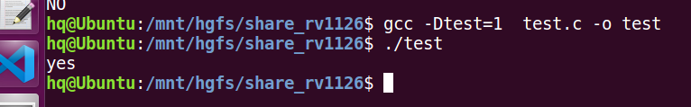
**千万不要写成下面这样**
```c
#include <stdio.h>
#define test 0
int main()
{
    #if test 
    printf("yes\n");
    #else
        printf("NO\n");
    #endif
}
```
## 防止头文件重复包含
**此处用法一般都是放在头文件中针对头文件使用**
```c
#ifndef 宏名
#define 宏名
	/*code*/
#endif
```
**分析**
如果第一次引用head.h就会定义__HEAD_H__这个宏，
下一次引用head.h时这个#ifndef的条件就不满足了，不会编译头文件里面内容。


