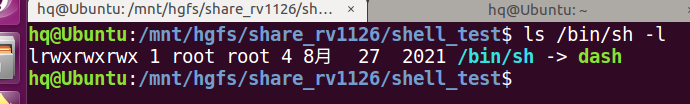
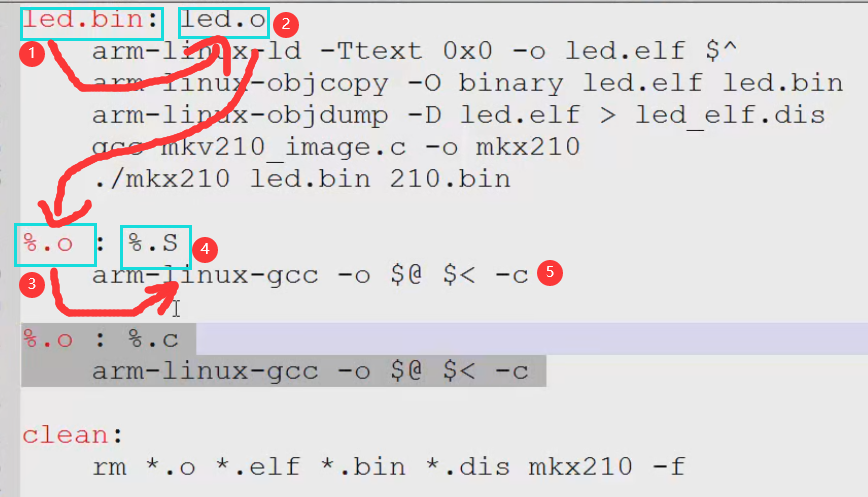
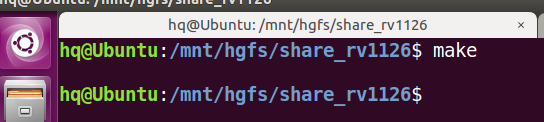
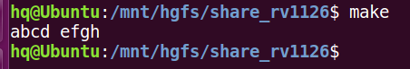
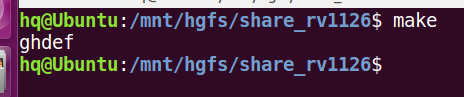
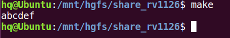
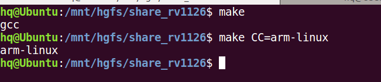
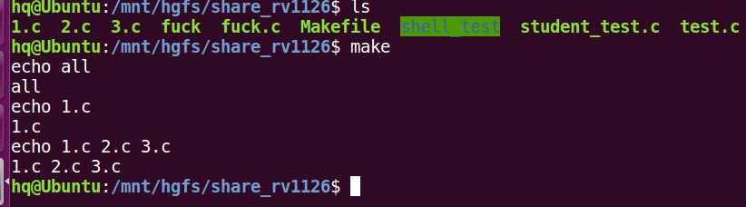
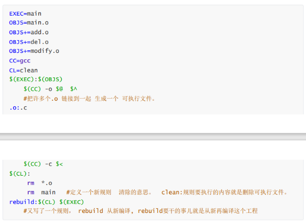

# Shell和Makefile补充学习
shell语言不是一种语言，而是一类，甚至包含perl python，（系统运维人员一般会这个）
在linux下常用的就是bash，这些脚本语言不需要编译链接的过程，直接运行，解释性语言和python一样。

脚本语言一般在嵌入式中的应用就是做配置，用户通过脚本来配置程序的一些参数等，比如U-boot或者内核的编译配置。
（嵌入式不需要太深入学习脚本语言）
**因为我们编写的Shell脚本是在linux系统下运行的，所以换行符必须是'\n'，而window下的换行符是'\r\n'**
## 使用多个命令

到目前为止，你已经了解了如何使用 shell 的命令行界面提示符来输入命令和查看命令的结果。shell 脚本的关键在于输入多个命令并处理每个命令的结果，甚至需要将一个命令的结果传给另一个命令。shell 可以让你将多个命令串起来，一次执行完成。如果要两个命令一起运行，可以把它们放在同一行中，彼此间用分号隔开。

```bash
$ date ; who
Sun Dec 20 08:59:29 AM CST 2020
testuser   tty1         2020-12-20 08:11 (:0)
testuser   pts/0        2020-12-20 08:11 (:0)
testuser   pts/1        2020-12-20 08:59 (:0)
```

恭喜，你刚刚已经写好了一个脚本。这个简单的脚本只用到了两个 bash shell 命令。date 命令先运行，显示了当前日期和时间，后面紧跟着 who 命令的输出，显示当前是谁登录到了系统上。使用这种办法就能将任意多个命令串连在一起使用了，只要不超过最大命令行字符数 255 就行。

这种技术对于小型脚本尚可，但它有一个很大的缺陷：每次运行之前，你都必须在命令提示符下输入整个命令。可以将这些命令组合成一个简单的文本文件，这样就不需要在命令行中手动输入了。在需要运行这些命令时，只用运行这个文本文件就行了。
## shell程序运行的方法
shell程序运行有多种方法，这里介绍三种方法
**尽管Shell解释器（有人也称作终端环境）有很多种，但是功能大部分差不多**
**需要注意乌班图下面的解释器默认不是bash是dash,不过大部分情况下是手动指定/bin/bash运行**

### 直接运行
*第一种：直接./xx.sh* 
这种运行方式要求Shell脚本必须有可执行权限
### 借助source
```bash
source xx.sh
```
source是linux系统下用来执行脚本的命令，**这种方式运行脚本，脚本可以没有可执行权限(前提是你得在管理员权限下)**
### 调用解释器
```bash
bash xx.sh
```
**这种方式运行脚本，脚本可以没有可执行权限(前提是你得在管理员权限下)**
bash是一个脚本程序解释器，本质上还是一个可执行程序，这种执行方式就相当于运行
bash程序然后把xx.sh作为参数传递给它（等会试试需不需要有可执行权限）
*根据终端环境bash可以换成别的终端环境，比如ksh zsh*

## 编写Makefile注意点
**Makefile有很多高端用法，我的笔记仅仅是记录常用的内容，高端用法请参考《跟我一起写Makefile》**
- 执行的命令开头一定要按下键盘的Tab，哪怕你用空格输入和tab一样的空格数量也不行
## Makefile基本概念
- 目标：在冒号前面的哪个顶格写的单词，单词就代表你的目的
- 依赖：用来生产目标的原材料
    - 在冒号后面的那一堆文件名
- 命令：命令就是生成目标需要做的动作
    - 命令前面一定是Tab，不能是多个空格。
**目标就是最终的大理石雕塑，依赖是一堆大理石石头，命令就是人的一系列雕刻动作**
## Makefile的基本工作流程
- 执行make xx时，会自动执行xx这个目标下的命令
- 输入make xx后，是否执行命令取决于依赖，依赖成立才会执行
    - Makefile是根据文件最后的修改时间判断文件有没有更新
- 只输入make和输入make 第一个目标名 的效果一样，第一个目标就是默认目标
## 通配符和自动推导（规则）

make工作的过程就能体现出这个自动推导的功能。
- 1 输入make,默认执行第一个目标
- 2 判断led.o这个依赖是否成立
    - 在当前路径下搜索是否存在.o文件
    - 没找到文件，跳转到%.o的目标尝试执行
- 3 判断%.o的依赖是否成立（先判断.s是否成立，不成立就判断.c）
    - 当前路径下搜索.S文件
    - 搜索成功
- 4 执行%.o下的命令
- 5 自动推导结束，回溯命令并执行，类似递归程序的流程
- %是Makefile中的通配符，代表一个或者几个字母
    - %.o代表所有的.o文件

## 定义和使用变量
和shell非常相似，因为makefile本身也是脚本语言，**也是弱类型语言，直接定义使用，引用变量时加$符号把需要引用的变量用小括号括起来**
## 伪目标(.PHONY)
*概念：*这个目标本身不代表一个文件，执行这个目标不是为了得到某个文件，而是为了
执行伪目标下的命令。（**伪目标一般都没有依赖，不加依赖就是无条件执行命令**）
*clean就是一个典型的伪目标，执行之后不会得到任何文件，只是完成删除功能，伪目标就类似调用函数一样*
### 伪目标的写法
**1.直接写**就比如写clean那样
```bash
clean:
    rm *.o a.out
```
**2.加入前缀.PHONY**这个前缀加不加都一样，只是为了提醒用户这是个伪目标
```bash
.PHONY clean
clean:
    rm *.o a.out
```
## Makefile文件名
合法的Makefile文件名一般有两种
- Makefile (这个一般都支持)
- makefile

*貌似Makefile也能写成.mk后缀的文件，比如U-boot中就引用了一些mk文件，打开之后你会发现这些mk文件就是makefile，加.mk后缀和不加的有啥区别，暂时不清楚，估计得看gnu文档*
## 引用子Makefile文件
Makefile文件中可以引用其他Makefile文件，就像C语言包含头文件一样，**引用之后就是原地展开文件内容**
- include 前面可以有一个或者多个空格，但是绝不能跟[TAB]
- 允许结合通配符使用
*下面两种写法就是等价的*
```bash
include *.mk
```
```bash
include a.mk b.mk c.mk d.mk
```
## 静默执行
- makefile默认执行命令前会先把这行命令打印出来，打印完再执行
- 如果不想看到打印的命令，想让他直接执行，那就设置为静默执行
- makefile命令行前面的@表示静默执行

*写成下面这样就行*
```bash
all:
    @echo hello
```
## 变量赋值运算符（重点）
*Makefile中赋值运算符两边有没有空格无所谓*
### 问号等号
**？=**：如果变量前面并没有赋值过则执行这条赋值，如果前面已经赋值过了则本行被忽略（**所谓的没有赋过值，其实就是这个变量没有被定义过，定义之后哪怕等于空也许**）
```bash
var="abcd"
var ?= "efgh"
all:
    @echo $var
```
上述代码执行之后会只输出abcd
*注意空值也算给变量赋值*
```bash
var=""
var ?= "efgh"
all:
    @echo $var
```
```bash
var=
var ?= "efgh"
all:
    @echo $var
```

### 加号等号
**+=**：用来给一个已经赋值的变量继续赋值，意思就是把这次的赋值放在原来的值后面，类似于Strcat函数（**在shell和Makefile中可以认为所有变量都是字符串**）
**注意一个细节，加等于拼接的内容和原来的内容间默认会加一个空格**
```bash
var="abcd"
var+="efgh"
all:
    @echo $var
```

*观察现象可以发现新添加的内容与原来的内容间默认加了一个空格*
### 等号与冒号等号
这两个赋值运算符非常容易混淆,*大部分情况下二者一样，但是有差别*
**一般都是写冒号等号**
- 等于号= 这是最简单的赋值
- 冒号等号:= 一般情况下也是赋值

```bash
A=abc
B=$(A)def
A=gh
all:
    echo $(B)
```

用等号赋值的变量，在解析时他的值取决于最后一次赋值时的值，所以此时看变量的值不止得往前看，还得往后看
```bash
A:=abc
B:=$(A)def
A:=gh
all:
    echo $(B)
```

用冒号等号赋值的变量，是就地解析的，只往前看就行**需要注意的是，你解析谁才考虑对谁用冒号等号，比如对B解析，只把B的赋值改成冒号等号也是可以的**
```bash
A=abc
B:=$(A)def
A=gh
all:
    echo $(B)
```
## Makefile的环境变量（重要）
Makefile中用**export**导出的就是环境变量。一般情况下要求环境变量名用大写，普通变量名用小写。
### 环境变量的普通变量的区别
- 普通变量只能在当前Makefile中使用
- 环境变量类似于整个工程中所有Makefile之间可以共享的全局变量
- Makefile中有一些环境变量是Makefile本身定义的内部环境变量
    - 类似C语言编译器自己定义的宏，例如NULL
- 在make时给makefile传的环境变量值优先级是最高的，可以覆盖makefile中的赋值
```bash
CC=gcc
all:
    echo $(CC)
```

## Makefile中使用通配符
常见的通配符有下面几种
- 星号* 若干个任意字符
- 问号 ？ 代表一个任意字符
- 中括号 [] 将中括号的字符依次与外面的匹配
    - 例如[12].c最后筛选出来的就是1.c 2.c
- 百分号 % 表示任意多个字符，%一般只用于规则描述中，也叫规则通配符
**疑问：Makefile中是否可以与正则表达式结合使用？**
## Makefile自动变量
*自动变量的含义*：预定义的特殊意义的字符（类似C语言内部定义的宏）
常见的自动变量：
- $@ 规则的目标文件名
- $< 规则的依赖文件名(规则依赖的第一个文件名)
- $^ 依赖的文件集合（规则依赖的所有文件名）
**常见的就这几种，其他的用到再说**
```bash
all:1.c 2.c 3.c
    echo $@
    echo $<
    echo $^
```

如果规则的依赖文件是用通配符写的，那么此时$<就不是指一个了（**此处我也有些模糊，暂时不清楚具体的场景是啥**）
## 个人喜欢的模板
因为Makefile编写的方式太过反人类，在加上现在很多构建工具都可以自动生成Makefile
例如Cmake Xmake等工具，所以自己从零开始写一个Makefile是不现实的，下面这种模板，是我个人比较喜欢的。

