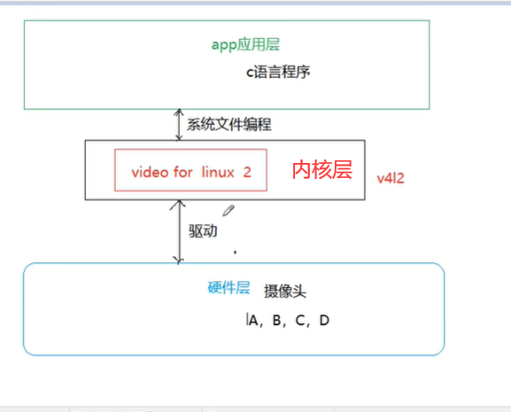
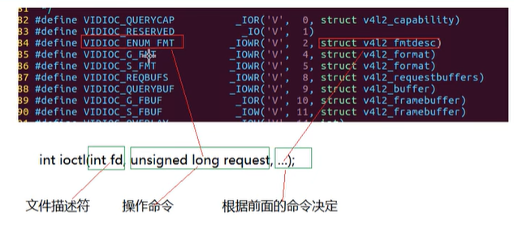

# V4L2学习杂记
总体架构如下图，进行应用层编程时就无需关心驱动层了，现在大部分摄像头都
是支持V4L2的，毕竟V4L2很早之前就已经提出了。


## 需要的知识
**其实本质上还是文件IO编程**
需要的函数其实还是文件IO那些，但是重点是**ioctl**这个函数
利用这个函数完成一下功能
- 配置视频格式，一般是YUV 4：2：2
- 配置视频宽度 高度
- 配置视频帧率
## V4L2接口编程基本流程
>1打开设备
一般摄像头设备都是video开头的，可以输入
```sh
ls /dev/vi*
```
查看是否识别到摄像头设备
通过正常的IO操作来完成打开关闭设备
```c
#include <stdio.h>
#include <sys/stat.h>
#include <sys/types.h>
#include <fcntl.h>
#include <stdlib.h>
#include <unistd.h>

int main(int argc, char const *argv[])
{
    // 1 打开设备
    int fd=open("/dev/video1",O_RDWR);
    if (fd<0)
    {
        perror("打开设备失败");
    }else
    printf("摄像头1打开成功\n");
    //9 关闭设备
    close(fd);
    return 0;
}
```
>2配置（获取支持格式）
*获取文件格式通过ioctl这个函数来完成*
```c
int ioctl(文件描述符，命令，根据前面的命令决定)
```

注意此处一定要先自己初始化一下这个type因为V4L2这个框架针对很多东西，你不初始化，他不知道要干啥。
```c
struct v4l2_fmtdesc v4fmt;
v4fmt.type = V4L2_BUF_TYPE_VIDEO_CAPTURE;
```

**注意这一步一定要包含下面这两个头文件**
```c
#include <sys/ioctl.h>
#include <linux/videodev2.h> 
//或者直接包含下面这个头文件
//#include <uapi/linux/videodev2.h>//所有的命令都在这个头文件里
```

>3申请内核缓冲区队列


>4把内核的缓冲区队列映射到用户空间

>5开始采集（相当于打开一个开关）

>6采集数据（要给缓冲区上锁）

>7停止采集（要给缓冲区解锁）

>8释放映射

>9关闭设备