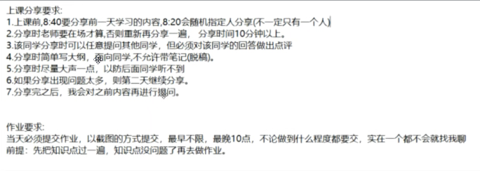
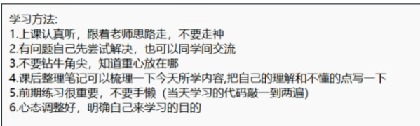
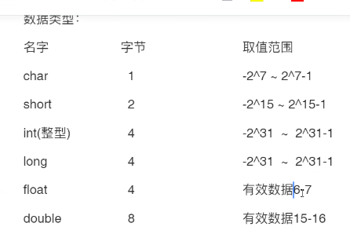
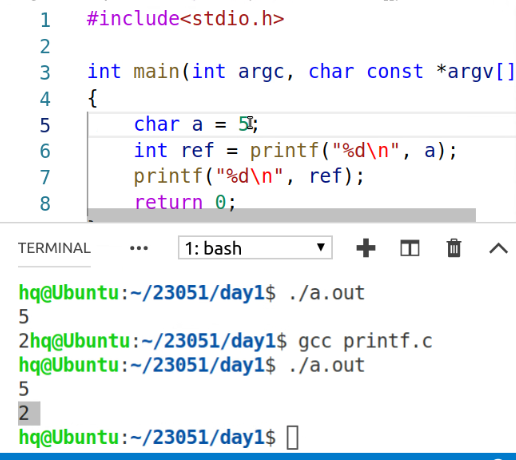
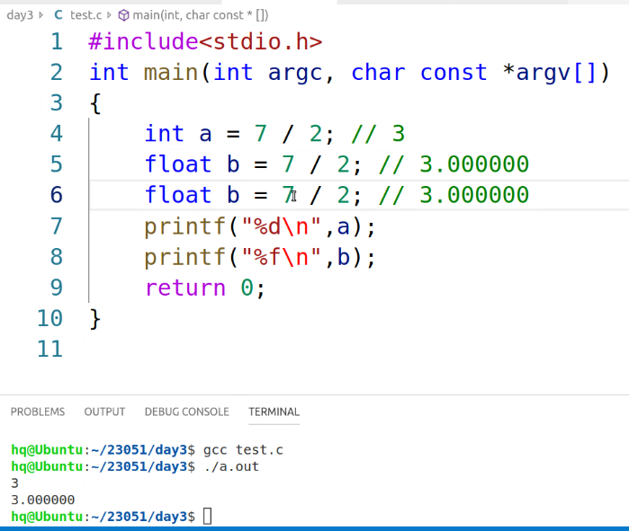
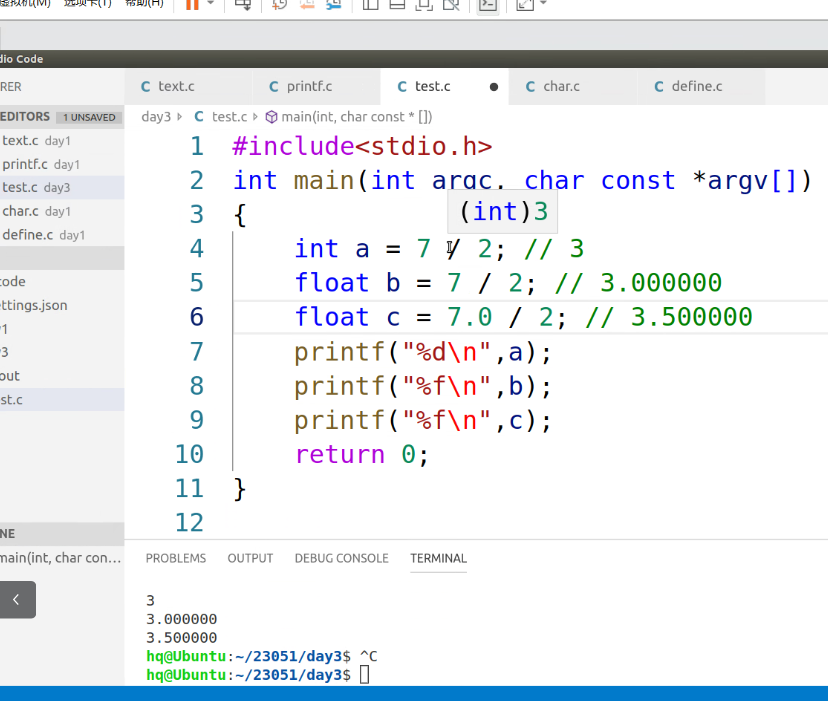
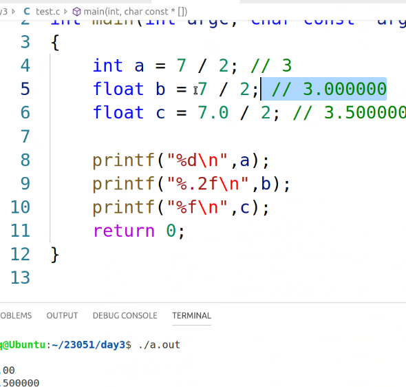
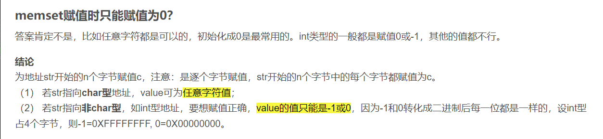
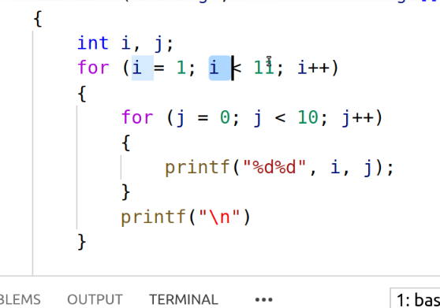

# 从0开始的C语言
作业要求，以截图方式提交要求现象也有，最早不限，最晚10点（写不出来也得交，能写多少写多少，一个写不出来就问问老师）。做作业的前提是先把知识点过一遍


**需要做思维导图，课程结束之后要求上交**
短期目标：完成QQ的注册和登录（比较简单）
## 变量
概念：在程序运行期间，这个值会发生改变
变量名：遵循标识符的命名规则
- 由字母 数字下划线所组成
- 开头的第一个字符不能是数字
- 变量名不能和关键字重合
## 数据类型
各种数据类型占用的字节和起始范围，也可以用sizeof来看下不同数据类型的所占字节

**注意上图中的浮点数和双精度浮点数，是存在有效位数的，超过这个位数会造成精度损失问题**
```c
#include<stdio.h>
#include<stdlib.h>
#include<string.h>

int main(int argc, char* argv[])
{
	float b=3.33333333;
	double c=123456789123456.3;
  float d=1.3456789;
	printf("%f\n",b);
	printf("%f\n",c);
 	printf("%f\n",d);

	return 0;
}//上述代码是为了验证二者的精度损失问题，可能在第六位或者第七位发生精度损失
//这个不一定
```
*现象*
```c
3.333333
123456789123456.296875
1.345679
```
## 常量
概念：程序运行过程中不会发生改变的量
### 字符型常量
用单引号括起来就是说明是字符型常量
*\0表示字符串结束的标志*
*' '(两个单引号间一个空格)也表示一个字符*
C语言支持用多种方式来表示一个字符，还可以利用ASCII码结合转义字符引导符来表示同一个字母。
```c
#include <stdio.h>
int main()
{
  char a='A';
  char b='\x41';
  char c='\101';
  printf("a is %c\n",a);
  printf("b is %c\n",b);
  printf("c is %c\n",c);
}//上述代码的3种方式都可以用来表示字母A
```
**反斜杠\表示转义字符引导符，例如\x41 代表用转义字符的方式来解析X41，x代表后面的数字是十六进制数**
*现象*
```c
a is A
b is A
c is A
```
用这种ASCII码的方式也可以用来表示A 可以man看ASCII手册
### 字符串常量
在C语言中本身是没由字符串类型的，是通过字符串数组来操作的。
用双引号括起来表示字符串。**在字符串的最后默认有个\0，\0本身也算一个字符**
比如"hello"是个字符串它实际占用了6个字符，hello\0
### 整型常量
int和long int长整型
### 浮点型常量
一般选择float，比double节省内存空间 
### 指数常量
用3e8可以表示3×19的八次方
2e-12表示2的-12次方
注意：在e后面不能跟括号,后面只能是常量或者常数
不是10的几次方就不能用e表示，得用pow这个函数
### 标识常量（重要）
宏定义：起到标识作用
宏定义的名字应该遵循标识符的命名规则（一般为了区分这个是宏定义会把名字给大写）
格式如下
```c
#define 宏名 常量或常量表达式
```
宏定义的式子只能替换，不能进行运算
## 输入输出语句
大致分为两类
- 按字符输出
- 按格式输出
函数三要素
- 功能
- 参数
- 返回值
### 按格式输出
**printf**
功能：按照指定格式向终端输出
返回值是输出的字符个数

\n \0都会被计入这个输出的字符个数
man手册可以看一下
```sh
man 3 printf
```
格式 
%d 整型
%f 浮点型
%c char型
%s 字符串
%lf 双精度浮点型
%#x 十六进制
%#o 8进制
%p 输出地址
%e 输出指数
%-m.n m代表位宽，如果打印的东西超过本身位宽，那么会按照m输出
        如果小于本身位宽，会按照实际位宽输出
        例如short是位宽16，如果要输出一个int那么会输出32位而不是16
      .n代表打印小数点后n位（默认是后6位）
      - 代表左对齐,如果不加这条杠默认就是右对齐的
### 按格式输入
**scanf**
功能：按格式从终端输入
man scanf查看函数细节
后面的参数需要写入变量地址
返回值：返回正确输入数据的个数
*从终端输入的注意事项*
```c
#include <stdio.h>
int main(void)
{
  int a,b;
  scanf("%d\n",&a);
  printf("%d\n",a);
}
```
**后面跟着\n会导致在终端卡死，可以自己执行一下看下现象**
注意中间的空格加不加的问题
```c
#include <stdio.h>
int main(void)
{
  int a,b;
  scanf("%d%d",&a,&b);
  printf("%d %d\n",a,b);
}
```
*现象*
```sh
1回车2
最终打印 1 2
```
```sh
1空格2
最终打印 1 2
```
**如果scanf输入的顺序错误，会返回0**
```c
#include <stdio.h>
int main(void)
{
  int a;
  char b;
  int ref;
  ref=scanf("%d %c",&a,&b);
  printf("%d %c\n",a,b);
  printf("%d\n",ref);
}
```
*正确按顺序输入的现象*
输入
```sh
1 a回车
```
输出
```sh
1 a
2 //成功输出2个字符
```
*错误输入顺序的现象*
输入
```sh
a 1回车
```
输出
```sh
753547952
0
```
## 分支语句
### if
根据不同的条件执行不同的语句。
需要注意的是，如果if和else间有其他语句把两者隔开会直接报错
## 运算符
### 算术运算符
重点是这个除以，他是整数相除，向下取整
；例如7/2会得到3而不是3.5
除以运算符的细节




当除号两边都是整数的时候，那么得到的也是整数，不会管是不是浮点型
*除号不止能计算整数,取余操作只能用于整数预算*
取余 把每一位抠出来
1234
个位1234%10
十位1234%100/10
百位1234%1000/100
千位1234/1000
#### 自加自减运算符
在前和在后的位置不一样的话，现象不一样，
**++/--在前**
这属于赋值运算
```c
int a=3;
int b=++a;//此时b是4，先自加运算然后赋值
```
**++/--在后**
```c
int a=3;
int b=a++;//此时b是3，先赋值然后a自加为4
printf("%d",&a);//此时a是4
```
### 逻辑运算符
与或非
*截断法则*
在逻辑或运算中，如果前面的表达式为真，则后面的表达式不执行
在逻辑与运算中，如果前面的表达式为假，则后面的表达式不执行
```c
int a=4;
int b=-1;
if(a>1||b>0)//从左往右看当第一个a>1的条件满足之后，另一个条件不会执行判断
```
注意下面的特殊情况
```c
int main()
{
  int a=5,b=6,c=7,d=8,m=2,n=2;
  (m=a<b)||(n=c>d);
  printf("m=%d n=%d\n",&m.&n);
}//上述代码会输出m=1,n=2
```
因为a<b 成立，所以m的值被赋值为1，然后根据截断法则并不会对后面的语句进行执行判断
### 位运算符
此处的位指的是二进制中的每一位
包含下面这些运算符
- & 位与
- | 位或
- ^ 位异或
- ~ 位取反
- << 左移
- (>>) 括号里是右移
位运算符是操作补码的，
*原码*：原码是它本身，
*反码*：正数的反码是它本身，负数是除符号位其他位按位取反
*补码*：正数是本身，负数是反码加1
**置0公式**
a&(~(1<<n)) 把a的第n位变成0
**置1公式**
a|(1<<n)这样就能把a的第n位置1
**左移右移**
这也是对补码进行操作，在补码的基础上进行左移和右移。
左移几位就需要在右边补多少个0
8<<2相当于8*2的2次方就是32 负数也有这个规律
右移就相当于除以2的几次方，右移几位，左边就得补几个符号位
### 关系运算符
用来比较大小的
### 赋值运算符
= += -= *= /=
a+=3相当于a=a+3
### 三目运算符(条件运算符)
表达式1?表达式2:表达式3
如果表达式1成立，就会执行表达式2，否则就会执行表达式3
```c
int a=3,b=5;
int c=a>b?a++;++b;
//上述代码中的c为6
```
*注意*：三目运算符只能计算这种简单的表达式
语句块中出现多条语句也不行
```c
a?b?a++;b++;c++//这样语句块中存在多条语句就不行
```
### 运算符优先级
口诀
**单算移关与，异或逻条赋，从右向左单条赋**
单目运算符：
算术运算符：
移位运算符
关系运算符
## while循环
格式 while(判断条件)
do while
格式
```c
do
{
  语句块
  增值减脂终止条件
}while(终止条件);
```
*他会先执行一次do然后判断，先执行后判断，就算条件不符合也会执行一次do*
```c
while(1);//这么写会让代码卡死在这里
```
### 循环控制语句
**break**
直接结束循环
**continue**
结束本次循环，开始下次循环

应用场景：
使用在循环语句里，结束循环
使用时需要有判断条件
## 数组
具有一定顺序的若干变量的集合
格式
```c
存储类型 数据类型 数组名字[元素个数]
```
数组名代表数组的首地址，数组名是个地址常量不能被赋值
不能给地址进行赋值操作，比如取出一个地址让他++
### 初始化
全部初始化 定义数组的同时就给他赋值
部分初始化 只对一部分赋值
```c
int a[4]={1,2}
//此时打印出全部变量值 分别是1 2 0 0
```
未初始化的部分为默认为0

未初始化：只定义未赋值，此时每个元素的值是随机的
*但你暂时不想给数组赋值，但是也不想让元素为随机值，此时可以利用定义空数组的方式*
**定义空数组有3种方式**
1 全部初始化(鸡肋的方式)
```c
int a[5]={0,0,0,0,0};
```
2 部分初始化
```c
int a[5]={0};
```
3 常用方式
```c
int a[5]={};
```
*引用的方式*
1 先定义后引用
单个单个引用
2 循环遍历引用
打印数组元素地址需要使用%p
*数组的大小*
```c
int a[5];
double b[2];
char c[32]
printf("%d\n",sizeof(a))
//数据元素个数*数据类型大小
```
*计算数组元素个数*
1 直接观察
2 strlen
3 sizeof(数组名)/元素大小
**清零函数清数组**
*bzero*
```c
int a[10]={1,2,3};
bzero(a,sizeof(a));//从首地址开始往后清空全部数组，清空之后每个元素为0
//第二个参数表示字节大小（要清空的大小）
```
看到函数中参数或者返回值的类型为size_t时，把size_t当int用就行，详情可以参考libc手册的介绍
看到void *表示需要一个地址，任意类型的指针都行
*memset*
对字符数组进行改
这个函数一般是给别的写入0或者-1 虽然也能写入别的但是需要一些特殊条件
'\0'的ASCII是0

## for循环
```c
for(表达式1;表达式2;表达式3)
{
  语句块
}
```
### for的嵌套结构

## 字符数组
概念存放元素的数据类型为字符型的数组
一般用这个来存放字符串
```c
//可以这样定义
char a[]={'a','b','c'};//此时这个数组里寸的是字符不是字符串没有'\0'
char a[]="abc"//这种叫字符串，里面有四个元素包括'\0'
//但是不能这样定义
char a[]={};
//这样定义也不行
char a[];
```
### 字符数组的输入输出
**吞字符问题**
我想输入空格，但是还想输入空格可以写成下面这样
```c
scanf("%[^n]"，s);//这么写表示直到遇到\n才算结束，默认是遇到空格也结束
```
**gets**
输入函数
*注意*：使用这个函数时，函数内部不会关注数组越界等问题，所以编译的时候gcc会提示你gets操作很危险
**puts**
输出函数，向终端输出字符串
向终端输出字符串，参数得是只读的字符串地址
返回值是输出字符的个数
## 字符串操作函数
函数：实现特定功能的代码模块
strcpy返回目标字符串首地址，该函数复制的时候，会把'\0'也复制进去
*strncpy*
*strcat*
功能：用于字符串拼接
返回值是目标字符串的首地址
*strncat*（有点问题，后续研究一下）
拼接字符串的前几个内容
*strcmp*
字符串比较函数
从字符串首个字符开始比较
返回值是0 1 -1
第一个参数第二个参数
*strncmp*
比较两个字符串前n个字符的大小
*strlen*
计算字符串长度，不包括反斜杠0
**sizeof与strlen的区别**
- sizeof是关键字，strlen是函数
- sizeof是计算数据所占空间大小，strlen是计算字符串的实际长度的
- sizeof的计算包括反斜杠0，但是strlen不包括。（当然这是在省略元素个数的情况下）
## 函数


