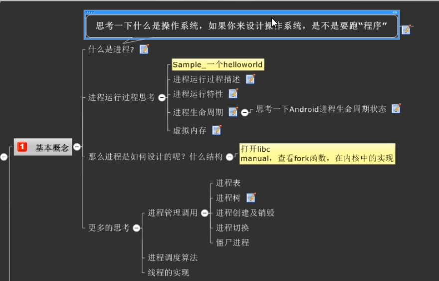
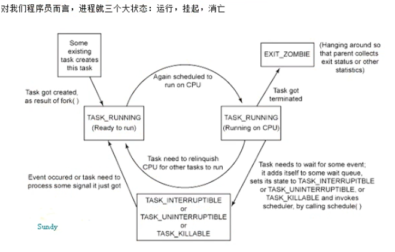
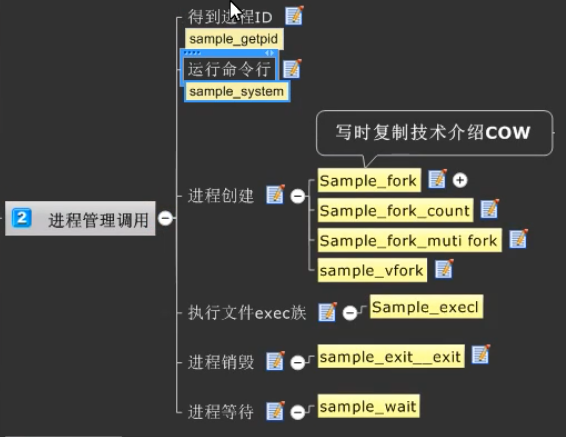
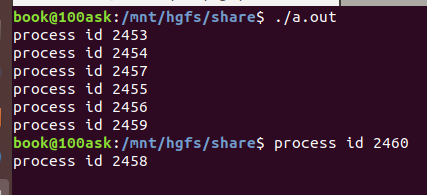
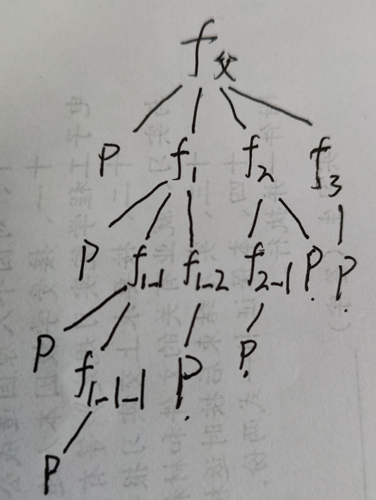
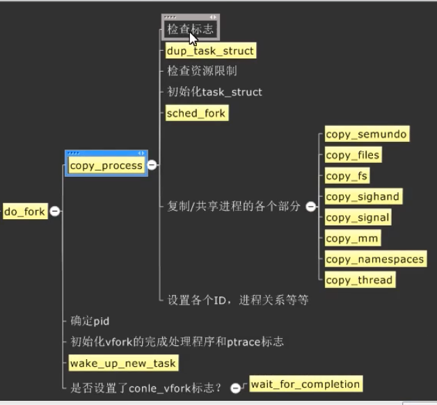

# 应用开发之进程管理
**课程目标**
- 知道进程的概念
- 了解Linux进程的创建，切换和调度机制
- 进程优先级，进程生命周期的掌握
- 了解内核进程数据结构（难点）
- 虚拟内存与进程的关系（难点）
- 进程的独占性（难点）

## 进程相关的概念
*进程通常被定义为一个正在运行的程序的实例* 由两部分组成
- 1 是系统中用来管理进程的内核对象。内核对象也是系统用来存放关于进程统计信息的地方
- 2 是地址空间，它包含所有可执行模块或DLL模块的代码和数据。也包含动态内存分配的空间。如 线程堆栈和堆栈分配空间。

进程运行的过程其实就是把磁盘的二进制文件加载（映射）到内存空间中，并指引CPU去内存中寻址，然后运算并且返回（I/O）的过程。

**题外话** 实现进程管理有2种思路。
- 1 在操作系统内核中实现(Linux和Windows的做法)
- 2 在系统类库层中实现（也被称为虚拟机，安卓和JAVA的做法）

*在windos系统中用拓展名来判断是否是一个可执行文件，而Linux是根据文件权限判断*（了解性）
**小知识点**
- 2的10次方代表1K
- 2的20次方代表1M
- 2的30次方代表1G
### 进程的运行特性
**多任务，多进程“并发”，linux系统是多任务分时的**
一个独立的逻辑控制流，好像我们的程序在独占使用CPU
*实现方法：* 进程调度
**进程间彼此独立，所处内存互相隔离**
每个进程有一个私有的地址空间，好像我们程序独占使用内存
*实现方法：* 虚拟内存（毕竟32位操作系统实际能寻址的最大物理内存是2的32次方，4G。不通过虚拟内存的思想实现真是遭不住啊）
### 进程生命周期

此处后面补充详细内容
### 虚拟内存
后面细说
### 进程如何设计？什么结构
打开libc的手册，Glibc中有关于进程的函数（Process章节）
查看fork函数在内核中的实现
*示例*
```c
#include <stdio.h>
int main()
{//这种例子还有很多，只是简单做个示例
    system("ls -a");//运行命令行
    return 0;
}//执行后的现象与执行ls -a的现象一致
```
**冷知识**
由于大部分linux系统是分时机制的多任务系统，所以实时性差，若要提高实时性有两种渠道
- 修改内核
- 在系统层实现属于自己的进程调度，不按照内核的调度来。如RTLinux
## 进程管理调用

### 得到进程ID
```c
//可以man一下看看这两个函数的介绍
pid_t getpid(void);//得到当前进程ID
pid_t getppid(void);//得到父进程ID
```
*依赖头文件*
```c
#include <sys/types.h>
#include <unistd.h>
```
*示例*
```c
#include <stdio.h>
#include <sys/types.h>
#include <unistd.h>
int main()
{
    pid_t pid=getpid();
    printf("pid= %d\n",pid);
    pid_t ppid=getppid();
    printf("ppid= %d\n",ppid);
    return 0;
}//上述代码会打印出当前进程的pid与父进程的pid
```
### 运行命令行
*函数原型*
```c
int system(const char *command);//里面填写Shell命令
```
*依赖头文件*
```c
#include <stdlib.h>
```
*返回值*
```
失败返回 -1
```
*示例*
```c
#include <stdio.h>
#include <stdlib.h>
#include <sys/types.h>
#include <unistd.h>
int main()
{
    system("ps -aux");
    return 0;
}//与在命令行执行ps -aux的效果一样
//该程序的父进程其实就是shell
```
### 进程创建
此处主要用到两个函数，这两个函数都能创建子进程
#### fork函数
*函数原型*
```c
pid_t fork(void)
```
*依赖头文件*
```c
#include <sys/types.h>
#include <unistd.h>
```
*返回值*
```
失败返回 -1 并记录到errno
0 子进程中返回0（说明此时是子进程在运行）
返回大于0说明当前是父进程在运行，返回的就是创建的子进程pid
```
fork **完全copy了一份父进程的地址空间给子进程**，让彼此可以独立的执行。父子进程执行先后顺序不定，子进程有自己的pid
*示例1*
```c
#include <stdio.h>
#include <sys/types.h>
#include <unistd.h>
int main()
{
    pid_t pid;
    pid = fork();
    if (pid==-1)
    {
        perror("fork error");
    }else if(pid==0)
    {
        //此时是子进程运行，输出子进程的pid
        printf("child process %d\n",getpid());
    }else//此时是大于零的情况
    {
        //此时是父进程运行，输出父进程的pid
        printf("parent process %d\n",getpid());
    }

    return 0;
}
```
*实验现象*
屏幕输出
```sh
parent process 3122
child process 3123
```
说明创建子进程之后，两个进程互相独立，都执行了一遍代码，所以输出了2次。**有的时候输出的顺序可能颠倒，这是因为这两个进程是异步的，执行顺序是不可预知的**

*示例2*
```c
#include <stdio.h>
#include <sys/types.h>
#include <unistd.h>
int main()
{
    pid_t pid=fork();
    int count =0;
    count++;
    if (pid==0)
    {
        printf("child count %d\n",count);
    }else if (pid>0)
    {
        printf("parrent count %d\n",count);
    }
    return 0;
}
```
示例2执行后输出
```sh
parrent count 1
child count 1
```
**他们的count值都为1，说明fork函数创建的子进程是复制的父进程的地址空间**
*示例3*
```c
#include <stdio.h>
#include <sys/types.h>
#include <unistd.h>
int main()
{
    fork();
    fork();
    fork();
    printf("process id %d\n",getpid());
    return 0;
}
```
*实验现象*

实验现象是最终输出了8次信息，这是因为没次创建一个子进程都会执行下面的代码，并且
子进程的子进程也会输出信息。可以用一个树状图来描述。

**若有n个fork那么最终代码的执行次数是2的n次方**

*fork的优缺点*
- 优点：进程间彼此独立
- 缺点：内存空间开销大，浪费空间

*为了解决上面的缺点，发明了写时复制技术(COW技术)，就是只开辟需要用的空间，不用的时候不开辟*

*fork内部的流程*目前只做了解，详细的可以去看内核fork.c代码


#### vfork函数
*函数原型*
```c
pid_t vfork(void)
```
*依赖头文件*
```c
#include <sys/types.h>
#include <unistd.h>
```
*返回值*
```
失败返回 -1 并记录到errno
0 子进程中返回0（说明此时是子进程在运行）
返回大于0说明当前是父进程在运行，返回的就是创建的子进程pid
```
vfork是**与父进程共享地址空间**，并且父进程会等待子进程执行完毕后才继续执行，子进程有自己的pid

*示例1*
```c
#include <stdio.h>
#include <sys/types.h>
#include <unistd.h>
int main()
{
    pid_t pid=vfork();
    if (pid==-1)
    {
        perror("vfork err!!!\n");
    }else if (pid==0)
    {
        printf("child process id %d\n",getpid());
    }else
        printf("parrent process id %d\n",getpid());
    return 0;
}
```
*实验现象*
```sh
child process id 2733
parrent process id 2732
Segmentation fault (core dumped)
```
执行两次之后会直接报错提示**段错误**（我的环境是乌班图1804），如果用比较老版本的linux内核他会循环输出父进程和子进程的ID，输出很多次，然后退出。出现这种问题可以打开man手册查一下。经过查阅资料得知，在glibc 2.12版本中实现的vfork与2.12版本之后的实现不一样。**当我们创建fork时，假设在第一行调用fork，那么子进程会从第二行开始执行代码，但是如果在第一行调用vfork，子进程会从第一行重新开始执行代码，这就造成了上述代码死循环，可以在代码中手动退出解决这个问题**
*示例2*
```c
#include <stdio.h>
#include <stdlib.h>
#include <sys/types.h>
#include <unistd.h>
int main()
{
    pid_t pid;
    pid =vfork();
    if (pid==-1)
    {
        perror("vfork err!!!\n");
    }else if (pid==0)
    {
        printf("child process id %d\n",getpid());
        exit(0);//子进程打印完信息之后直接退出，就不会进入死循环
    }else
    {
        printf("parrent process id %d\n",getpid());
        // exit(0);父进程需不需要手动退出无所谓
    }
    return 0;
}
```
*实验现象*
```sh
child process id 2860
parrent process id 2859
```
**而且子进程是在父进程之前执行的，符合vfork的特点**
### 执行文件exec族函数
这部分的函数主要功能就是实现执行某个文件，比如shell脚本或者是之前自己编译通过的应用程序。
**这个函数族的返回值都有如下特点**
- 成功时 不返回任何值
- 失败时 返回-1，同时设置errno错误码
#### execl
*依赖头文件*
```c
#include <unistd.h>
```
*函数原型*
```c
int execl(const char *path, const char *arg, ...
                       /* (char  *) NULL */);
//该函数是可变参数，要求最后一个可变参数以NULL结尾
//const char *arg 表示参数结合下面的示例理解
```
该函数不仅能执行Shell命令，系统的类库，用户自己编译通过的程序等都可以执行。
*示例*
```c
#include <stdio.h>
#include <stdlib.h>
#include <sys/types.h>
#include <unistd.h>
int main()
{
    execl("/bin/ps","ps","-ef",NULL);
    return 0;
}
```
运行之后相当于执行了ps -ef这个Shell命令。**冷知识：Shell命令中命令本身也属于参数，第一个参数，所以代码中写参数的位置写了俩**
#### execlp
*依赖头文件*
```c
#include <unistd.h>
```
*函数原型*
```c
int execlp(const char *file, const char *arg, ...
                       /* (char  *) NULL */);
//第一个参数是要执行的文件名字
//该函数是可变参数，要求最后一个可变参数以NULL结尾
//const char *arg 表示参数结合下面的示例理解
```
**与execl不同的是该函数不需要填写文件路径，直接填写文件名就行，系统会自动去环境变量中寻找。** 
该函数不仅能执行Shell命令，系统的类库，用户自己编译通过的程序等都可以执行。
*示例*
```c
#include <stdio.h>
#include <stdlib.h>
#include <sys/types.h>
#include <unistd.h>
int main()
{
    execlp("ps","ps","-ef",NULL);
    return 0;
}//运行之后相当于执行了ps -ef这个Shell命令
```
#### execv
*依赖头文件*
```c
#include <unistd.h>
```
*函数原型*
```c
int execv(const char *path, char *const argv[]);
//该函数只有两个参数
//第一个参数是 文件路径
//第二个参数是 指针数组名
```
**之前的函数传参是通过列表的方式，手动一个一个传入。而这个函数支持用户把参数作为指针数组内容传入,但是数组的最后一个元素必须是 NULL**
*示例1*
```c
#include <stdio.h>
#include <stdlib.h>
#include <sys/types.h>
#include <unistd.h>
int main()
{
    char *test[]={"ps","-ef",NULL};
    execv("/bin/ps",test);
    return 0;
}//效果与执行shell命令ps一样
```
*示例2*
```c
#include <stdio.h>
#include <stdlib.h>
#include <sys/types.h>
#include <unistd.h>
int main(int argc,char *argv[])
{
    execv("/bin/ps",argv);
    return 0;
}
```
编译完成之后在终端输入
```sh
./a.out -ef
#此时实验现象与输入ps -ef的shell命令一样
./a.out
#此时实验现象与输入ps的效果一样
./a.out ps
#此时会直接报错，报错信息与输入ps ps的效果一样，log如下
error: process ID list syntax error

Usage:
 a.out [options]

 Try 'a.out --help <simple|list|output|threads|misc|all>'
  or 'a.out --help <s|l|o|t|m|a>'
 for additional help text.

For more details see ps(1).
```
*示例3*
```c
#include <stdio.h>
#include <stdlib.h>
#include <sys/types.h>
#include <unistd.h>
int main()
{
    char *test[]={"-ef",NULL};
    execv("/bin/ps",test);
    return 0;
}
```
此时的实验现象与只执行ps命令，但不加参数的效果一样。
**此处有疑惑，为什么会忽略-ef这个参数**
```sh
   PID TTY          TIME CMD
  2379 pts/0    00:00:00 bash
  2518 pts/0    00:00:00 ps
```
*示例4*
```c
#include <stdio.h>
#include <stdlib.h>
#include <sys/types.h>
#include <unistd.h>
int main()
{
    char *test[]={NULL};
    execv("/bin/ps",test);
    return 0;
}
```
此时的实验现象与只执行ps命令，但不加参数的效果一样。
```sh
   PID TTY          TIME CMD
  2379 pts/0    00:00:00 bash
  2518 pts/0    00:00:00 ps
```
*示例5*
```c
#include <stdio.h>
#include <stdlib.h>
#include <sys/types.h>
#include <unistd.h>
int main()
{
    char *test[]={"ps",NULL};
    execv("/bin/ps",test);
    return 0;
}
```
此时的实验现象与只执行ps命令，但不加参数的效果一样。
```sh
   PID TTY          TIME CMD
  2379 pts/0    00:00:00 bash
  2518 pts/0    00:00:00 ps
```
*示例6*
```c
#include <stdio.h>
#include <stdlib.h>
#include <sys/types.h>
#include <unistd.h>
int main()
{
    char *test[]={"wc","-c","hello",NULL};
    execv("/usr/bin/wc",test);
    return 0;
}//hello为我自己编译通过的一个应用程序
//wc -c 文件名可以查看文件体积大小
```
*实验现象*
```sh
8304 hello
```
#### execve
*依赖头文件*
```c
#include <unistd.h>
```
*函数原型*
```c
int execve(const char *filename, char *const argv[],
                 char *const envp[]);
```
#### execle
*依赖头文件*
```c
#include <unistd.h>
```
*函数原型*
```c
int execle(const char *path, const char *arg, ...
                       /*, (char *) NULL, char * const envp[] */);

```
#### execvp
*依赖头文件*
```c
#include <unistd.h>
```
*函数原型*
```c
int execvp(const char *file, char *const argv[]);
```
#### execvpe
*依赖头文件*
```c
#include <unistd.h>
```
*函数原型*
```c
int execvpe(const char *file, char *const argv[],
                       char *const envp[]);
```
### 进程销毁
**_exit()函数的作用最为简单：直接使进程停止运行，清除其使用的内存空间，并销毁其在内核中的各种数据结构；exit() 函数则在这些基础上作了一些包装，在执行退出之前加了若干道工序。
exit()函数与_exit()函数最大的区别就在于exit()函数在调用exit系统调用之前要检查文件的打开情况，把文件缓冲区中的内容写回文件，就是"清理I/O缓冲"。**
#### exit
*依赖头文件*
```c
#include <stdlib.h>
```
*函数原型*
```c
void exit(int status);
```
**exit在销毁进程的时候会清空缓存**
该函数无返回值，传入的参数是程序退出时的状态码，0表示正常退出，其他表示非正常退出，一般都用-1或者1，标准C里有EXIT_SUCCESS和EXIT_FAILURE两个宏，
用exit(EXIT_SUCCESS);
*示例*
```c
#include <stdio.h>
#include <stdlib.h>
#include <unistd.h>
int main()
{
    printf("exit test");
    exit(0);//销毁进程时清空缓存，所以信息会打印出来
}
```
#### _exit
*依赖头文件*
```c
#include <unistd.h>
```
*函数原型*
```c
void _exit(int status);
```
**_exit销毁进程时不会清空缓存** 该函数无返回值
*示例*
```c
#include <stdio.h>
#include <stdlib.h>
#include <unistd.h>
int main()
{
    printf("exit test");
    _exit(0);//销毁进程时不清空缓存，所以信息不会打印出来
}
```
*如果修改为 printf("exit test\n");那么也会输出信息*
**printf中\n本质上的作用是刷新缓冲区，把存储在Stdout中的信息马上输出**
刷新缓冲区的方法
- 在输出语句中加入\n
- 在输出语句后面加入fflush(stdout)手动刷新缓冲区
- 等程序结束一并刷新输出

*示例2*
```c
#include <stdio.h>
#include <stdlib.h>
#include <unistd.h>
int main()
{
    printf("exit test");
    fflush(stdout);
    _exit(0);
}//这样写也可以输出信息
```
### 进程等待
使用fork时，由于父子进程执行的顺序不确定，有时父进程会先于子进程销毁，如果我们不希望出现这种现象可以用下面的方法，来达到vfork的效果,即让主进程等待子进程执行完再继续
#### wait
*依赖头文件*
```c
#include <sys/types.h>
#include <sys/wait.h>
```
*函数原型*
```c
pid_t wait(int *wstatus);
//传入一个描述子进程是怎么消亡的状态指针
```
*示例*
```c

```
#### waitpid
*依赖头文件*
```c
#include <sys/types.h>
#include <sys/wait.h>
```
*函数原型*
```c
pid_t waitpid(pid_t pid, int *wstatus, int options);
```
#### waitid


extern char **envirson;
进程环境表这样声明就能直接用

单片机那些RTOS还是没做到虚拟地址，还是用的物理地址，
所以他们叫任务不是进程，（此处存疑？MMU？）
《图解Linux,,,,,,》新设计团队编写关于虚拟地址与物理地址间的转换
进程也是有生命周期的，一个进程的生命周期就是从程序的开始执行到程序运行结束
ps -aux显示的问号说明是守护进程


有名管道还是半双工，读的时候不能写，写的时候不能读