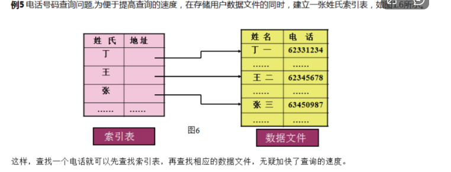

# 数据结构
## 数据相关的概念（没啥大用）
### 数据
> 数据：不是单纯的数值，而是一个类似于集合的概念
### 数据元素(又叫节点)
> 数据元素是数据的基本单位，数据元素由若干个基本项组成
比如：含有图书编号，作者，出版日期的一栏信息
### 数据项
> 数据元素由若干个数据项组成，数据项是数据的最小单位
比如：书名 作者这些单独的信息
## 数据间的关系
### 线性关系
> 线性关系----线性结构------一对一---------一对一----顺序表（数组） 链表
> （指针）、栈 、队列（队头出队，队尾入队）
### 层次关系
> 层次关系----树形结构-----一对多-----树 
### 网状关系
> 网状关系----图状结构-----多对多-----图

## 存储结构
### 存储结构的概念
存储结构：数据的存储结构值得是**数据的逻辑结构**在计算机存储器上的映像（表示）。*存储结构是通过计算机语言所编制的程序来实现的，因而是依赖于具体的计算机语言*
### 顺序存储结构
**数组：**将数据结构中的元素按照其逻辑顺序存放于存储器一片**连续**的存储空间中（例如C语言的一维数组）。
### 链式存储结构
**特点**：数据在内存中存储时不连续的，通过指针将数据联系到一起
### 索引存储结构
在存储数据的同时，建立一个附加的索引表，**索引存储结构=数据文件+索引表**

### 散列存储结构
数据在存储的时候与关键码之间存在着某种对应关系。存的时候按照对应关系存，取的时候按照对应关系取出数据
## 算法相关的概念（不是特别重要）
### 算法与程序
- 算法：解决问题的思想办法
- 程序：用计算机语言对算法的具体实现
### 算法与数据结构
- 算法的设计：取决于选定的逻辑结构
- 算法的实现：依赖于采用的存储结构
*算法+数据结构=程序*
### 算法的特性
- 有穷性：算法的执行步骤是有限的
- 确定性：算法的每一个步骤，无二义性，没有歧义
- 可行性：算法能够在有限的时间内完成
- 输入：一个算法可以有一个或者多个输入
- 输出：一个算法可以有一个或者多个输出

## 可能会考的点
冒泡排序和选择排序的时间复杂度？

## 待补充部分
链表的内存申请不能用栈区，因为栈区先进后出不能实现只释放中间节点，保留两边节点
头指针的类型是struct node *类型的，所以它才能指向链表的结点，别的类型指针经过
强制转换也可以指向它，但是本身指针是没有类型之分的，只不过是编译器玩的把戏罢了。