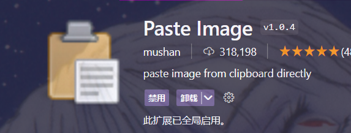
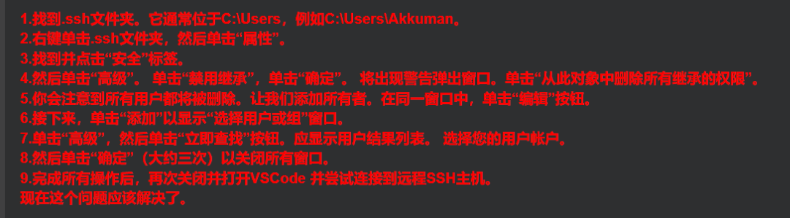
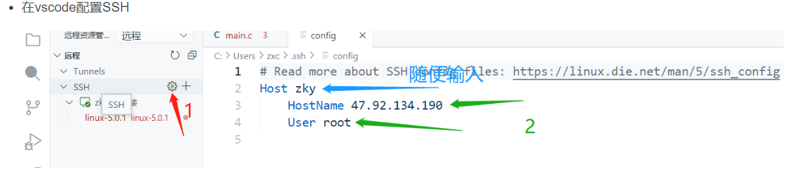
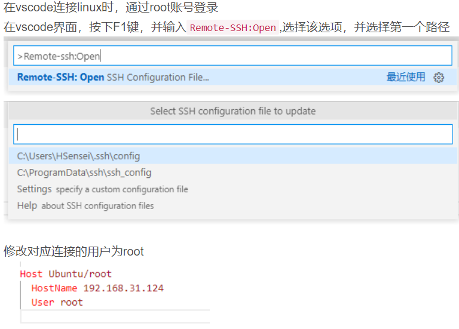

# 乌班图虚拟机部分
## 怎样使用命令搜索软件源中的软件
在*centos*中可以利用
```sh
yum search + 软件名
```
centos可以利用这种方式来查询软件源中有没有所需要的软件
**在乌班图中并不是利用sudo apt-get中的命令**
而是利用
```sh
sudo apt-cache search 软件名
```
或者可以在浏览器手动打开镜像源的网站然后利用ctrl+f这样在浏览器中手动查询有没有
需要的软件。
## 无法获得锁 /var/lib/dpkg/lock问题
有时在终端运行命令或者利用终端下载软件时，会出现如下报错
```sh
E: Could not get lock /var/lib/dpkg/lock-frontend - open (11: Resource temporarily unavailable)
E: Unable to acquire the dpkg frontend lock (/var/lib/dpkg/lock-frontend), is another process using it?
```
*方法一*
```sh
sudo killall apt apt-get
```
如果提示没有apt进程
```sh
apt: no process found
apt-get: no process found
```
*此时需要按照方法二的来*
依次输入
```sh
sudo rm /var/lib/apt/lists/lock
sudo rm /var/cache/apt/archives/lock
sudo rm /var/lib/dpkg/lock*
sudo dpkg --configure -a
sudo apt updat
```
一般这样就能解决问题了，如果还是不行，或者报错信息如下
```sh
dpkg was interrupted, you must manually run 'sudo dpkg --configure -a' to correct the problem. 
```
**此时依次输入下面的指令**
```sh
sudo rm /var/cache/apt/archives/lock
sudo rm /var/lib/dpkg/lock
sudo dpkg --configure -a
sudo rm /var/lib/dpkg/lock-frontend
```
## 为root用户重新设置密码
输入su想切换为管理员账号，提示你不行，这时候要设置管理员密码
```sh
sudo passwd root
```
# VScode环境配置问题
## markdown插件问题
虽然我已经安装了Markdown All in one但是一直没找到系统的介绍来使用该插件的各项功能。所以这部分也会总结其他插件
### Past Image

该插件可以用来向markdown文件中快速粘贴图片。
可以使用windows自带的截图功能或者QQ截图功能，截图完成之后，手动按下
**ctrl+alt+v(也可以修改为别的按键)**
按下之后即可粘贴到文档中，可以设置图片的默认名字和存放路径
下面是我的常用设置
```json
{
    "pasteImage.path": "${currentFileDir}/img",
    "pasteImage.showFilePathConfirmInputBox": true,
    "pasteImage.defaultName": "",
    "pasteImage.filePathConfirmInputBoxMode": "onlyName",
    "pasteImage.nameSuffix": ".png",
}
```
*img是我存放图片的路径，在当前路径下的img文件夹下，这样设置之后，每次粘贴都可以直接输入图片名字来自定义* 
## SSH远程连接部分
**SSH插件用的是 Remote - SSH**
**openssh貌似有很多问题，所以我直接采用了安装git时git自带的Ssh**
*vscode的SSH插件你有时候不稳定，不清楚为啥*
### 一直连接不上
此时可能是windows本地的文件权限问题

### Vscode设置ssh

### vscode配置clangd
vscode安装clangd插件之后，一般需要在setting.json中配置一下，不然这个插件会自作聪明识别出代码中很多莫须有的错误
```json
    "clangd.arguments": [
        "--compile-commands-dir=${workspaceFolder}",
        "--background-index",
        "--completion-style=detailed",
        "--header-insertion=never",
        "--log=verbose"
    ],
```
### 远程连接linux保存文件出错
利用SSH remote远程保存文件时，会提示权限不足导致的问题。
此时有两种方法。**方法一对我不起作用**
*方法一*
在ssh设置中把usr设置为管理员账户名，

黑色标注位置替换为管理员账户名
*方法二*
在linux中切换到管理员账户
```sh
chmod 777 目录名 -R
```
这样修改权限